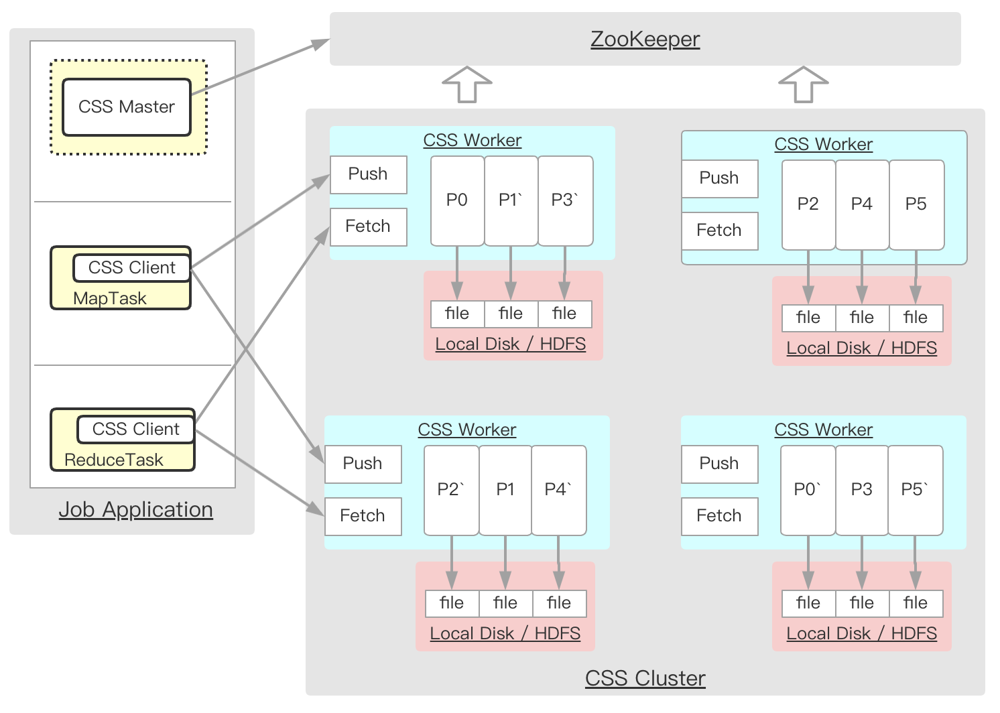

# [Cloud Shuffle Service(CSS)](https://github.com/bytedance/CloudShuffleService)

> A general purpose remote shuffle solution for compute engines, including Spark/Flink/MapReduce.

**计算和中间Shuffle数据分离**

## 架构

计算框架将shuffle数据推送到CSS集群并存放在磁盘或者HDFS中， 之后当需要读取数据时，再通过CSS集群的接口**拉取相关**的shuffle数据。

- CSS Worker

  负责把来自Map Task发送的数据存储到内存中并最终异步的把数据刷写到文件系统中。当Reduce Task开始时可以从Worker拉取之前存储的数据。

- CSS Master

  负责协调application的整个shuffle过程，需要被整合进application的运行过程中，例如跑在Spark的driver中。 CSS Master会从ZooKeeper中获取worker的列表并且分配合适的worker给application提供shuffle服务，并且跟进所有Map Task完成的进度， 当Map Task运行完成的时候会通知所有worker把所有缓存中的数据持久化到磁盘并关闭文件。

- CSS Client

  当运行Map或者reduce task时，负责从所有worker推送或者拉取shuffle数据

## TODO(https://mp.weixin.qq.com/s/_dWEfuwbJEnHFxsmRY0cGA)