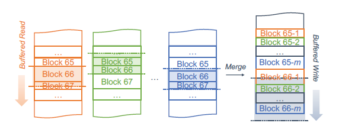

# Riffle: Optimized Shuffle Service for Large-Scale Data Analytics

## 1. 目标

大规模数据处理系统中随着数据量的增加，Shuffle操作称为系统的性能和可扩展性瓶颈：

- **磁盘IO操作的超线性增长**；

## 2. 思路

- 将小的、随机的磁盘IO操作变成大的、顺序的磁盘IO操作
  - 将碎片式的中间shuffle文件合并成大的块文件

## 3. 实现

### 3.1 中央调度器

- 记录中间的shuffle文件，动态协调合并操作；

### 3.2 Shuffle合并服务

- 在每个物理节点上运行，高效地将多个小文件合并成大文件；

#### 3.2.1 细节

- **将合并操作和map任务重叠**；
- 防止straggler的额外延迟时间
  - best-effort merge阈值，不一定将所有的map输出文件都合并；
- 容错，在合并文件和shuffle出错时
  - 保留shuffle的合并文件和原始文件；

- 多种合并策略：
  - N个文件合并，或者特定Block Size合并；

- 对每个shuffle文件，分配一个缓冲区用于异步读取和缓存索引文件；分配一个单独的缓冲区来异步写入合并的输出文件
  - 按顺序读取Block，并合并到缓冲区再写入；

### 3.3 计算存储分离架构下的合并请求均衡

在每个计算节点运行一个Merger进程

- 每个Merger进程，不仅可以合并本地的文件，也可以合并其它物理节点的文件？	
  - map的输出数据是本地临时目录，不是物理节点的 存储目录？

- [“power of two choices”](The Power of Two Choices in Randomized
  Load Balancing.[) 策略进行负载均衡，随机选择两个合并进程，选择队列最短的一个进行提交。

