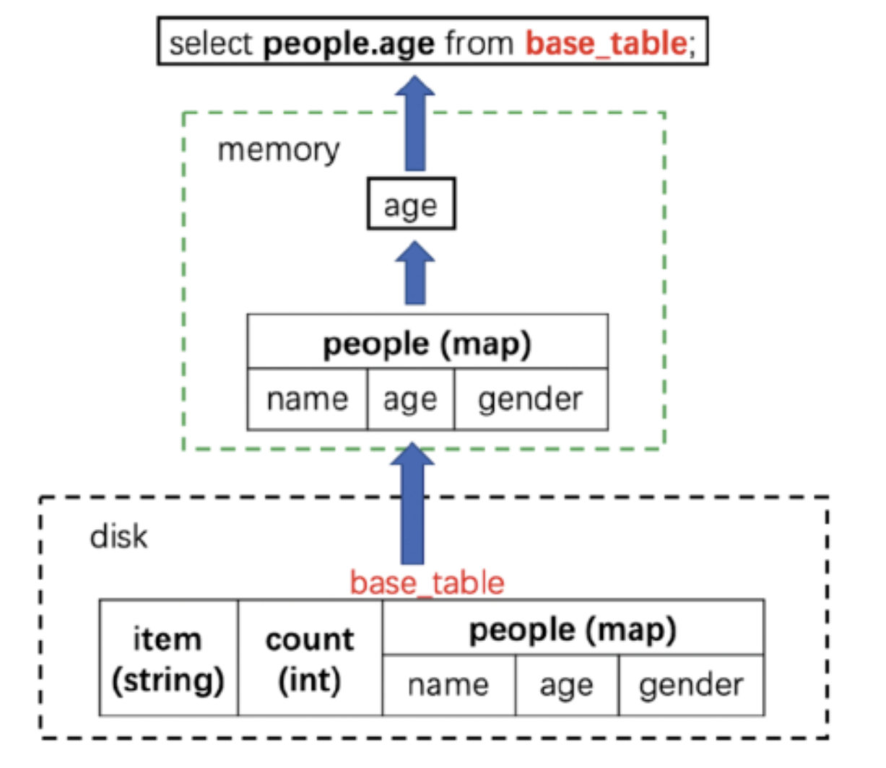
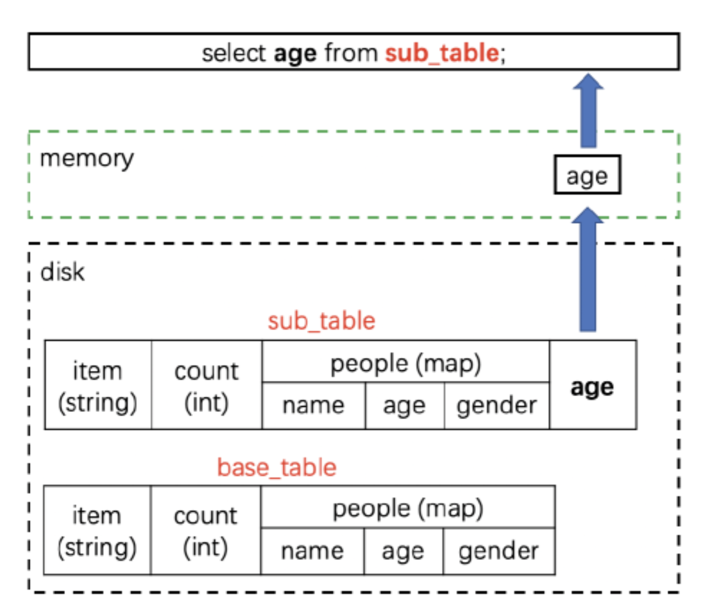
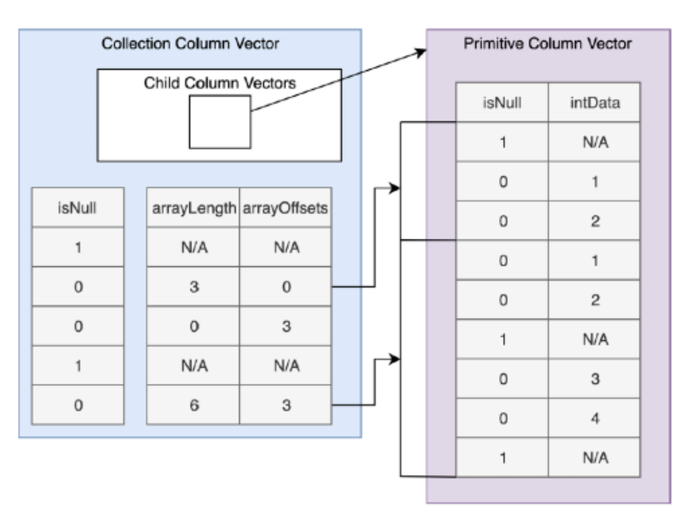
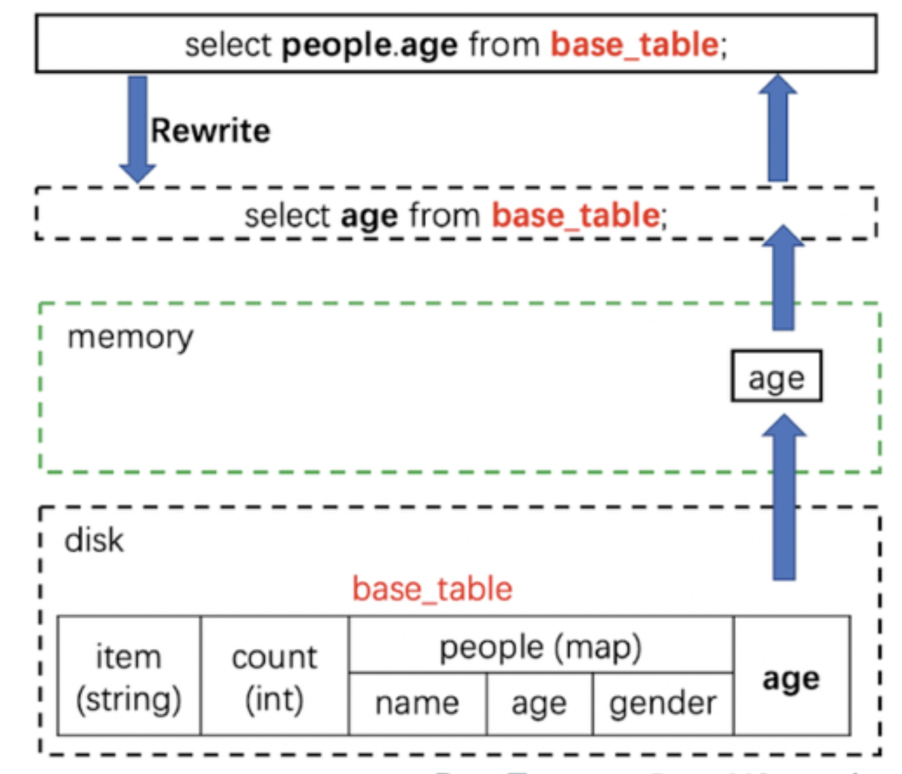
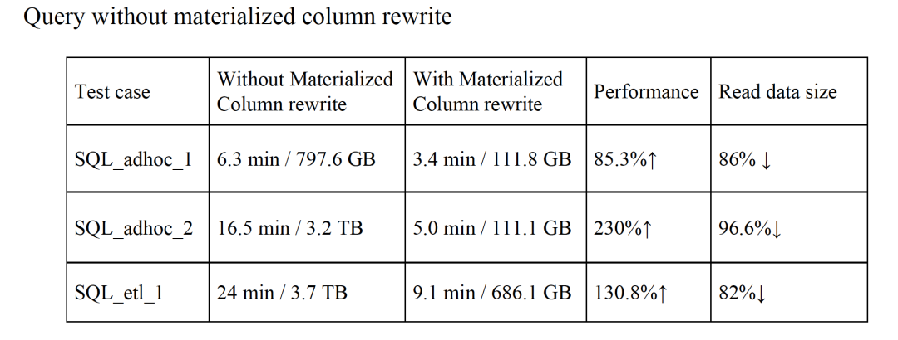

# Spark 实战

## [Hive 迁移到 SparkSQL](https://mp.weixin.qq.com/s?__biz=MzA5MTc0NTMwNQ==&mid=2650718982&idx=1&sn=7687fb3360072885b6cb0a264b067f07)

### [JDBC-Spark Thrift Server的SQL执行的进度日志](https://github.com/apache/spark/pull/19961)

Spark-2.3 已修复。

### 小文件问题

SparkSQL 在写数据时会产生很多小文件，会对 namenode 产生很大的压力，进而带来整个系统稳定性的隐患。

- 通过 Coalesce and Repartition 的SQL hint 定义输出文件个数；
- 程序方式定时扫描合并；
- [`spark.hadoop.mapreduce.fileoutputcommitter.algorithm.version`](../spark_output.md)设置为2，解决commit耗时问题；

### Spark作业监控

- 近实时的读取 EventLog 产生的 Spark 事件，通过事件回放并结合 REST API 最终形成我们需要的 Job 数据；
- Spark + Prometheus

### SQL多引擎自动选择

 SQL 引擎选择通过 SQL 解析，语法检查，规则匹配，各个引擎的资源负载情况等等因素最终给用户选择合适的引擎（Presto/SparkSQL/Hive ）来执行计算

### 低效且危险的 Not in Subquery

`select * from t1 where f1 not in (select f1 from t2)`，对于 “ not in subquery ”的场景最终都会选择 **BroadcastNestedLoopJoinExec** （？？）物理执行计划，而 **BroadcastNestedLoopJoinExec** 是一个非常低效的物理执行计划，内部实现将 subquery `broadcast` 成一个 `list`，然后 t1 每一条记录通过 `loop` 遍历 list 去匹配是否存在。由于它的低效可能会长时间占用 executor 资源，同时 subquery 结果数据量比较大的情况下，broadcast 可能带来 driver 的 OOM 风险。

## [物化列-嵌套列查询性能低下的优化](https://mp.weixin.qq.com/s/8mOsNJ7VCAH2OYP2T5T9Zg)

### 场景

- 不同的事件日志有很多不同的信息，**为事件日志的每个字段都创建一个列存储是非常不明智**，所以在字节事件日志的存储就两列 Event type（String类型）和 Message（Map类型）。所有的事件信息都是存放在 Message 中的；
- 维度数据（Dimension data），维度表里面的数据是从 MySQL dump 过来的。MySQL 中对应表的字段可能会增加，也可能会减少。**在维度表里面不能简单的删除对应的列**，否则数据可能会丢失。所以对于维度数据，一些常用的列是以一列一列单独存储的；其他一些列是存储在一个 map 类型的列中。

### 问题

在数据仓库领域，使用**复杂类型**（如map）中的一列或多列，对性能影响比较大：

- **大量消耗 IO**，因为读取该列时需要将整个列读出来；
- 读取嵌套类型列时**不能利用向量化**读取；
- 读取嵌套列时**不能使用算子下推**（Filter pushdown）。

### 解决方法

示例：base_table 的表，里面有三个字段：item、count 以及 people，其中 people 字段是 map 类型的。现在我们要查询 people 字段里面的 age 字段。

#### 单独表

sub_table 的表：

- 除了包含 base_table 的所有字段之外还新增了一个新字段 age，这个字段其实是 people 中 age 字段的值。

缺点：

- 告诉下游所有使用到 base_table 的用户来使用 sub_table；
- sub_table 明显占用了重复的存储；
- 不能处理频繁的子字段更改

#### 嵌套列的向量化读

**Parquet vectorized reader**，可以向量化读取嵌套数据类型。并且支持对 struct 类型的过滤下推，但是 map 类型的数据并不支持。

缺点：

- 需要分别重构 Parquet 和 ORC 的向量化读取逻辑；
- Array/Map 数据类型的过滤下推目前还不支持；
- 嵌套类型数据的向量化读取性能没有简单数据类型的高

#### 物化列

物化列（materialized column），透明地解决了**任意列式存储**（不仅仅是Parquet）的上述问题：

- 添加 MATERIALIZED 关键字；
- **？需要对Parquet文件读取，进行重新写？**

结果：

- 往表里面插入了一个名为 age 字段，自动插入；
- rewrite 成 `select age from base_table`，自动读取；

### 性能

物化列的性能：查询性能均有很大提升，查询读的数据量大大减少。

