[toc]

# 性能分析工具 

## Spark 原生

### Spark Metrics


### Advanced Instrumentation

分析Spark jobs的工具:  **对于多作业同时运行，难以分析每个应用的性能；**

- 集群级别的监控工具：如 [Ganglia](http://ganglia.sourceforge.net/), 提供集群整体利用率和资源瓶颈分析；
- OS分析工具：如 [dstat](http://dag.wieers.com/home-made/dstat/), [iostat](http://linux.die.net/man/1/iostat), 和 [iotop](http://linux.die.net/man/1/iotop)；
- JVM系列工具：如 `jstack`提供栈分析, `jmap`分析堆快照，`jstat` 报告时间序列的统计信息， `jconsole`，`jvisualvm`，`jmc`等。

Spark提供插件API，支持在应用中添加`custom instrumentation code`：

- `spark.plugins`
- `spark.plugins.defaultList`

支持“,”分隔的类名（实现 `org.apache.spark.api.plugin.SparkPlugin` 接口）。

- 确保自定义的plugin的jar包，spark应用可见；

## Uber JVM Profiler

见 [spark的executor的性能分析使用](../../languages/java/performance/jvm_profile.md )

### 问题分析

https://github.com/g1thubhub/phil_stopwatch

https://g1thubhub.github.io/4-bigdata-riddles

### 需要的监控功能

横轴：

- **时间**
- **Stage的开始和结束节点**；（Spark Timeline）
- **Task的开始和结束节点**；（Spark Timeline，但是没有整合所有Stage的Task的同一个视图）


时间作为横轴：

- **进程的CPU使用率**；（非常有用）
- **进程的内存使用率，堆和非堆内存**；（分配合适的内存）
- **同一时间并发的任务数**；**任务的执行时序图**；
- 节点的CPU使用率；（监控软件可看）
- 节点的内存使用率；（监控软件可看）


### The Fatso（瓶颈点）

需要对 JVM 进行**堆栈进行profile**，找出耗时的函数。


### The Straggler（拖后腿者）

通过Task的开始和结束时间，可以找出Straggler。

通过同一时间的并发任务数，可以找出Straggler（有的时间只有极少数并发）。


### The Slacker（懒惰者）

cpu利用率低？系统大部分空闲，stage是和外部DB或者HDFS进行交互，没有使用足够的写分区。

通过CPU profile和火焰图，可以看出**函数耗时但CPU利用率不高，在做IO**的事情。


### The Heckler

第三方库中比较重的对象创建使用方式：

- 每条记录创建一个，map
- 每个分区创建一个，mapPartition
- 多线程安全，则Broadcast，每个executor一个

从日志中截取信息，正则匹配，获取Top N进行展示；


崩溃的原因通常不是很明显，需要对日志文件进行筛选，从日志中就截取错误信息，按时间顺序倒排显示


## Sparklens

### 前言

> 2021/10/18

造成 Spark 任务性能低下的原因主要有 3 个：

- Driver 计算时间长；
- 存在任务倾斜；
- 任务数不够，存在并行度问题；


根据情况，可以实现两个优化目标：

- 减少应用程序的运行时间；
- 通过使用更少的资源使其更好地工作；


​		任何 Spark 应用程序的性能都可通过 Yarn Web UI 或 Spark Web UI 来观察，但没有提供详细指标。现有多种工具可用于 Spark 性能监控，提供了更详细的应用程序性能细节：

- [Sparklens](https://github.com/qubole/Sparklens)
- [Sparklint](https://github.com/qubole/Sparklens)：最新版本2018年
- [Dr. Elephant](https://github.com/linkedin/dr-elephant)：A job and flow-level performance monitoring and tuning tool for Apache Hadoop and Apache Spark
- [SparkOscope](https://github.com/ibm-research-ireland/sparkoscope) ：最新版本2017年

### 一、什么是 Sparklens

Sparklens 是一个内置 Spark Scheduler 模拟器的 Spark 分析和性能预测工具。

Sparklens 作用：

- 使用户更容易理解 Spark 任务的可伸缩性限制。
- 有助于了解给定 Spark 任务使用的计算资源的效率。
- 提供 Spark 任务各个阶段的各种信息。
- 提供了可用于优化的后续步骤的想法。
- 有助于将 Spark 应用程序调优作为一种定义明确的方法/过程。

### 二、如何使用Sparklens

可以通过以下方式使用 Sparklens：

- 和 Spark 任务一同运行；
- 在 Spark 任务运行后运行；
- 从 event-log 里获取报告；

`sparklens_2.11-0.3.2.jar` 以 scala-2.11 编译，确保Scala和Java版本与Spark集群所需的版本相对应。目前支持，Java 7/8、Scala 2.11.8和Spark 2.X。  

以下操作基于 Spark 2.4.4、Java 8、Scala 2.11.8

#### 1、和 Job 一起运行

​		这种方式是指当你的job在运行的时候，Sparklens 会实时的开始收集job的运行信息，最后打印结果。

​		只要你的节点能联网，那么只需要在使用 `spark-submit` 或 `spark-shell` 时，加上如下两行（如果没有网，你也可以从网上下载 package 之后打包运行）：

```
--packages qubole:sparklens:0.3.2-s_2.11
--conf spark.extraListeners=com.qubole.sparklens.QuboleJobListener
```

例：

```
spark-submit \
--master spark://hadoop004:7077 \
--packages qubole:sparklens:0.3.2-s_2.11 \
--conf spark.extraListeners=com.qubole.sparklens.QuboleJobListener \
--class sparksqltest.SparkSQLtest SparkSQLtest.jar
```

或

```
spark-shell \
--master spark://hadoop004:7077 \
--packages qubole:sparklens:0.3.2-s_2.11 \
--conf spark.extraListeners=com.qubole.sparklens.QuboleJobListener
```

#### 2、Job 跑完之后使用

​		你可以选择不在任务运行时运行 Sparklens，但在任务运行后使用 Sparklens。这种方式会在你的 job 运行时生成一个 Json 文件，路径默认是 /tmp/Sparklens。如果你想要设置自己的路径，可以通过配置 spark.sparklens.data.dir 来完成。

1. 首先你需要在运行你自己的 spark job 的时候在提交命令里面加上：

   ```
   --packages qubole:sparklens:0.3.2-s_2.11
   --conf spark.extraListeners=com.qubole.sparklens.QuboleJobListener
   --conf spark.sparklens.reporting.disabled=true
   ```

2. 之后根据生成的 Json 文件，另外启动一个 Job 来获取分析你的 Sparklens 的报告结果：

   ```
   spark-submit \
   --packages qubole:sparklens:0.3.1-s_2.11 \
   --class com.qubole.sparklens.app.ReporterApp qubole-dummy-arg <filename>
   ```

例，之前所示 spark 任务离线运行 Sparklens：

```
spark-submit \
--master spark://hadoop004:7077 \
--packages qubole:sparklens:0.3.2-s_2.11 \
--conf spark.extraListeners=com.qubole.sparklens.QuboleJobListener \
--conf spark.sparklens.reporting.disabled=true \
--conf spark.sparklens.data.dir=/home/hadoop \
--class sparksqltest.SparkSQLtest SparkSQLtest.jar
```

通过控制台日志可查看生成的 Json 文件保存路径：

> Saving sparkLens data to /home/hadoop/app-20211012144030-0017.sparklens.json

启动一个 Job 来获取分析你的 Sparklens 的报告结果：

```
spark-submit \
--packages qubole:sparklens:0.3.2-s_2.11 \
--class com.qubole.sparklens.app.ReporterApp qubole-dummy-arg /home/hadoop/app-20211012144030-0017.sparklens.json
```

#### 3、从event-log里面获取

​		这种方式就是根据 event log 来生成 Sparklens 的报告，当然你需要在你的 spark job 里面 enable event-log。这种方法支持 event log 文件所支持的任何文件形式：**text、 snappy、lz4、lzf**

```
spark-submit \
--packages qubole:sparklens:0.3.1-s_2.11 \
--class com.qubole.sparklens.app.ReporterApp qubole-dummy-arg <filename> source=history
```

也可以使用以下命令将事件历史文件转换为Sparklens Json文件:

```
spark-submit \
--packages qubole:sparklens:0.3.2-s_2.11 \
--class com.qubole.sparklens.app.EventHistoryToSparklensJson qubole-dummy-arg <srcDir> <targetDir>
```

例，之前所示 spark 任务从 event-log 里获取 Sparklens 的报告：

```
spark-submit \
--master spark://hadoop004:7077 \
--conf spark.eventLog.enabled=true \
--conf spark.eventLog.dir=/home/hadoop/data \
--class sparksqltest.SparkSQLtest SparkSQLtest.jar
```

从event-log里面获取 Sparklens 的报告：

```
spark-submit \
--packages qubole:sparklens:0.3.2-s_2.11 \
--class com.qubole.sparklens.app.ReporterApp qubole-dummy-arg /home/hadoop/data/app-20211012145019-0018 source=history
```

将事件历史文件转换为 Sparklens Json 文件:

```
spark-submit \
--packages qubole:sparklens:0.3.2-s_2.11 \
--class com.qubole.sparklens.app.EventHistoryToSparklensJson qubole-dummy-arg /home/hadoop/data/app-20211012145019-0018 /home/hadoop/data
```

### 三、Sparklens 报告提供的详细性能指标

Sparklens 报告提供非常详细的的性能指标：

#### 1、基于任务的汇总指标

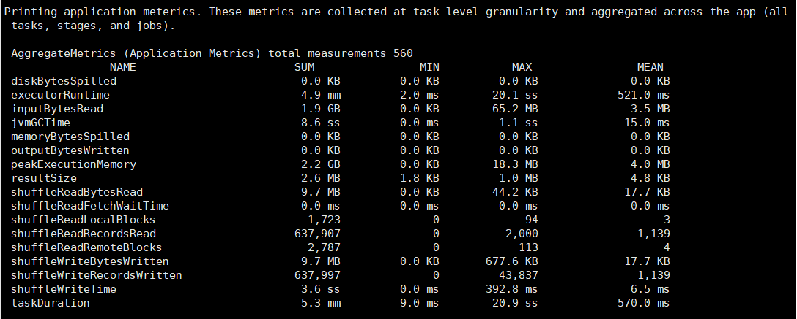

#### 2、任务运行时长

​		job/stage 时间表，显示作业中并行阶段是如何调度的。这使得在作业级别很容易可视化带有阶段依赖性的DAG。

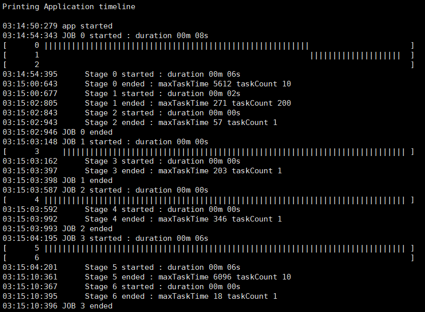

#### 3、Spark 是否高效

​		Spark任务的总时间可以分为花费在驱动程序上的时间和花费在执行程序上的时间。当 Spark 应用程序在驱动程序上花费太多时间时，就会浪费执行程序的计算时间。

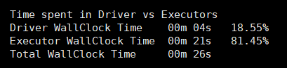

| 列名                | 说明                                      |
| ------------------- | ----------------------------------------- |
| Driver WallClock    | 驱动程序完成执行所需的总时间。            |
| Executors WallClock | 所有 executors 完成其执行所花费的总时间。 |
| Total WallClock     | Driver WallClock + Executors WallClock    |

#### 4、理想应用程序运行时间的估计

​		理想的应用程序时间是通过假设应用程序的所有阶段的数据的理想分区（任务 = 核心和无偏斜）来计算的。

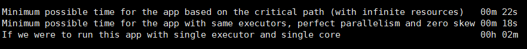

#### 5、最佳执行者数量

​		可以看到在任何给定时间有多少个 executor 可用。Sparklens 绘制了应用程序中不同 Spark 作业使用的执行程序，以及可以在相同的挂钟时间内完成相同工作的最少数量的执行程序（理想情况）。

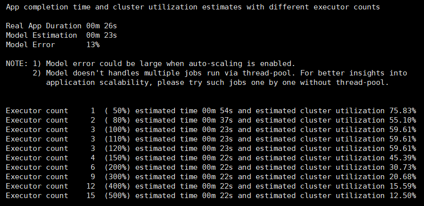

#### 6、计算资源使用情况

​		它告诉我们有多少分配给应用程序的计算资源根本没有使用。

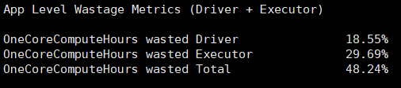

#### 7、各阶段参数

​		许多有趣的阶段参数，如输入、输出、Shuffle输入和每个阶段的Shuffle输出。

​		OneCoreComputeHours 可用，每个阶段使用它来发现低效的阶段。

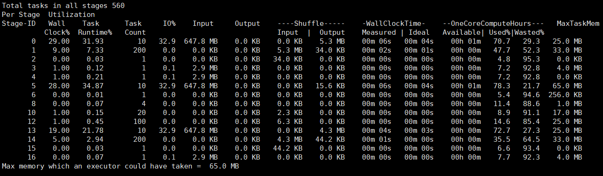

#### 8、每阶段指标

​		由于缺乏任务或偏差，执行器也可能浪费计算时间。

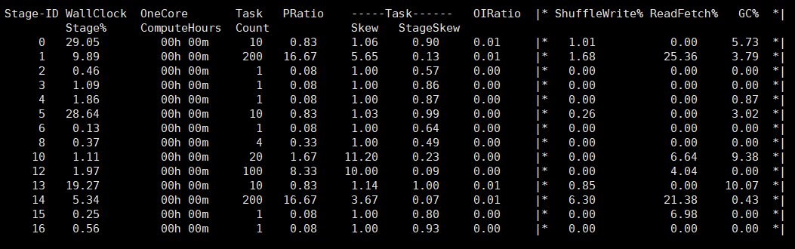

其中：

| 列名         | 说明                                                         |
| :----------- | ------------------------------------------------------------ |
| PRatio       | stage 中任务数除以核数，表示 stage 中的并行度。PRatio > 1 => 任务过多，PRatio < 1 => 内核过多。 |
| TaskSkew     | stage 中最大任务的持续时间除以中位数任务的持续时间，表示 stage 中的倾斜程度。越低越好。 |
| TaskStageSke | stage 中最大任务的持续时间除以该阶段的总持续时间。表示最大任务对 stage 的时间影响。越低越好。 |
| OIRatio      | 输出与输入比。stage 的总输出(结果+ shuffle 输出)除以总输入(输入数据+ shuffle 输入)。 |

下面这些指标代表了这个阶段的时间分布：

| 列名         | 说明                                                     |
| :----------- | -------------------------------------------------------- |
| ShuffleWrite | 在 stage 阶段中所有任务进行 shuffle 写入所花费的百分比。 |
| ReadFetch    | 在 stage 阶段中所有任务进行 shuffle 读所花费的百分比。   |
| GC           | 在 stage 阶段中所有任务进行 GC 所花费的百分比。          |

### 四、Sparklens UI

​		所有上述参数也可以通过 Sparklens UI 以图形方式观察，将得到的 Sparklens Json 文件上传至 http://sparklens.qubole.com/，即得到一份 Sparklens UI 图形界面。

Sparklens UI 包括五个关键组件：

- 效率统计；
- 模拟；
- 每阶段指标；
- 理想执行器；
- 聚合指标。

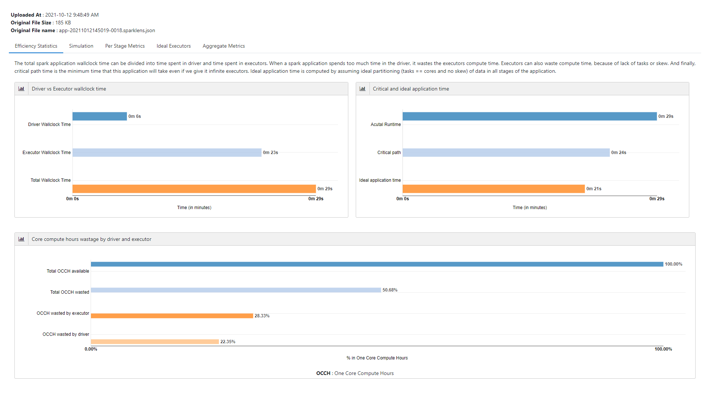

### 五、使用 Streaming 流应用程序

​	Streaminglens 是运行在微批处理模式下的 Spark 结构化流应用程序的分析工具。由于每个微批的执行计划是相同的，可以不断地从以前的微批学习，以预测下一个微批的理想 spark 集群配置。Streaminglens 每5分钟分析最后一个微批处理的执行运行，给出流管道健康状况的总体概念。

​	在分析过程中，Streaminglens计算完成微批处理的临界时间。Critical Time是指在无限个执行器的情况下， Spark 作业完成所需的最小时间。

​	根据关键时间、实际批处理运行时间的比较，streaminglens决定流管道的状态为`Optimum`, `Underprovisioned`, `Overprovisioned` or `Unhealthy`，并给出适当的建议来调优 spark 集群。

#### 一、Streaming Pipeline 状态

| 状态             | 描述                                                         |
| ---------------- | ------------------------------------------------------------ |
| No New Batches   | 管道中没有新的数据。如果这种状态在数据摄入后仍然存在，可能会有一些批处理被卡住，请检查Spark UI。 |
| Overprovisioned  | 批处理完成时间远远少于预期的SLA，因此您可以降低集群规模以降低成本。另一方面，如果你看到这个状态，但流是滞后的，降低触发间隔或检查具体的建议。 |
| Optimum          | 流媒体管道正在轻松地满足SLA。                                |
| Underprovisioned | 您需要升级集群来匹配预期的微批处理SLA。                      |
| Unhealthy        | 您需要通过改变spark集群或管道配置来增加Source级别的摄入。    |

#### 二、如何获取报告？

可以通过以下方式获取 Streaminglens 报告：

- 打印在Spark Application的驱动日志中。
- Streaminglens 通过 Dropwizard 发布其指标。您可以通过Apache Spark中任何受支持的指标集查看这些指标。
- 您可以使用自己的自定义报告器，以每一小时查看流管道的聚合运行状况和建议。

#### 三、Streaminglens 报告提供的信息

Streaminglens在分析了上一个微批的执行后提供以下报告：

- 批量运行时间，临界时间和触发间隔的比较；
- 流管道的状态为`Underprovisioned`, `Optimum`, `Overprovisioned` or `Unhealthy`。
- 每一小时对流管道进行聚合状态，并提供建议，以防管道不是最优的。

驱动程序日志中的一个示例如下所示：

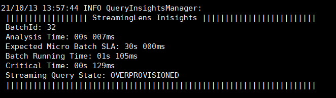

#### 四、怎样使用 Streaminglens ？

##### 1、添加 streaminglens 包至 Spark 任务中

​		通过使用`--packages`命令行选项，可以将 Streaminglens jar 添加到通过 Spark -shell 或 Spark -submit 启动的Spark作业中。例如：

```
spark-shell --packages com.qubole:spark-streaminglens_2.11:0.5.3
```

或

```
spark-submit \
--master spark://hadoop004:7077 \
--packages com.qubole:spark-streaminglens_2.11:0.5.3 \
--class SparkStreamingWordCount SparkStreamingtest.jar
```

或者，可以从https://mvnrepository.com/artifact/com.qubole/spark-streaminglens_2.11/0.5.3中下载 jar，使用`--jars`选项将它添加到 spark-submit 命令行选项中，例：

```
spark-submit \
--class spark://hadoop004:7077 \
--jars /home/hadoop/spark-streaminglens_2.11-0.5.3.jar \
--class StructuredStreamingWordCount SparkStreamingtest.jar 
```

##### 2、初始化 streaminglens

需要通过以下方式初始化 streaminglens 

1. 添加环境依赖

   ```xml
   <dependency>
   	<groupId>com.qubole</groupId>
   	<artifactId>spark-streaminglens_2.11</artifactId>
   	<version>0.5.3</version>
   </dependency>
   ```

2. 初始化 streaminglens 

   ```scala
   import com.qubole.spark.streaminglens._
   
   var options: Map[String, String] = Map();
   options += ("streamingLens.analysisIntervalMinutes" -> "1");
   val streamingLens = new StreamingLens(spark,options)
   ```

##### 3、使用自定义的报告

可以使用自己的自定义报告器来报告流管道的聚合运行状况和相关建议。只需编写类继承`streaminglen7sreporterinterface` ，并通过`streamingLens.reporter.className`选项传递类名，并将`streamingLens.reporter.enabled`设置为true。还可以通过`streamingLens.reporter.intervalMinutes`选项配置报告频率。默认情况下，聚合运行状况和建议每一小时报告一次。

```scala
var options: Map[String, String] = Map();
options += ("streamingLens.reporter.className" -> "streamingLensreport");
options += ("streamingLens.reporter.enabled" -> "true");
options += ("streamingLens.reporter.intervalMinutes" -> "60");
val streamingLens = new StreamingLens(spark,options)
```

##### 4、配置 StreamingLens 选项

Streaminglens 支持多种配置选项：

| 名称                                                         |     默认      | 含义                                                         |
| ------------------------------------------------------------ | :-----------: | ------------------------------------------------------------ |
| `streamingLens.analysisIntervalMinutes`                      |    5 mins     | 微批次分析的频率。                                           |
| `streamingLens.criticalPathAnalysis. overProvisionPercentage` | 0.3 (or 30%)  | 将 spark 集群视为 over-provisoned 状态的百分比，例如:如果批处理运行时间小于预期微批SLA的30%，则认为集群状态为 over-provisoned。 |
| `streamingLens.criticalPathAnalysis. underProvisionPercentage` | 0.7 (or 70%)  | 将 spark 集群视为 under-provisioned 状态的百分比，例如:如果批处理运行时间超过预期微批SLA的70%，则认为集群状态为 under-provisioned。 |
| `streamingLens.criticalPathAnalysis. criticalPathPercentage` | 0.7 (or 70%)  | 考虑 spark 应用程序配置不正确的百分比，例如:如果关键时间超过预期微批SLA的70%，则认为管道不健康， spark 集群配置不正确。 |
| `streamingLens.minBatches`                                   |       1       | 在进行下一次分析之前必须完成的最少批次。                     |
| `streamingLens.maxResultsRetention`                          |      30       | 要保留在内存中的分析结果的数量。                             |
| `streamingLens.maxBatchesRetention`                          |      10       | 在内存中保留度量的批数。                                     |
| `streamingLens.maxAnalysisTimeSeconds`                       |       5       | 在超时分析之前等待的秒数。                                   |
| `streamingLens.maxRetries`                                   |       3       | 在分析过程中发生错误时的重试次数。                           |
| `streamingLens.shouldLogResults`                             |     true      | 是否在spark driver日志中打印分析结果。                       |
| `streamingLens.reporter.enabled`                             |     false     | 是否在任何自定义输出中转储分析结果。                         |
| `streamingLens.expectedMicroBatchSLAMillis`                  | 1000 * 60 * 2 | SLA的时间间隔，单位为毫秒。                                  |
| `streamingLens.reporter.className`                           |               | 报告器类的完全解析的 classname 。                            |
| `streamingLens.reporter.discountFactor`                      |     0.95      | 在计算聚合状态时，将早期微批次打折的指数因子。               |
| `streamingLens.reporter.intervalMinutes`                     |      60       | 报告流查询运行状况的频率。                                   |

##### 5. 停止 Streaminglens

可以停止 streaminglens 在一个运行的spark应用程序使用以下 streaminglens API:

```
streamingLens.stopStreamingLens()
```


### 六、Sparklens on Spark 3.X

环境版本：Hadoop 3.3.1、Spark 3.1.2、Java 8、Scala 2.12.10

#### 1、获取源码并进行编译

1. 文件 build.sbt

   ```
   scalaVersion := "2.11.8"
   crossScalaVersions := Seq("2.10.6", "2.11.8")
   spName := "qubole/sparklens"
   sparkVersion := "2.0.0"
   ```

   改为

   ```
   scalaVersion := "2.12.10"
   crossScalaVersions := Seq("2.10.6", "2.11.8", "2.12.10")
   spName := "qubole/sparklens"
   sparkVersion := "3.1.1"
   ```

2. 文件 project/plugins.sbt

   ```
   resolvers += "Spark Package Main Repo" at "https://dl.bintray.com/spark-packages/maven"
   ```

   改为

   ```
   resolvers += "Spark Package Main Repo" at "https://repos.spark-packages.org"
   ```

3. 文件 src/main/scala/com/qubole/sparklens/QuboleJobListener.scala

   ```scala
   failedStages += s""" Stage ${si.stageId} attempt ${si.attemptId} in job ${stageIDToJobID(si.stageId)} failed.
   ```

   改为

   ```scala
   failedStages += s""" Stage ${si.stageId} attempt ${si.attemptNumber} in job ${stageIDToJobID(si.stageId)} failed.
   ```

4. 文件 src/main/scala/com/qubole/sparklens/helper/HDFSConfigHelper.scala

   ```scala
   if (sparkConfOptional.isDefined) {
   	SparkHadoopUtil.get.newConfiguration(sparkConfOptional.get)
   }else {
   	val sparkConf = new SparkConf()
   	SparkHadoopUtil.get.newConfiguration(sparkConf)
   }
   ```

   改为

   ```scala
   // After Spark 3.0.0 SparkHadoopUtil is made private to make it work only within the spark
   // using reflection code here to access the newConfiguration method of the SparkHadoopUtil
   val sparkHadoopUtilClass = Class.forName("org.apache.spark.deploy.SparkHadoopUtil")
   val sparkHadoopUtil = sparkHadoopUtilClass.newInstance()
   val newConfigurationMethod = sparkHadoopUtilClass.getMethod("newConfiguration", classOf[SparkConf])
   if (sparkConfOptional.isDefined) {
   	newConfigurationMethod.invoke(sparkHadoopUtil, sparkConfOptional.get).asInstanceOf[Configuration]
   } else {
   	val sparkConf = new SparkConf()
   	newConfigurationMethod.invoke(sparkHadoopUtil, sparkConf).asInstanceOf[Configuration]
   }
   ```

5. 文件 version.sbt

   ```
   version in ThisBuild := "0.3.2"
   ```

   改为

   ```
   version in ThisBuild := "0.4.0"
   ```

#### 2、打包

```
sbt compile 
sbt package 
sbt clean 
```

#### 3、提交任务

```
spark-submit \
--master yarn \
--jars sparklens_2.12-0.4.0.jar \
--conf spark.extraListeners=com.qubole.sparklens.QuboleJobListener \
--class sparksqltest.SparkSQLtest SparkSQLtest.jar
```

```
spark-submit \
--jars sparklens_2.12-0.4.0.jar \
--class com.qubole.sparklens.app.ReporterApp qubole-dummy-arg /tmp/sparklens/application_1634174539117_0001.sparklens.json
```

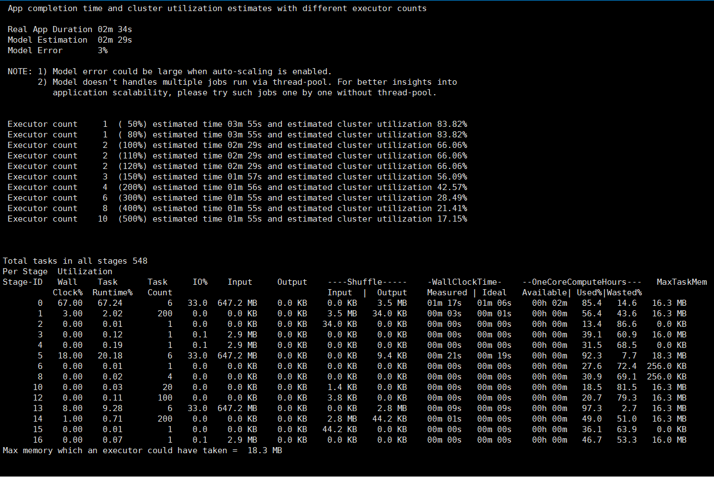


