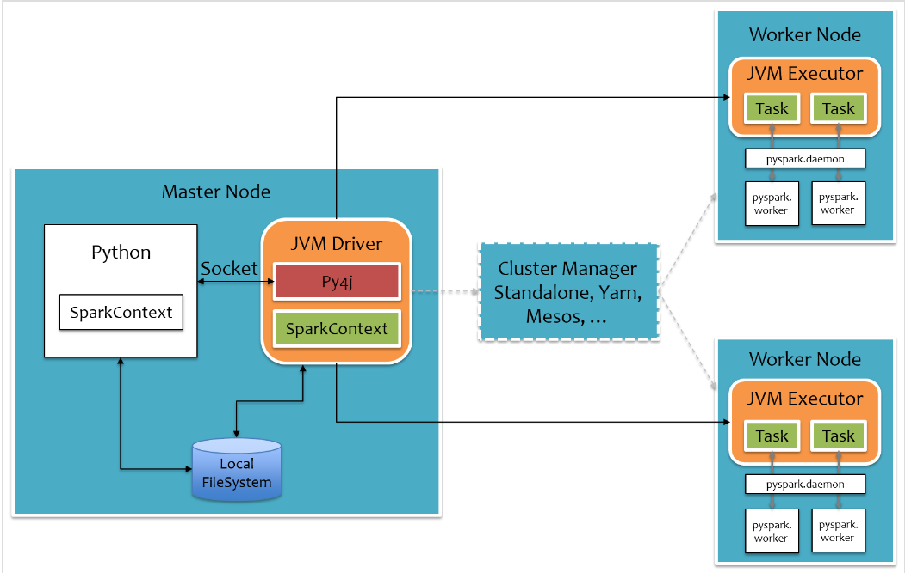

# PySpark

## 原理

其中白色部分是新增的Python进程，在Driver端，通过Py4j实现在Python中调用Java的方法，即将用户写的PySpark程序”映射”到JVM中；

在Executor端，则不需要借助Py4j，因为Executor端运行的Task逻辑是由Driver发过来的，那是序列化后的字节码。

Python进程通过Py4j调用Java方法提交Job，Job运行结果通过本地Socket被拉取到Python进程。

对于大数据量，例如广播变量等，**Python进程和JVM进程是通过本地文件系统来交互**，以减少进程间的数据传输。

每个Executor上有一个公共的pyspark.deamon进程，负责接收Task请求，并`fork pyspark.worker`进程单独处理每个Task，实际数据处理过程中，pyspark.worker进程和JVM Task会较频繁地进行本地Socket数据通信。

数据通过socket协议发送给Python Worker（不跨网络），期间需要将InternalRow转化为Java对象，然后再用**Java Pickle进行序列化**(一次)，这个时候才能通过网络发送给Worker。

