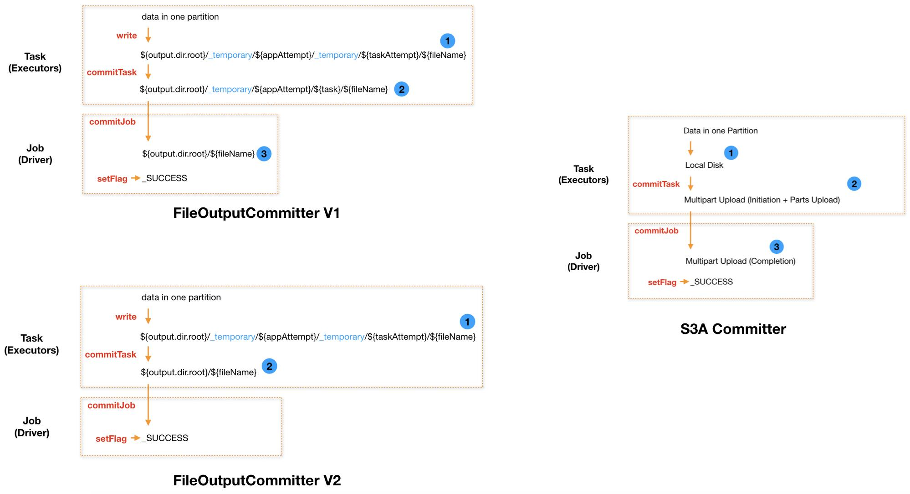

# Committers

## Batch

### Hadoop FileOutputFormat

Hadoop的`FileOutputFormat` 和 `FileOutputCommitter`，分为`commitTask, commitJob, recoveryTask, abortTask, abortJob` 几个函数。

`mapreduce.fileoutputcommitter.algorithm.version`：默认为1

- 值为1时：
  - Task 线程将 TaskAttempt 数据写入 `${output.dir.root}/_temporary/${appAttempt}/_temporary/${taskAttempt}`
  - commitTask 由 Task 线程将 `${output.dir.root}/_temporary/${appAttempt}/_temporary/${taskAttempt}` 移动到 `${output.dir.root}/_temporary/${appAttempt}/${taskAttempt}`
  - **commitJob 由 Driver 单线程依次将所有** `${output.dir.root}/_temporary/${appAttempt}/${taskAttempt}` 移动到 `${output.dir.root}`，然后创建 `_SUCCESS` 标记文件
  - recoverTask 由 Task 线程将 `${output.dir.root}/_temporary/${preAppAttempt}/${preTaskAttempt}` 移动到 `${output.dir.root}/_temporary/${appAttempt}/${taskAttempt}`
- 值为2时：（hadoop 2.7 之后版本）
  - Task 线程将 TaskAttempt 数据写入 `${output.dir.root}/_temporary/${appAttempt}/_temporary/${taskAttempt}`
  - commitTask 由 Task 线程将 `${output.dir.root}/_temporary/${appAttempt}/_temporary/${taskAttempt}` 移动到 `${output.dir.root}`
  - commitJob 创建 `_SUCCESS` 标记文件
  - recoverTask 无需任何操作

**V1 vs. V2 committer 性能对比**

- V1 在 Job 执行结束后，**在 Driver 端通过 commitJob 方法，单线程串行将所有 Task 的输出文件移动到输出根目录**。移动以文件为单位，当 Task 个数较多（大 Job，或者小文件引起的大量小 Task），Name Node RPC 较慢时，该过程耗时较久。在实践中，可能因此发生所有 Task 均执行结束，但 Job 不结束的问题。甚至 commitJob 耗时比 所有 Task 执行时间还要长
- 而 V2 在 Task 结束后，由 Task 在 commitTask 方法内，将自己的数据文件移动到输出根目录。一方面，Task 结束时即移动文件，不需等待 Job 结束才移动文件，即文件移动更早发起，也更早结束。另一方面，**不同 Task 间并行移动文件，极大缩短了整个 Job 内所有 Task 的文件移动耗时**

**V1 vs. V2 committer 一致性对比**

- V1 只有 **Job 结束，才会将数据文件移动到输出根目录，才会对外可见**。在此之前，所有文件均在 `${output.dir.root}/_temporary/${appAttempt}` 及其子文件内，对外不可见。
  -  commitJob 过程可能耗时较久，如果在此过程中，Driver 失败，则可能发生部分 Task 数据被移动到 ${output.dir.root} 对外可见，部分 Task 的数据未及时移动，对外不可见的问题。此时发生了数据不一致性的问题
- V2 当 **Task 结束时，立即将数据移动到 ${output.dir.root}，立即对外可见**。如果 Application 执行过程中失败了，已 commit 的 Task 数据仍然对外可见，而失败的 Task 数据或未被 commit 的 Task 数据对外不可见。也即 V2 更易发生数据一致性问题

### S3ACommitter

> [Apache Hadoop Amazon Web Services support – Committing work to S3 with the S3A Committers](https://hadoop.apache.org/docs/r3.1.1/hadoop-aws/tools/hadoop-aws/committers.html)
>
> staging(directory/partitioned), magic committer
>
> - *MinIO 没有一致性缺点，因为它是严格一致*，可以使用 **magic committer**（high performance than stage committer）；

**stage committer**

- 采用S3 Multipart Upload机制替换了Rename机制；
  - S3而言，Rename不仅仅会带来性能问题，还可能因为S3的“最终一致性”特性而失败
    - rename 等价于 使用List + Copy + Delete三个动作，但是**没有原子性**；
    - 最终一致性，会导致文件新增/删除时，**List可能会拿到缺失的信息或者被删除的信息**；
  - 每个Task中将数据先写入到本地磁盘，然后采用**Multipart Upload**方式上传到S3；
  - 所有Task都完成后，由 Job 统一向 S3发送Complete信号，此时文件对外可见；
    - 这里的 RPC 次数是针对每个Task的文件都要发送一次？
- 也可以在 CommitTask 阶段，进行 `Upload Completion` （类似 FileOutputFormat V2）； 

### FileCommitProtocol

Spark 自身抽象出来的 File Commit 协议，定义了 setupJob, commitTask 等阶段。

- RDD：`SparkHadoopWriter`->`HadoopMapReduceCommitProtocol`
- DataFrame：`DataSource`->`InsertIntoHadoopFsRelationCommand` -> `SQLHadoopMapReduceCommitProtocol`

## Streaming

### ManifestFileCommitProtocol

> tracks the list of valid files in a manifest file, used in structured streaming.