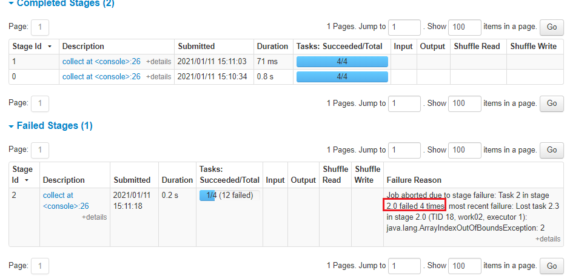

[toc]

# Spark重试

## ApplicationMaster 重试

## Executor 重试

参数：**spark.yarn.max.executor.failures= max(** numExecutors * 2 , 3)

说明：如果 executor failed 一定数量后，整个 Spark 任务就会kill 掉。

## Stage 重试

参数：spark.stage.maxConsecutiveAttempts=默认为 4

说明：在一个 stage 被中止之前，允许的连续 stage 重试的次数

### RDDBarrier

- Stage是ShuffleMapStage，则会终止该Stage所有Task，并进行Stage整体重试，超过重试次数（默认4），作业失败；
- Stage是ResultStage，则不会重试，作业失败；

## Task 重试

### 配置

- spark.task.maxFailures

 默认为 4次，允许重试次数=此值-1。

### 什么情况会重试？

当RDD进行Map的时候，抛出 ArrayIndexOutOfBoundsException 时，Spark已经进行重试，**即只要抛出异常都会重试**

- Task 2 in stage 2.0 **failed 4 times**

### 重试失败结果

Task 重试次数超过 `spark.task.maxFailures`，则 **taskSet 会失败，即一个 stage 失败。stage 失败导致整个 Job 就失败**，spark 会取消该 stage 对应的 job 包含的所有 task，并**返回用户任务执行失败**。