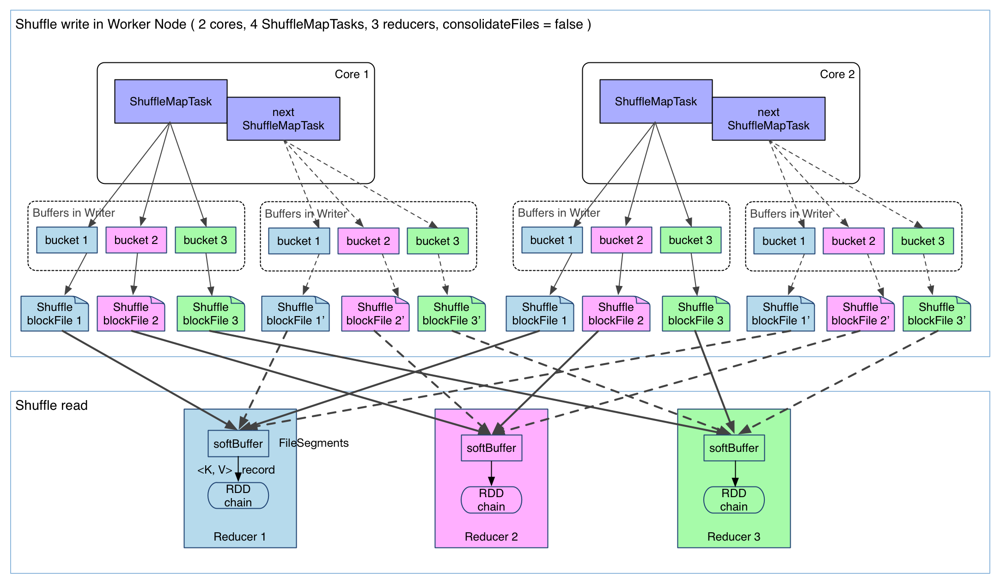
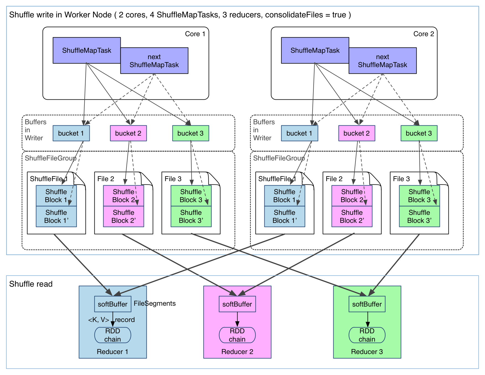
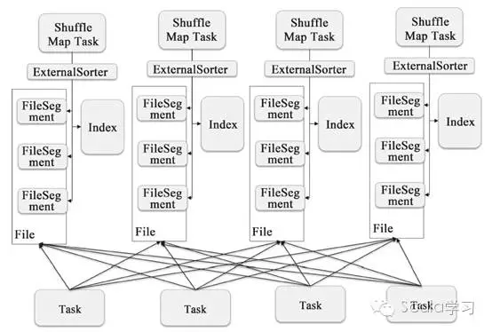

[TOC]

# Spark Shuffle

## Spark Shuffle的方式

m：shuffle前的分区数（即map数），r：shuffle后的分区数（即reduce数）

### HashShuffle(1.6.0版本后移除)

- 0.8.1版本之前产生文件数为 m * r，产生中间文件太大，扩展性差；

  

- 0.8.1版本后引入 file consolidation，每个core上的map共用文件（同时最多运行core个map）和缓存，文件个数为cores *  r；

  

假如下游 Stage 的分区数 N 很大，还是会在每个 Executor 上生成 N 个文件，同样，如果一个 Executor 上有 K 个 Core，还是会开 K*N 个 Writer Handler，所以这里仍然容易导致OOM。

### SortShuffle

Spark 参考了 MapReduce 中 Shuffle 的处理方式，引入基于排序的 Shuffle 写操作机制。

#### BypassMergeSortShuffleWriter

- Hash Shuffle的一种改进，的Shuffle操作
  - r分区对应r个单独的文件，map端数据直接写到对应的文件里，最后再将这些文件合并，生成index和data文件；
  - 需要并发打开多个文件，对内存的消耗较大；
- 使用条件：
  -  分区数小于spark.shuffle.sort.bypassMergeThreshold(default 200)，且没有map端的combine；
  - 默认Sort（分区数小于200）时，采用该排序；

#### SortShuffleWriter

- 1.2版本后引入，**每个map只输出一个reduce文件和一个index文件，index文件根据reducer序号得到数据偏移量**

  
  
#### UnsafeShuffleWriter

- 直接在serialized binary data上sort而不是java objects，减少了memory的开销和GC的overhead；
- 提供cache-efficient sorter，使用一个8bytes的指针，把排序转化成了一个指针数组的排序；
- spill的merge过程也无需反序列化即可完成；

Shuffle的方式通过SortShuffleManager类中registerShuffle函数进行判断，使用BypassMergeSortShuffleWriter、UnsafeShuffleWriter还是SortShuffleWriter。

## Spark Shuffle 原理/流程

[流程思维导图](./materials/Shuffle Service.xmind)

## Spark Shuffle With HDFS

### 问题和解决方案

>  参考 字节跳动+PasaLab 的实践

**稳定性**：Spark阶段的Shuffle Write的数据存储于Mapper的本地磁盘，只有一个副本。如果该**机器出现故障或者I/O满载、CPU满载时，Reducer无法读取该数据，造成FetchFailedException，进而引起重试Stage**。重试会造成作业的执行时间增长，同时，执行时间越长，出现Shuffle数据无法读取的可能性越大，造成更多的重试，如此的恶性循环导致作为执行失败。

**性能**：每个 Mapper 的数据会被大量 Reducer 读取，对于 Mapper 输出文件而言，存在大量的随机读取。而 HDD 的随机 IO 性能远低于顺序 IO。最终的现象是，Reducer 读取 Shuffle 数据非常慢。

**解决方案**：通过**将Shuffle的中间数据在存储到本地磁盘之后，再上传到HDFS创建副本**。Reducer首先通过External Shuffle Service读取Shuffle数据，如果读取失败，再从HDFS读取。

- **直接写HDFS，会造成NameNode压力过大，性能下降**，如10000个reducer和mapper，需要读取数据和索引文件共 2 亿次；

### 代码实现原理

[Shuffle HDFS 导图](./materials/Spark Shuffle HDFS.xmind)

### 工程

见github相关项目：https://github.com/oap-project/remote-shuffle，https://github.com/uber/RemoteShuffleService

