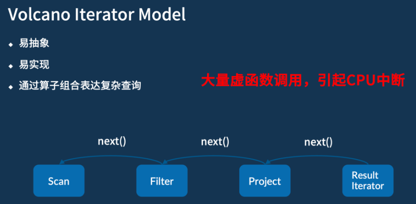
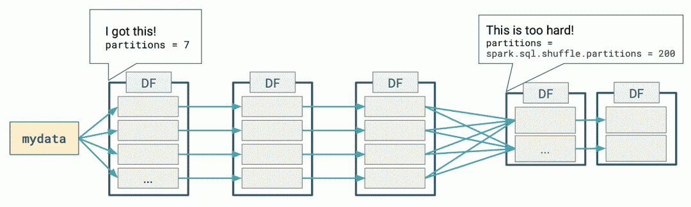
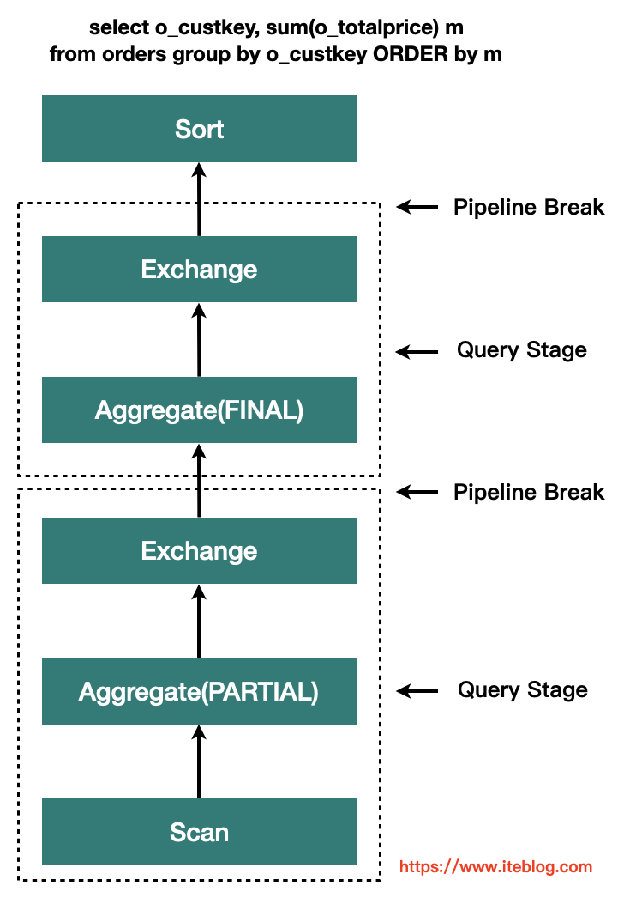
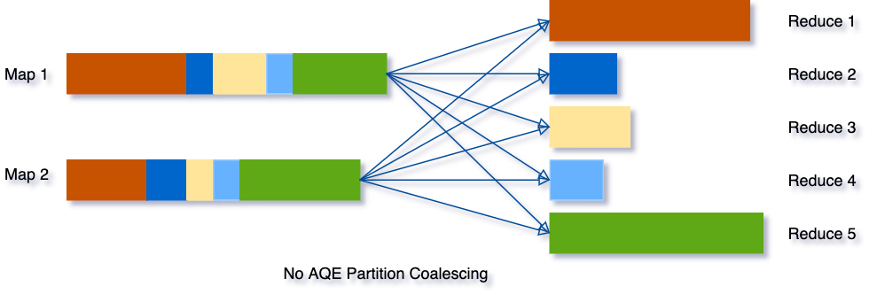
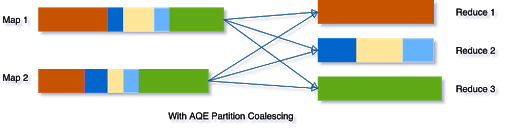
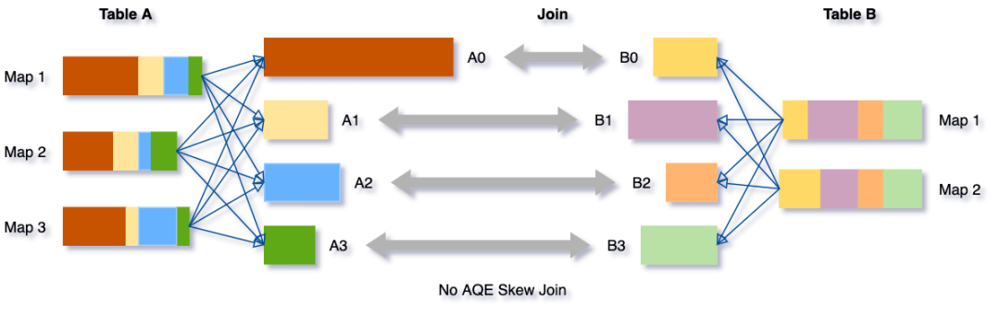
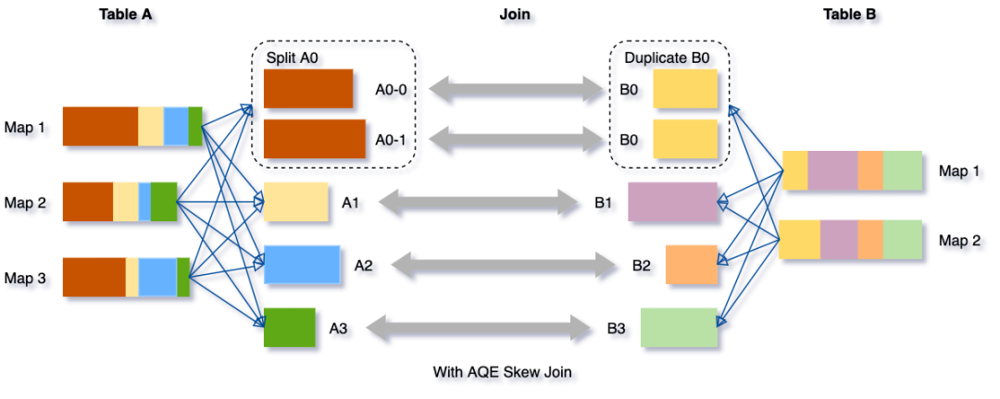
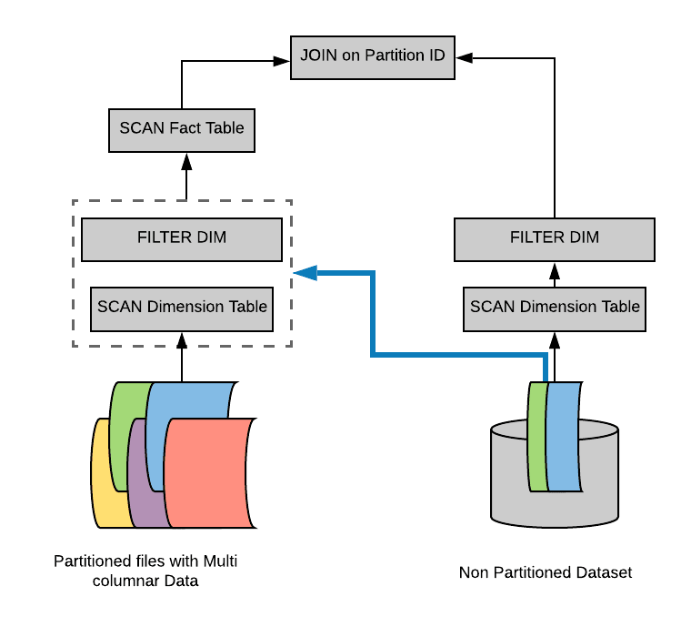
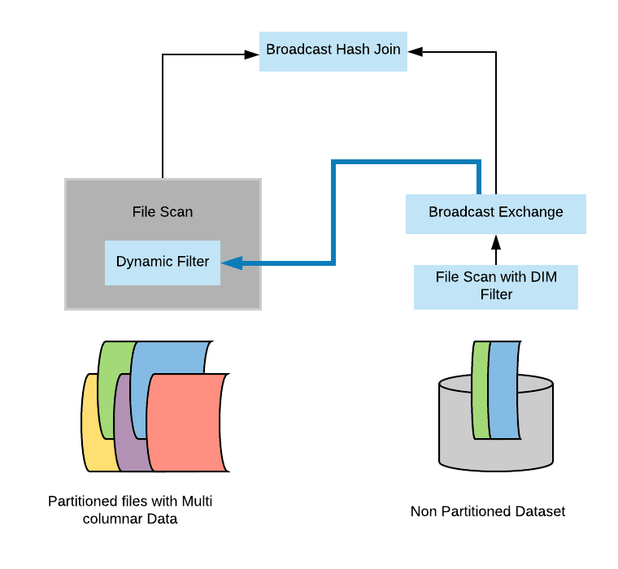

# Spark SQL 原理特性

## 向量化执行和代码生成

### Java向量化

向量化代码：

```java
for (int i-0; i < pos.length; i++) {
    pos[i] = pos[i] + mov[i];
}
```

Java代码向量化执行：

- **自动的**：**不能手动控制，只能由 JVM 自动处理。**没有办法做到像 C++ 一样直接调一个底层的 CPU 指令；
- **隐式的**：**代码层面无法找到向量化的显式调用，整个过程是隐式的**，比如上面的 for 循环被向量化执行；
- **不可靠的**：**依赖于 JVM 运行期的热点代码跟踪以及 JIT ，所以整个过程是不可靠的**；


### 火山迭代模型（Volcano Iterator Model）

现在大多数大数据系统或者说数据库底层，对 SQL 进行处理时通常会采用的模型。

模型具有**易抽象、易实现**、以及能够通过**算子组合表达复杂查询**这三个优势。

- 大量虚函数的调用，就可能会导致 CPU 的中断和耗时




### Spark Code Generation

- 减少基本类型的自动装箱；
- 避免多态调用（火山迭代模型）；
- 利用SIMD批量处理数据（JVM向量化）；
- 其它Fix（算子融合/缩减栈深）；


### 整体Stage代码生成（Whole-stage code generation）

**使得计算引擎的物理执行速度能达到 hard code 的性能**：

- 对物理执行的多次调用转换为代码 for 循环，减少中间执行的函数调用次数

示例：*select count(\*) from store_sales where ss_item_sk = 1000*

通常物理计划的代码是这样实现的：

```scala
class Filter(child: Operator, predicate: (Row => Boolean)) {
	def next(): Row = {
        var current = child.next()

        while (current != null && !predicate(current)) {
            current == child.next();
        }
        return current
    }
}
```

但是真正如果我们用 hard code 写的话，代码是这样的：

```scala
var count = 0
for (ss_item_sk in store_sales) {
    if (ss_item_sk == 1000) {
        count += 1
    }
}
```

原因：

- 避免**virtual function dispatch**；next()等函数调用在操作系统层面，会被编译为virtual function dispatch。
- 通过**CPU Register存取中间数据**，而不是内存缓冲：在Volcano Iterator Model中，每次一个operator将数据交给下一个operator，都需要将数据写入内存缓冲中。然而在手写代码中，JVM JIT编译器会将这些数据写入CPU Register。
- **Loop Unrolling** 和 **SIMD**；


## [自适应查询执行设计（AQE，Spark 3.0）](https://spark.apache.org/docs/latest/sql-performance-tuning.html#adaptive-query-execution)

下图表示了使用 DataFrames 执行简单的分组计数查询时发生的分布式处理：



Spark 在第一阶段（stage）确定了适当的分区数量，但对于第二阶段，使用默认的分区数 200，即使手动设置分区数，但是也有以下挑战：

- 每个查询都设置这个属性是非常繁琐的；
- 随着业务的变化，之前设置的值可能会过时；
- 这个设置将应用于**同一个程序里面的所有 Shuffle 操作**中。


基于**精确的运行时统计信息**进行优化，引入了 Query Stages 的概念，以 Query Stage 为粒度，进行运行时的优化



**Query Stage 是由 Shuffle 或 broadcast exchange 划分的，在运行下一个 Query Stage 之前，上一个 Query Stage 的计算需要全部完成**，这是进行运行时优化的绝佳时机，因为此时所有分区上的数据统计都是可用的，并且后续操作还没有开始。


参数

`spark.sql.adaptive.enabled `：是否开启自适应优化，默认`true`。

### 自适应调整分区数

Spark 将会把连续的 shuffle partitions 进行合并（coalesce contiguous shuffle partitions）以减少分区数。

相关参数：

`spark.sql.adaptive.coalescePartitions.enabled`：是否开启自适应分区缩减，默认`true`；

`spark.sql.adaptive.advisoryPartitionSizeInBytes`：自适应分区所见的分区的划分大小，默认64MB；

`spark.sql.adaptive.coalescePartitions.minPartitionSize`：自适应分区所见的分区的最小大小；

`spark.sql.adaptive.coalescePartitions.parallelismFirst`：根据集群默认并行度，设置分区大小（尽可能利用资源并发），而不是根据`advisoryPartitionSizeInBytes`，默认`true`，推荐`false`；

示例如下图所示：

- 三个非常小的分区，为每个分区启动一个单独的任务将是一种浪费；
- 使用 AQE 之后，Spark 将这三个小分区合并为一个，最终的聚合只需要执行三个任务，而不是五个。






### 动态将 Sort Merge Joins 转换成 Broadcast Joins

Spark 估计参加 join 的表数据量小于广播大小的阈值（`spark.sql.autoBroadcastJoinThreshold`）时，其会将 Join 策略调整为 broadcast hash join。但是，很多情况都可能导致这种大小估计出错，比如表的统计信息不准确等（且统计信息只能支持Hive或者文件系统）。

AQE，Spark 可以利用**运行时的统计信息**动态调整 Join 方式，只要参与 Join 的任何一方的大小小于广播大小的阈值时，即可将 Join 策略调整为 broadcast hash join。进一步将常规的 shuffle 优化为本地化 shuffle来减少网络流量。

参数：

- `spark.sql.adaptive.autoBroadcastJoinThreshold`：自适应优化的Broadcast表的阈值，默认同`spark.sql.autoBroadcastJoinThreshold`，10M；

- `spark.sql.adaptive.localShuffleReader.enabled`：sort merge转为broadcast join时，是否开启本地读shuffle数据，默认`true`；

### 动态将Sort Merge Joins转换为 Shuffled hash join

AQE converts sort-merge join to shuffled hash join when **all post shuffle partitions** are smaller than a threshold。

参数

- `spark.sql.adaptive.maxShuffledHashJoinLocalMapThreshold	`：使用 build local hash map的分区最大大小；


### 动态优化倾斜的 join

AQE 倾斜 Join 优化从 shuffle 文件统计信息中自动检测到这种倾斜。然后，它将倾斜的分区分割成更小的子分区，这些子分区将分别从另一端连接到相应的分区。

假设表 A join 表B，其中表 A 的分区 A0 里面的数据明显大于其他分区。



将把分区 A0 分成两个子分区，并将每个子分区 join 表 B 的相应分区 B0。



如果没有这个优化，将有四个任务运行 sort merge join，其中一个任务将花费非常长的时间。在此优化之后，将有5个任务运行 join，但每个任务将花费大致相同的时间，从而获得总体更好的性能。

参数：

- **spark.sql.adaptive.skewJoin.enabled** ：是否启用倾斜 Join 处理；
- **spark.sql.adaptive.skewJoin.skewedPartitionFactor**：如果一个分区的大小大于这个数乘以分区大小的中值（median partition size），并且也大于`spark.sql.adaptive.skewedPartitionThresholdInBytes` 这个属性值，那么就认为这个分区是倾斜的。
- **spark.sql.adaptive.skewedPartitionThresholdInBytes**：判断分区是否倾斜的阈值，默认为 256MB，这个参数的值应该要设置的比 spark.sql.adaptive.advisoryPartitionSizeInBytes 大。


## 动态分区裁减（Dynamic Partition Pruning，简称 DPP）

> 开启了动态分区裁减，那么 AQE 将不会被触发。

假设我们有一个具有多个分区的事实表(fact table)，为了方便说明，我们用不同颜色代表不同的分区。另外，我们还有一个比较小的维度表(dimension table)，维度表不是分区表。

```sql
Select * from iteblog.Students join iteblog.DailyRoutine where iteblog.DailyRoutine.subject = 'English'; 
```

在逻辑计划和物理计划上都有实现：

- **在逻辑计划阶段就知道事实表需要扫描哪些分区**：在逻辑计划层面，通过**维度表构造出一个过滤子查询**，然后在扫描事实表之前加上这个过滤子查询。但是，物理计划执行起来还是比较低效。因为里面有重复的子查询（每个分区都需要获取子查询的结果），需要找出一种方法来消除这个重复的子查询。



- **避免扫描无用的数据**：在物理计划层面，在维度表上运行上面构造的过滤，然后将**结果广播到事实表端**，从而达到避免扫描无用的数据效果。

在 broadcast hash join 中大表进行 build relation 的时候拿到维度表的广播结果(broadcast results)，然后在 build relation 的时候(Scan 前)进行动态过滤，从而达到避免扫描无用的数据效果。具体如下：



如果将`spark.sql.optimizer.dynamicPartitionPruning.reuseBroadcastOnly`设置为`false`，那么 DPP 也可以在其他类型的 Join 上运行，比如 `SortMergeJoin`。在这种情况下，Spark 将估计 DPP 过滤器是否确实提高了查询性能。DPP 可以极大地提高高度选择性查询的性能，

**动态分区裁剪适用条件**

并不是什么查询都会启用动态裁剪优化的，必须满足以下几个条件：

- `spark.sql.optimizer.dynamicPartitionPruning.enabled`： 参数必须设置为 true，不过这个值默认就是启用的;
- 需要裁减的表必须是分区表，而且分区字段必须在 join 的 on 条件里面;
- Join 类型必须是 INNER, LEFT SEMI (左表是分区表), LEFT OUTER (右表是分区表), or RIGHT OUTER (左表是分区表)。
- 满足上面的条件也不一定会触发动态分区裁减，还必须满足 `spark.sql.optimizer.dynamicPartitionPruning.useStats` 和 `spark.sql.optimizer.dynamicPartitionPruning.fallbackFilterRatio` 两个参数综合评估出一个进行动态分区裁减是否有益的值，满足了才会进行动态分区裁减。

