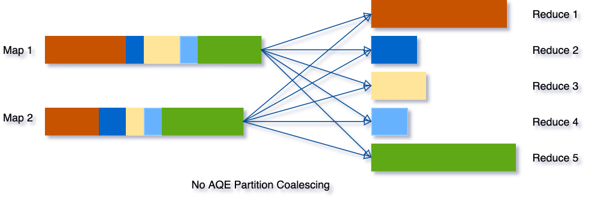
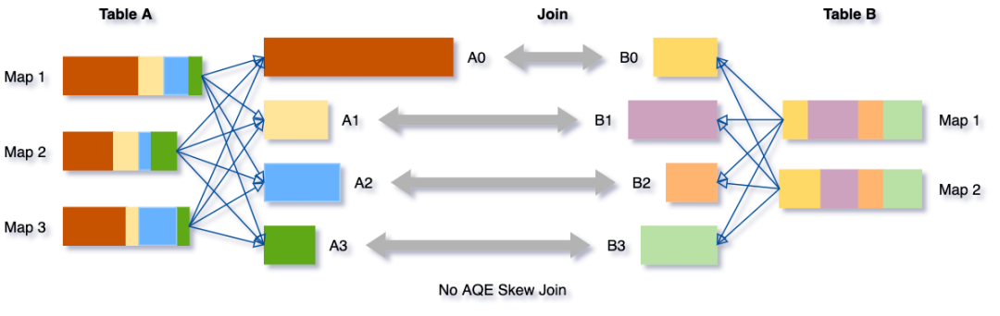

# Spark SQL

http://spark.apache.org/docs/latest/sql-programming-guide.html


## DataFrame

Koalas：基于 Spark DataFrame 实现的分布式 Pandas DataFrame，已经被集成到 Spark 3.x 中。


## SQL语法

### 辅助语句

#### refresh

`REFRESH` is used to invalidate and refresh all the cached data (and the associated metadata) for all Datasets that contains the given data source path. Path matching is by prefix, i.e. “/” would invalidate everything that is cached.

```sql
df = spark.read.format("hudi").load(basePath+"/*/*")
df.createOrReplaceTempView("track_log")
# 刷新表的元数据和data
spark.sql("refresh table mytable")
```


## Hive

[Spark的Hive版本的管理](https://spark.apache.org/docs/latest/sql-data-sources-hive-tables.html)


## 自定义数据源

> [Spark原理图解：DataSource V1 API与自定义数据源](https://mp.weixin.qq.com/s/gSRchNJNPo6STVw4rDyZeg)

### DataSource V1与V2

Spark 2.3以前数据源相关的API一般叫做V1 API，它以RDD为基础，向上扩展schema信息，形成DataFrame。

之后的版本则是另一种实现思路，直接基于新的接口在DataFrame的思路上提供数据。


在`DataFrameReader`中，会先找 V2 实现，找不到则会再找 V1 实现；

```scala
DataSource.lookupDataSourceV2(source, sparkSession.sessionState.conf)
		  .map {...}
          .getOrElse(loadV1Source(paths: _*))
```


### V1自定义

关键点:

- `DataSourceRegister`，标识是数据源服务类，Spark会以它来扫描实现类；
- RelationProvider，标识是关系型的数据源，可以在Spark SQL中使用；
- BaseRelation，描述DataFrame的Schema信息 ；
- TableScan, 提供无参的数据扫描服务；PrunedScan，提供列裁剪的数据扫描服务；PrunedFilteredScan，提供列裁剪和过滤下推的数据扫描服务。三个scan接口任选其一

流程：

- `loadV1Source`中调用`DataSource`的`apply`进行初始化，并调用其`resolveRelation`创建`BaseRelation`，然后通过`SparkSession`创建`DataFrame`返回；

自定义

- 实现类必须继承DataSourceRegister，否则无法使用简称自动扫描到该实现类
- 实现类需要继承RelationProvider，才能标识为关系型的数据源，在SparkSQL才能使用
- shortName中的简称用于使用时format中指定格式
- 一般在实现中会通过option()传递自定义参数，参数会传入parameters
- 在createRelation需要获取相关信息，创建Schema，这里写死模拟了一下。正常如果是mysql之类的，需要连接数据库获取对应表的字段以及类型信息。

```scala
class TestProvider extends DataSourceRegister with RelationProvider {
    override def shortName(): String = "test"

    override def createRelation(sqlContext: SQLContext,
                                parameters: Map[String, String]): BaseRelation = {
        // 1 通过参数等生成schema信息
        val schema = StructType(Seq(
            StructField("name", StringType, nullable = true),
            StructField("age", IntegerType, nullable = true),
            StructField("address", StringType, nullable = true)
        ))

        // 2 创建BaseRelation
        TestRelation(schema)(sqlContext.sparkSession)
    }
}

case class TestRelation(override val schema: StructType)
                       (@transient val spark: SparkSession)
    extends BaseRelation with PrunedFilteredScan {
    override def sqlContext: SQLContext = spark.sqlContext

    override def buildScan(requiredColumns: Array[String],
                           filters: Array[Filter]): RDD[Row] = {
        // 构建查询返回RDD，根据requiredColumns进行列裁剪，filters进行谓词下推
        spark.createDataFrame(Seq(Stud("a", 10, "aaa"), Stud("b", 20, "bbb")))
            .rdd
    }
}

case class Stud(name: String, age: Int, address: String)

```

使用，注意还需要单独配置SPI的发现文件：

```scala
import org.apache.spark.sql.SparkSession

object Test2 {
  def main(args: Array[String]): Unit = {
    val spark: SparkSession = SparkSession.builder()
      .master("local")
      .getOrCreate()

    val df = spark.read.format("xingoo")
      .load()

      df.select("name")
        .filter("age > 15")
        .show(false)
  }
}
```


## 特性

### 向量化执行和代码生成

具体见[向量化介绍](./vectorized.md)


### [自适应查询执行设计（AQE，Spark 3.0）](https://spark.apache.org/docs/latest/sql-performance-tuning.html#adaptive-query-execution)

下图表示了使用 DataFrames 执行简单的分组计数查询时发生的分布式处理：


Spark 在第一阶段（stage）确定了适当的分区数量，但对于第二阶段，使用默认的分区数 200，即使手动设置分区数，但是也有以下挑战：

- 每个查询都设置这个属性是非常繁琐的；
- 随着业务的变化，之前设置的值可能会过时；
- 这个设置将应用于**同一个程序里面的所有 Shuffle 操作**中。


基于**精确的运行时统计信息**进行优化，引入了 Query Stages 的概念，以 Query Stage 为粒度，进行运行时的优化


**Query Stage 是由 Shuffle 或 broadcast exchange 划分的，在运行下一个 Query Stage 之前，上一个 Query Stage 的计算需要全部完成**，这是进行运行时优化的绝佳时机，因为此时所有分区上的数据统计都是可用的，并且后续操作还没有开始。


参数

`spark.sql.adaptive.enabled `：是否开启自适应优化，默认`true`。

#### 自适应调整分区数

Spark 将会把连续的 shuffle partitions 进行合并（coalesce contiguous shuffle partitions）以减少分区数。

相关参数：

`spark.sql.adaptive.coalescePartitions.enabled`：是否开启自适应分区缩减，默认`true`；

`spark.sql.adaptive.advisoryPartitionSizeInBytes`：自适应分区所见的分区的划分大小，默认64MB；

`spark.sql.adaptive.coalescePartitions.minPartitionSize`：自适应分区所见的分区的最小大小；

`spark.sql.adaptive.coalescePartitions.parallelismFirst`：根据集群默认并行度，设置分区大小（尽可能利用资源并发），而不是根据`advisoryPartitionSizeInBytes`，默认`true`，推荐`false`；

示例如下图所示：

- 三个非常小的分区，为每个分区启动一个单独的任务将是一种浪费；
- 使用 AQE 之后，Spark 将这三个小分区合并为一个，最终的聚合只需要执行三个任务，而不是五个。




#### 动态将 Sort Merge Joins 转换成 Broadcast Joins

Spark 估计参加 join 的表数据量小于广播大小的阈值（`spark.sql.autoBroadcastJoinThreshold`）时，其会将 Join 策略调整为 broadcast hash join。但是，很多情况都可能导致这种大小估计出错，比如表的统计信息不准确等（且统计信息只能支持Hive或者文件系统）。

AQE，Spark 可以利用**运行时的统计信息**动态调整 Join 方式，只要参与 Join 的任何一方的大小小于广播大小的阈值时，即可将 Join 策略调整为 broadcast hash join。进一步将常规的 shuffle 优化为本地化 shuffle来减少网络流量。

参数：

- `spark.sql.adaptive.autoBroadcastJoinThreshold`：自适应优化的Broadcast表的阈值，默认同`spark.sql.autoBroadcastJoinThreshold`，10M；

- `spark.sql.adaptive.localShuffleReader.enabled`：sort merge转为broadcast join时，是否开启本地读shuffle数据，默认`true`；

#### 动态将Sort Merge Joins转换为 Shuffled hash join

AQE converts sort-merge join to shuffled hash join when **all post shuffle partitions** are smaller than a threshold。

参数

- `spark.sql.adaptive.maxShuffledHashJoinLocalMapThreshold	`：使用 build local hash map的分区最大大小；


#### 动态优化倾斜的 join

AQE 倾斜 Join 优化从 shuffle 文件统计信息中自动检测到这种倾斜。然后，它将倾斜的分区分割成更小的子分区，这些子分区将分别从另一端连接到相应的分区。

假设表 A join 表B，其中表 A 的分区 A0 里面的数据明显大于其他分区。



将把分区 A0 分成两个子分区，并将每个子分区 join 表 B 的相应分区 B0。


如果没有这个优化，将有四个任务运行 sort merge join，其中一个任务将花费非常长的时间。在此优化之后，将有5个任务运行 join，但每个任务将花费大致相同的时间，从而获得总体更好的性能。

参数：

- **spark.sql.adaptive.skewJoin.enabled** ：是否启用倾斜 Join 处理；
- **spark.sql.adaptive.skewJoin.skewedPartitionFactor**：如果一个分区的大小大于这个数乘以分区大小的中值（median partition size），并且也大于`spark.sql.adaptive.skewedPartitionThresholdInBytes` 这个属性值，那么就认为这个分区是倾斜的。
- **spark.sql.adaptive.skewedPartitionThresholdInBytes**：判断分区是否倾斜的阈值，默认为 256MB，这个参数的值应该要设置的比 spark.sql.adaptive.advisoryPartitionSizeInBytes 大。

## 

### 动态分区裁减（Dynamic Partition Pruning，简称 DPP）

> 开启了动态分区裁减，那么 AQE 将不会被触发。

假设我们有一个具有多个分区的事实表(fact table)，为了方便说明，我们用不同颜色代表不同的分区。另外，我们还有一个比较小的维度表(dimension table)，维度表不是分区表。

```sql
Select * from iteblog.Students join iteblog.DailyRoutine where iteblog.DailyRoutine.subject = 'English'; 
```

在逻辑计划和物理计划上都有实现：

- **在逻辑计划阶段就知道事实表需要扫描哪些分区**：在逻辑计划层面，通过**维度表构造出一个过滤子查询**，然后在扫描事实表之前加上这个过滤子查询。但是，物理计划执行起来还是比较低效。因为里面有重复的子查询（每个分区都需要获取子查询的结果），需要找出一种方法来消除这个重复的子查询。


- **避免扫描无用的数据**：在物理计划层面，在维度表上运行上面构造的过滤，然后将**结果广播到事实表端**，从而达到避免扫描无用的数据效果。

在 broadcast hash join 中大表进行 build relation 的时候拿到维度表的广播结果(broadcast results)，然后在 build relation 的时候(Scan 前)进行动态过滤，从而达到避免扫描无用的数据效果。具体如下：


如果将`spark.sql.optimizer.dynamicPartitionPruning.reuseBroadcastOnly`设置为`false`，那么 DPP 也可以在其他类型的 Join 上运行，比如 `SortMergeJoin`。在这种情况下，Spark 将估计 DPP 过滤器是否确实提高了查询性能。DPP 可以极大地提高高度选择性查询的性能，

**动态分区裁剪适用条件**

并不是什么查询都会启用动态裁剪优化的，必须满足以下几个条件：

- `spark.sql.optimizer.dynamicPartitionPruning.enabled`： 参数必须设置为 true，不过这个值默认就是启用的;
- 需要裁减的表必须是分区表，而且分区字段必须在 join 的 on 条件里面;
- Join 类型必须是 INNER, LEFT SEMI (左表是分区表), LEFT OUTER (右表是分区表), or RIGHT OUTER (左表是分区表)。
- 满足上面的条件也不一定会触发动态分区裁减，还必须满足 `spark.sql.optimizer.dynamicPartitionPruning.useStats` 和 `spark.sql.optimizer.dynamicPartitionPruning.fallbackFilterRatio` 两个参数综合评估出一个进行动态分区裁减是否有益的值，满足了才会进行动态分区裁减。

