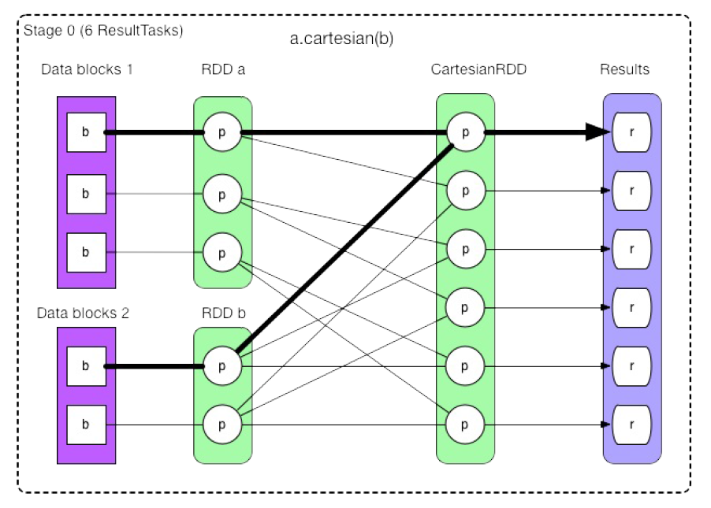
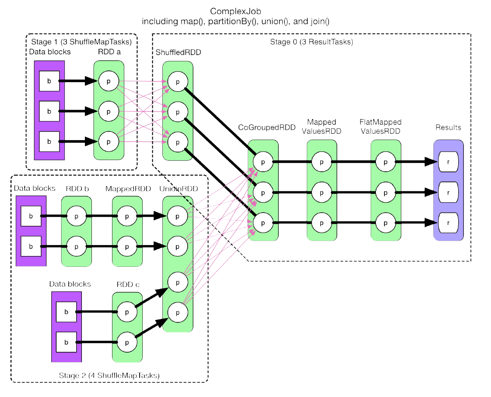

# Stage划分

## 窄依赖(NarrowDependency)

Each partition of the child RDD depends on **a small number** of partitions of the parent RDD；

- 窄依赖可以进行分区pipeline计算；
- 子类有**OneToOneDependency**和**RangeDependency**；
- RDD的**笛卡尔积cartesian是匿名窄依赖子类**；

## 宽依赖(ShuffleDependency) 

子RDD的每个分区数据依赖于**父RDD的所有分区**。

## Stage划分流程

1. 从后往前推算，遇到 ShuffleDependency 就断开，遇到 NarrowDependency 就将其加入该 stage。每个 stage 里面 task 的数目由该 stage 最后一个 RDD 中的 partition 个数决定
2. Spark的Stage的划分，是递归求parent stage，并为每个stage提供incremental id（createShuffleMapStage)，最后一个stage id 为 0；
3. 每个 RDD 包含的 getDependency() 负责确立 RDD 的数据依赖，compute() 方法负责接收 parent RDDs或者 data block 流入的 records，进行计算，然后输出 record。
2. 整个 computing chain 根据数据依赖关系自后向前建立，遇到 ShuffleDependency 后形成 stage。在每个stage 中，每个 RDD 中的 compute() 调用 parentRDD.iterator() 来将 parent RDDs 中的 records 一个个 fetch ；
5. TaskSchedulerImpl的resourceOffers函数：fill each node with tasks in a round-robin manner so that tasks are balanced across the cluster

