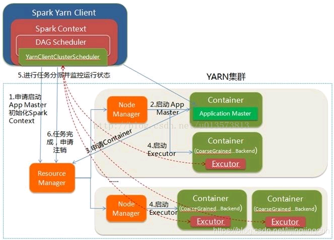
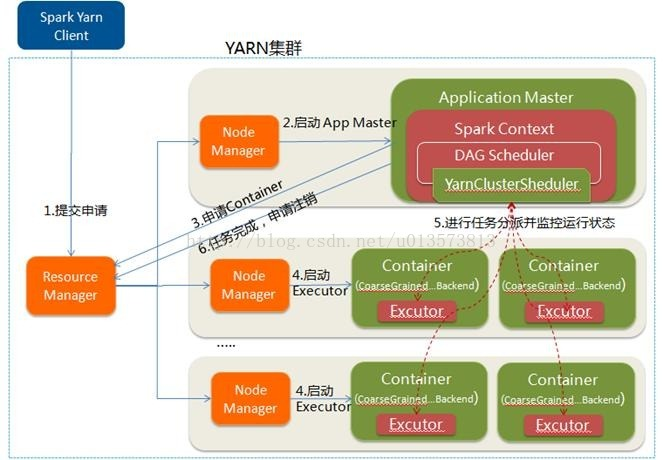

# Spark Yarn

## 架构

**Spark 相关概念**：

- Driver：和ClusterManager通信，进行资源申请、任务分配并监督其运行状况等。
- ClusterManager：这里指YARN。
- DAGScheduler：把spark作业转换成Stage的DAG图。
- TaskScheduler：把Task分配给具体的Executor。

**YARN相关概念**：

- ResourceManager：负责整个集群的资源管理和分配。
- ApplicationMaster：YARN中每个Application对应一个AM进程，负责与RM协商获取资源，获取资源后告诉NodeManager为其分配并启动Container。
- NodeManager：每个节点的资源和任务管理器，负责启动/停止Container，并监视资源使用情况。
- Container：YARN中的抽象资源。

### Yarn-Client

client模式下，driver运行在client的进程中。（YarnClientClusterScheduler => YarnClusterScheduler）

- Client 向 RM 申请启动 AM。同时 driver 初始化Spark Context，DAGScheduler、YarnClusterScheduler等；
- RM 收到请求，在集群中选择一个 NM 分配第一个Container，作为 AM。AM不运行 SparkContext，只是跟Client 通信进行资源申请；
- Client 与 AM 进行连接，向 RM 注册，根据任务信息通过 AM 向 RM 申请资源；
- AM 申请到资源 Container 后，与对应的 NM 进行通信，要求它在获取的Container中启动CoarseGrained Backend，CoarseGrainedExecutorBackend启动后会向Client中的SparkContext注册并申请Task；
- client中的 SparkContext 分配 Task 给 CoarseGrainedExecutorBackend 执行，CoarseGrainedExecutorBackend 运行 Task 并向 Driver 汇报运行的状态和进度，以让 Client 随时掌握各个任务的运行状态，从而可以在任务失败时重新启动任务；
- 应用程序运行完成后，Client的SparkContext向ResourceManager申请注销并关闭自己。

### Yarn-Cluster

与 client 模式的区别：

- Driver 进程运行在 AM 中，与 RM 进行资源的申请；

## 配置

1）配置`HADOOP_CONF_DIR`和`YARN_CONF_DIR`环境变量；

- 直接通过 new SparkConf()，需要将其加入CLASSPATH中；

2）Spark Runtime jars：`spark.yarn.archive` 或者 `spark.yarn.jars`

### GPU

Spark 向 Yarn 申请资源，通过配置的discoverScript，发现Container（driver/executor）的GPU卡；

Spark的Scheduler会根据executor的GPU资源信息，分配Task作业，并将资源信息传入Task；

Spark分区（Task）可以通过TaskContext获取Task使用的资源信息(比如Task可以使用的GPU卡号)；