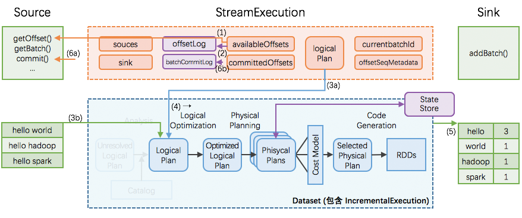
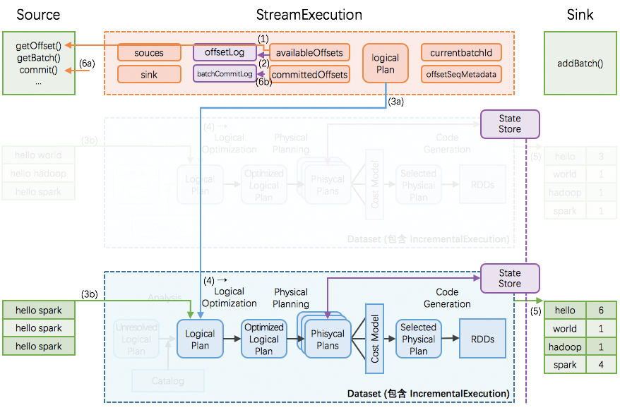
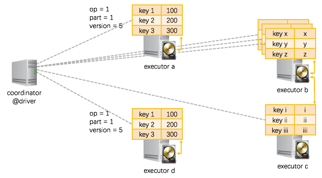
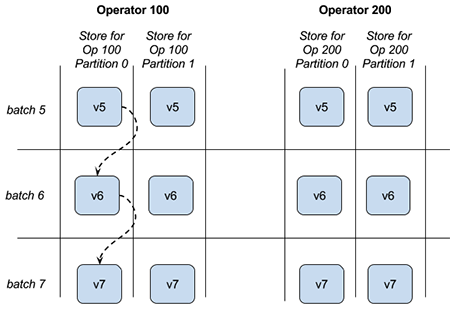

# Structured Streaming 实现思路与实现概述

## 执行

### StreamExecution：持续查询的运转引擎

先定义好 Dataset/DataFrame 的产生、变换和写出，再启动 `StreamExection` 去持续查询。这些 Dataset/DataFrame 的产生、变换和写出的信息就对应保存在 `StreamExecution` 非常重要的 3 个成员变量中：

- `sources`: streaming data 的产生端（比如 kafka 等）
- `logicalPlan`: DataFrame/Dataset 的一系列变换（即计算逻辑）
- `sink`: 最终结果写出的接收端（比如 file system 等）

StreamExection 另外的重要成员变量是：

- `currentBatchId`: 当前执行的 id
- `batchCommitLog`: 已经成功处理过的批次有哪些
- `offsetLog`, `availableOffsets`, `committedOffsets`: 当前执行需要处理的 source data 的 meta 信息
- `offsetSeqMetadata`: 当前执行的 watermark 信息（event time 相关，本文暂不涉及、另文解析）等

###  StreamExecution 的持续查询



一次执行的过程如上图；这里有 6 个关键步骤：

1. StreamExecution 通过 Source.getOffset() 获取最新的 offsets，即最新的数据进度；
2. StreamExecution 将 offsets 等写入到 offsetLog 里
   - 这里的 offsetLog 是一个持久化的 WAL (Write-Ahead-Log)，是将来可用作故障恢复用
3. StreamExecution 构造本次执行的 LogicalPlan
   - (3a) 将预先定义好的逻辑（即 StreamExecution 里的 logicalPlan 成员变量）制作一个副本出来
   - (3b) 给定刚刚取到的 offsets，通过 Source.getBatch(offsets) 获取本执行新收到的数据的 Dataset/DataFrame 表示，并替换到 (3a) 中的副本里
   - 经过 (3a), (3b) 两步，构造完成的 LogicalPlan 就是针对本执行新收到的数据的 Dataset/DataFrame 变换（即整个处理逻辑）了
4. 触发对本次执行的 LogicalPlan 的优化，得到 IncrementalExecution
   - 逻辑计划的优化：通过 Catalyst 优化器完成
   - 物理计划的生成与选择：结果是可以直接用于执行的 RDD DAG
   - 逻辑计划、优化的逻辑计划、物理计划、及最后结果 RDD DAG，合并起来就是 IncrementalExecution
5. 将表示计算结果的 Dataset/DataFrame (包含 IncrementalExecution) 交给 Sink，即调用 Sink.add(ds/df)
6. 计算完成后的 commit
   - (6a) 通过 Source.commit() 告知 Source 数据已经完整处理结束；Source 可按需完成数据的 garbage-collection
   - (6b) **将本次执行的批次 id 写入到 batchCommitLog 里**

### StreamExecution 的持续查询（增量）



Structured Streaming 在编程模型上暴露给用户的是，每次持续查询看做面对全量数据（而不仅仅是本次执行收到的数据），所以每次执行的结果是针对全量数据进行计算的结果。

但是在实际执行过程中，由于全量数据会越攒越多，那么每次对全量数据进行计算的代价和消耗会越来越大。

Structured Streaming 的做法是：

- 引入全局范围、高可用的 StateStore
- 转全量为增量，即在每次执行时：
  - 先从 StateStore 里 restore 出上次执行后的状态
  - 然后加入本执行的新数据，再进行计算
  - 如果有状态改变，将把改变的状态重新 save 到 StateStore 里
- 为了在 Dataset/DataFrame 框架里完成对 StateStore 的 restore 和 save 操作，引入两个新的物理计划节点 —— `StateStoreRestoreExec` 和 `StateStoreSaveExec`

所以 Structured Streaming 在编程模型上暴露给用户的是，每次持续查询看做面对全量数据，但在具体实现上转换为增量的持续查询。

### 容错

由于 exectutor 节点的故障可由 Spark 框架本身很好的 handle，不引起可用性问题，我们本节的故障恢复只讨论 driver 故障恢复。

如果在某个执行过程中发生 driver 故障，那么重新起来的 StreamExecution：

- 读取 WAL offsetlog 恢复出最新的 offsets 等；相当于取代正常流程里的 (1)(2) 步
- 读取 batchCommitLog 决定是否需要重做最近一个批次
- 如果需要，那么重做 (3a), (3b), (4), (5), (6a), (6b) 步
  - 这里第 (5) 步需要分两种情况讨论
    - (i) 如果上次执行在 (5) ***结束前即失效***，那么本次执行里 sink 应该完整写出计算结果
    - (ii) 如果上次执行在 (5) ***结束后才失效***，那么本次执行里 sink 可以重新写出计算结果（覆盖上次结果），也可以跳过写出计算结果（因为上次执行已经完整写出过计算结果了）

这样即可保证每次执行的计算结果，在 sink 这个层面，是 ***不重不丢*** 的 —— 即使中间发生过 1 次或以上的失效和恢复。

## 状态存储

在 Structured Streaming 里，StateStore 模块提供了 ***分片的***、***分版本的***、***可迁移的***、***高可用***  key-value store。

基于这个 StateStore 模块，StreamExecution 实现了 ***增量的*** 持续查询、和很好的故障恢复以维护 ***end-to-end exactly-once guarantees***。

### 总体思路



- **分布式实现**
  - 跑在现有 Spark 的 driver-executors 架构上；
  - **driver 端是轻量级的 coordinator，只做协调工作**；
  - **executor 端负责状态的实际分片的读写**；
- **状态分片**
  - 以 `operatorId`+`partitionId` 为切分依据：一个应用里可能会包含多个需要状态的 operator，而且 operator 本身也是分 partition 执行；
  - 以分片为基本单位进行状态的读入和写出；
  - 每个分片里是一个 key-value 的 store，key 和 value 的类型都是 `UnsafeRow`，可以按 key 查询或更新。

- **状态分版本**
  - 因为 StreamExection 会持续不断地执行批次，因而同一个 operator 同一个 partition 的状态也是随着时间不断更新、产生新版本的数据；
  - 状态的版本是与 StreamExecution 的进展一致，比如 StreamExection 的批次 id = 7 完成时，那么所有 version = 7 的状态即已经持久化。
- **批量读入和写出分片**
  - 对于每个分片，读入时
    - 根据 operator + partition + version， 从 HDFS 读入数据，并缓存在内存里
  - 对于每个分片，写出时
    - 累计当前版本（即 StreamExecution 的当前批次）的多行的状态修改，一次性写出到 HDFS 一个修改的流水 log，流水 log 写完即标志本批次的状态修改完成
    - 同时应用修改到内存中的状态缓存

关于 StateStore 的 operator, partiton, version 有一个图片可帮助理解：

<p align="center"></p>

### (a) StateStore 在不同的节点之间如何迁移

在 StreamExecution 执行过程中，随时在 operator 实际执行的 executor 节点上唤起一个状态存储分片、并读入前一个版本的数据即可（如果 executor 上已经存在一个分片，那么就直接重用，不用唤起分片、也不用读入数据了）。


我们上节讲过，持久化的状态是在 HDFS 上的。那么如上图所示：

- `executor a`, 唤起了 `operator = 1, partition = 1` 的状态存储分片，从 HDFS 里位于本机的数据副本 load 进来 `version = 5` 的数据；
- 一个 executor 节点可以执行多个 operator，那么也就可以在一个 executor 上唤起多个状态存储分片（分别对应不同的 operator + partition），如图示 `executor b`；
- 在一些情况下，需要从其他节点的 HDFS 数据副本上 load 状态数据，如图中 `executor c` 需要从 `executor b` 的硬盘上 load 数据；
- 另外还有的情况是，同一份数据被同时 load 到不同的 executor 上，如 `executor d` 和 `executor a` 即是读入了同一份数据 —— 推测执行时就容易产生这种情况 —— 这时也不会产生问题，因为 load 进来的是同一份数据，然后在两个节点上各自修改，最终只会有一个节点能够成功提交对状态的修改。

### (b) StateStore 的更新和查询

在一个状态存储分片里，是 key-value 的 store。这个 key-value 的 store 支持如下操作：

```scala
  /* == CRUD 增删改查 =============================== */

  // 查询一条 key-value
  def get(key: UnsafeRow): Option[UnsafeRow]
    
  // 新增、或修改一条 key-value
  def put(key: UnsafeRow, value: UnsafeRow): Unit
    
  // 删除一条符合条件的 key-value
  def remove(condition: UnsafeRow => Boolean): Unit
  // 根据 key 删除 key-value
  def remove(key: UnsafeRow): Unit
  
  /* == 批量操作相关 =============================== */
    
  // 提交当前执行批次的所有修改，将刷出到 HDFS，成功后版本将自增
  def commit(): Long

  // 放弃当前执行批次的所有修改
  def abort(): Unit
    
  // 当前状态分片、当前版本的所有 key-value 状态
  def iterator(): Iterator[(UnsafeRow, UnsafeRow)]
    
  // 当前状态分片、当前版本比上一个版本的所有增量更新
  def updates(): Iterator[StoreUpdate]
```

使用 StateStore 的代码可以这样写（现在都是 Structured Streaming 内部实现在使用 StateStore，上层用户无需面对这些细节）：

```scala
  // 在最开始，获取正确的状态分片(按需重用已有分片或读入新的分片)
  val store = StateStore.get(StateStoreId(checkpointLocation, operatorId, partitionId), ..., version, ...)

  // 开始进行一些更改
  store.put(...)
  store.remove(...)
    
  // 更改完成，批量提交缓存在内存里的更改到 HDFS
  store.commit()
    
  // 查看当前状态分片的所有 key-value / 刚刚更新了的 key-value
  store.iterator()
  store.updates()
```

### (c) StateStore 的维护

前面 StateStore 在写出状态的更新时，是写出的修改流水 log。

StateStore 本身也带了 maintainess 即维护模块，会周期性的在后台将过去的状态和最近若干版本的流水 log 进行合并，并把合并后的结果重新写回到 HDFS：`old_snapshot + delta_a + delta_b + … => lastest_snapshot`。

### (d) StateStore 的故障恢复

StateStore 的所有状态以 HDFS 为准。如果某个状态分片在更新过程中失败了，那么还没有写出的更新会不可见。

恢复时也是从 HDFS 读入最近可见的状态，并配合 StreamExecution 的执行批次重做。重新计算的粒度是 Spark 的单个 task，即一个 partition 的输入数据 + 一个 partition 的状态存储。

从 HDFS 读入最近可见的状态时，如果有最新的 snapshot，也就用最新的 snapshot，如果没有，就读入稍旧一点的 snapshot 和新的 deltas，先做一下最新状态的合并。


## 容错

**Spark的checkpoint可以自动恢复，不需要手工操作。**

### 目录组织（同步操作）

- offsets
  - 记录每个批次中的偏移量。为了保证给定的批次始终包含相同的数据，在处理数据前将其写入此日志记录
- commits
  - 记录已完成的批次，重启任务检查完成的批次与 offsets 批次记录比对，确定接下来运行的批次

- metadata
  - metadata 与整个查询关联的元数据，目前仅保留当前job id
- sources
  - sources 目录为数据源(Source)时各个批次读取详情；
  - file system作为输入时，记录每个batch处理的文件名；
- state
  - 存储状态数据，通过`StateStoreProvider`子类实现
- sinks
  - sinks 目录为数据接收端(Sink)时批次的写出详情


### HDFSBackendStateStoreProvider（每次batch同步checkpoint）

Fault-tolerance model：                                                                          

- **Every set of updates is written to a delta file before committing**.                           
- The state store is responsible for managing, collapsing and cleaning up of delta files.       
- Multiple attempts to commit the same version of updates may overwrite each other. Consistency guarantees depend on whether multiple attempts have the same updates and  the overwrite semantics of underlying file system.                                            
- Background maintenance of files ensures that last versions of the store is always recoverable to ensure re-executed RDD operations re-apply updates on the correct past version of the store.                    


配置

- `spark.sql.streaming.maxBatchesToRetainInMemory`配置在内存中最多保存的version的statestore的个数；


启动定时线程`state-store-maintenance-task`，执行snapshot操作和清除过期的检查点文件。

- `spark.sql.streaming.stateStore.maintenanceInterval`参数配置定期时间，默认1分钟；
- `spark.sql.streaming.stateStore.minDeltasForSnapshot`：当executor对应的state store的delta文件数超过时，才会被合并成snapshots，默认10；
- `spark.sql.streaming.minBatchesToRetain`，清理时最多保留的可恢复的最近的version的数量，默认100；

​                                                               

