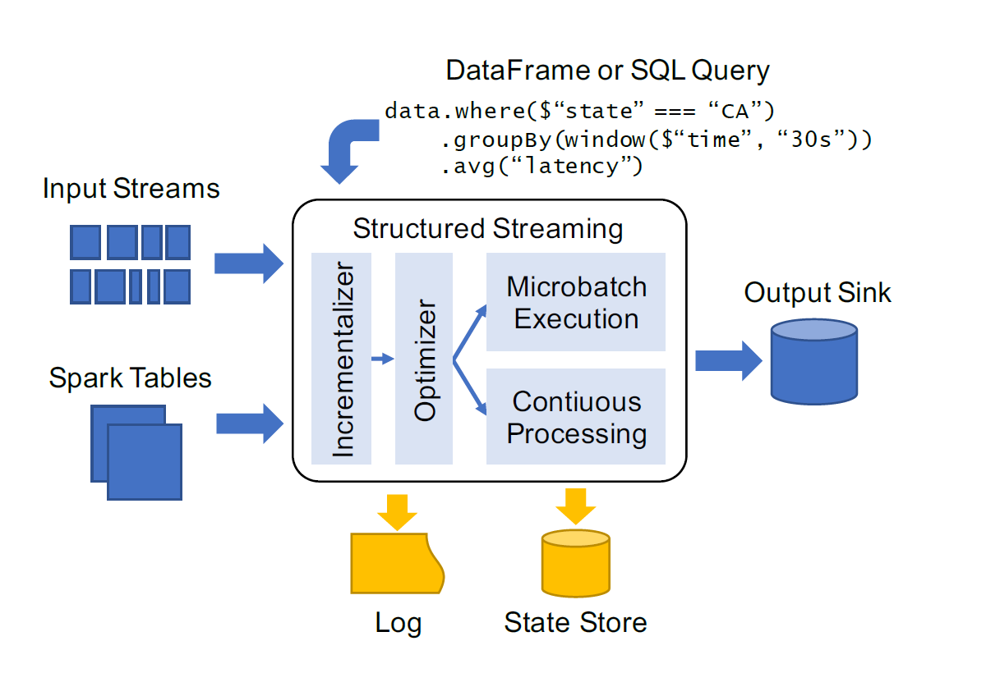
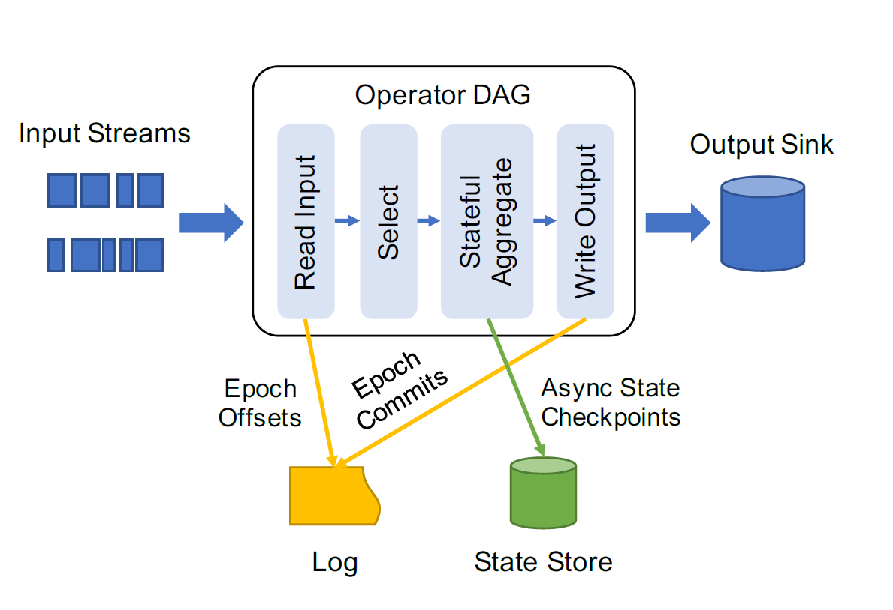

# Structured Streaming: A Declarative API for Real-Time Applications in Apache Spark

## 背景

早期的流处理系统（如Spark Streaming）存在两个问题：

1. 系统需要用户去考虑复杂的物理执行概念，比如 **at-least-once delivery、状态存储、触发模式**等流处理独有的概念；
2. 许多系统只关注流计算这一件事，但在实际应用场景中，流处理仅仅是一个大型商业应用程序的一部分，该应用程序同时还会**包括批处理、静态数据连接和交互式查询**等处理流程。

## 需求

1. 降低用户编程的难度；
2. 与其它计算模式统一。

## 难点

流系统的难点：

- **复杂性和低层次的API：**由于其复杂的语义，用户总认为流处理系统不如批处理系统容易使用：
  - 某些仅在数据流处理中存在的新的概念，比如，在收到与某种特定实体相关的全部数据之前，用户就需要考虑好应该输出什么类型的中间结果；
  - 低层次的API，这些API总是要求用户从物理操作算子的层面来描述自己特定的应用程序，且语义十分复杂。
- **在端到端应用程序中的集成**：目前多数Stream API着重关注的是如何从数据源读取数据流，以及如何将数据流输出到sink中，但是商业的端到端应用程序需要的是更多其他的任务。
  - 在最新的数据上进行交互式查询。如在结构化存储（如RDBM或Hive）中实现对汇总表的更新；
  - ETL作业中需要用到流处理，如将流数据和静态数据（其他存储系统）进行join，两个系统的一致性（如静态数据更新怎么办）；
  - 需要把流媒体业务逻辑当作批处理应用程序来运行，如在旧数据上回填结果等，重写代码耗时且易错。
- **操作层面的挑战：**
  - **容错率**：单个节点失效、应用下线、应用重启；
  - **代码更新**：
    - 业务代码更新后，希望应用程序从它停止的地方重新启动，或者可能希望重新计算由于错误而出错的过去的结果；
    - 系统运行时更新，如Spark升级；
  - **可伸缩性**：动态地提高和降低应用程序的负载；
  - **拖后腿者**：节点问题（由于硬件等原因）导致应用吞吐慢时，系统能够自动处理；
  - **监控机制**：了解系统负载、积压、状态大小和其他指标。
- **成本性能的挑战**：流应用程序是全天候运行
  - 如果不进行动态缩放，应用程序将在高峰时间之外浪费资源；即使是重新伸缩，连续地计算一个结果也可能比运行一个定期的批处理作业更昂贵；
  - 

## 已有的解决方案

Spark SS 最早的批流一体的解决方案，端到端的应用编程框架。

## 本文的解决方案

- 提供**增量查询**模型：通过Spark SQL/DataFrame模式，自动增量化查询静态数据。
  - 微批模式
  - 低延迟的持续算子
- 支持端到端的应用：

## 系统设计

### 概要

1. 将处理时间从触发器和事务时间中分离出来；
2. 为了性能使用了关系型执行引擎；
3. 提供了集成化语言的API。

**输入和输出设置：** 可连接至多种输入源和输出接收器，与现有的 “exactly-once"系统类似，用两点来保证此性能以及容错率：

- 输入源是**可重放**的，即当有节点崩溃的时候，系统可以根据offset重读最近的输入数据（如kafka，file system等）；
- 输出接收器支持**幂等写入**，以保证可靠恢复。

**API：用批处理（Spark SQL/DataFrame）的方式来处理数据流。**

- 流作为无限表，在处理时用table来代替输入stream中的所有数据，然后由引擎来决定如何对该表进行增量查询与更新；
- ***Triggles***：触发器来控制引擎计算新结果和更新输出接收器的频率；
- 标记事务时间列，同时设置watermark策略，window操作由Sql中聚合操作实现；
- 添加状态操作符，跟踪和更新状态；

**执行**：一旦收到查询，SS会优化该查询，使之增量化，然后开始执行它。默认情况下，系统使用类似于Spark Streaming中的microbatch模型（支持动态负载平衡，缩放，故障恢复和零散缓解）来计算。

**容错率保障：**用了两种持久化存储：

- 预写日志，用于记录**已经处理过并可靠写入输出接收器**的输入数据；
- 状态存储，大规模存储，**保存长时间运行的聚合操作的操作状态的快照**；

**操作特征：**

- 两种持久化存储使之可以实现回滚与快速恢复；
- 执行微批次的能力使之能自适应地批量处理数据。

### 编程模型

**语义：**
 （1） 每个输入源提供一组随时间部分有序的记录，比如kafka是分区内保证有序；
 （2） 用户提供查询语句，跨输入数据地执行命令，最终输出结果表；
 （3） 触发器是告知系统，何时对结果表执行一个新的增量化计算和更新；
 （4） 三种输出模式：***Complete\***将文件完全重写。***Append\***追加数据到结果表。***Update\***根据key来更新结果表。

#### 前缀一致性（prefix consistency）TODO

**watermark** ：水位，对于采用record中的列作为event time的场景，对于延迟的数据的无效判断。

- a delay threshold $t_C$​ for a given timestamp column $C$​. At any point in time, the watermark for $C$​ is $max(C) −t_C$​, that is, $t_C$​ seconds before the maximum event time seen so far in C.

**stateful operator**：自定义的流处理逻辑，`UDFs with state`

### 查询计划

> Catalyst extensible optimizer in Spark SQL

#### 分析

#### 增量

#### 优化

复用SparkSQL查询优化：

- predicate pushdown, projection pushdown, expression simplification；
- Tungsten binary format；
- runtime code generator；

### 应用执行

#### 状态管理和恢复

- write-ahead log that supports durable, atomic writes at low latency；
- a state store that can store larger amounts of data durably and allows parallel access.

1. As input opeartor read data, master writes the start and end offsets of each epoch durably to the log；
2. Any operators requiring state checkpoint their state periodically and asynchronosuly to the state store, using incremental checkpoints when possible（eppch id with state data）；
3. Output operators write the epochs they committed to the log；The master waits for all nodes running an operator to report a commit for a given epoch before allowing commits for the next epoch；
4. Upon recovery, the new instance of the application starts by reading the log to find the last epoch that has not been committed to the sink, including its start and end offsets

#### 微批模式

采用Spark Streaming的离散流执行模式：

- **动态负载均衡**：每个operator的工作被划分为小的、独立的任务，这些任务可以被调度到任何节点上，因此，如果某些操作的执行速度慢于其他操作，系统可以自动在各个节点之间平衡这些任务。
- **细粒度容错**：节点宕机时，只需要该节点的任务重做，不需要将整个集群回滚到上一个checkpoint；
- **拖后腿者迁移**：如batch模式一样，多个备份任务；
- **可扩展性**：可以动态的增加/删除节点，任务会自动调度到可用的节点；

#### 持续模式

long-live operator

1. The master( driver ) launches long-running tasks on each partition using Spark’s scheduler that each read one partition of the input source (e.g., Kinesis stream) but execute multiple epochs. If one of these tasks fails, Spark will simply relaunch it；
2. Epochs are coordinated differently. The master periodically tells nodes to start a new epoch, and receives a start offset for the epoch on each input partition, which it inserts into the writeahead log. When it asks them to start the next epoch, it also receives end offsets for the previous one, writes these to the log, and tells nodes to commit the epoch when it has written all the end offsets. Thus, the master is not on the critical path for inspecting all the input sources and defining start/end offsets.

暂时不支持straggler处理和动态负载均衡。

### 操作特性

- 代码热更新，如用户代码的bug修复，spark代码更新等，只要用户不更改state schema；

- 手动回滚，如发现逻辑错误，可以通过查看write-ahead log（json格式），回滚到特定的epoch；

- 批流异构执行，如ETL作为一次执行的流作业（保留输入偏移量，方便下一次操作），节省算力；

- 监控，如吞吐量等；

  

## 实验效果

实验基准：Yahoo! Streaming Benchmark

实验环境：five c3.2xlarge Amazon EC2 workers，8 core，15GB内存

Source：Kafka 40分区

Sink：Kafka

性能：6500 records / s
