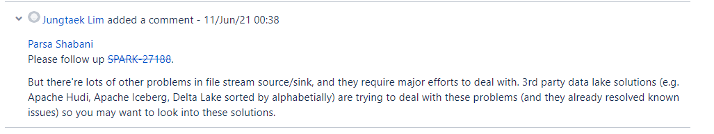
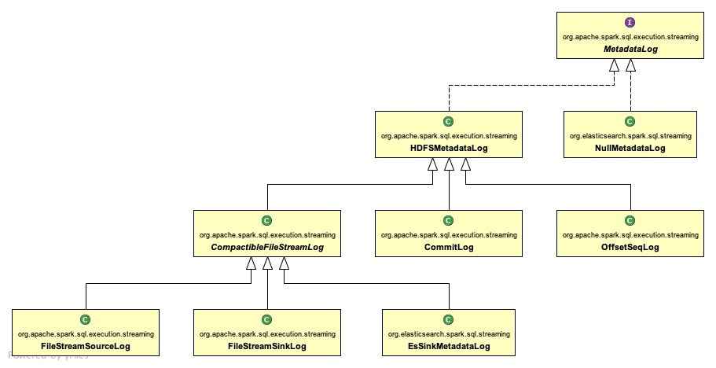

# 配置

## File Sink/Source

尽量使用第三方，如Hudi、Iceberg等，而不要使用原生，当前存在一些问题（3.1.0对Filesink加了retension配置）：





**fileSource 数据源端**：配置在 FileStreamSourceLog 引用

- 问题：checkpoint中的source中compact会越来越大

- spark.sql.streaming.fileSource.log.deletion (默认true)，删除过期日志文件
- spark.sql.streaming.fileSource.log.compactInterval (默认10)，日志文件合并阈值
- spark.sql.streaming.fileSource.log.cleanupDelay (默认10m)，日志文件保留时间

fileSink 接收端：配置在 FileStreamSinkLog 引用

- 问题：$OUT_PATH/_spark_metadata中会保存每次的文件，作为流式读取的依据？（当前3.1）

```json
v1
{"path":"file:///E:/spark_test/part-00000-70e530af-2072-4a07-a5ab-e1436e4fac25-c000.json","size":0,"isDir":false,"modificationTime":1630404583569,"blockReplication":1,"blockSize":33554432,"action":"add"}
{"path":"file:///E:/spark_test/part-00000-8151d857-8d7c-4a52-8e10-2856b8d4fe91-c000.json","size":56,"isDir":false,"modificationTime":1630404585406,"blockReplication":1,"blockSize":33554432,"action":"add"}
{"path":"file:///E:/spark_test/part-00001-4220c406-e887-4f69-b8f6-71521f148512-c000.json","size":56,"isDir":false,"modificationTime":1630404585406,"blockReplication":1,"blockSize":33554432,"action":"add"}
```


- spark.sql.streaming.fileSink.log.deletion (默认true)，删除过期日志文件CompactibleFileStreamLog
- spark.sql.streaming.fileSink.log.compactInterval (默认10)，日志文件合并阈值
- spark.sql.streaming.fileSink.log.cleanupDelay (默认10m)，日志文件保留时间