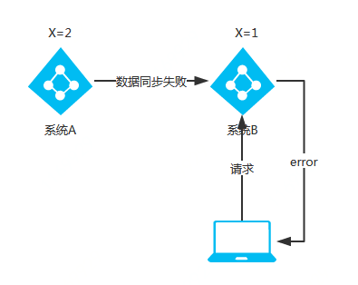
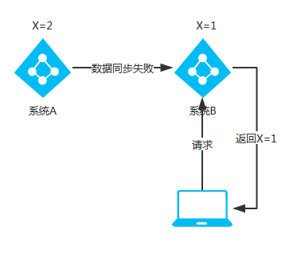
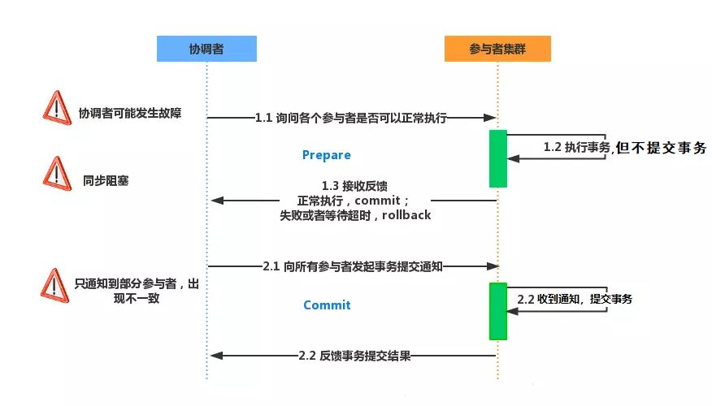
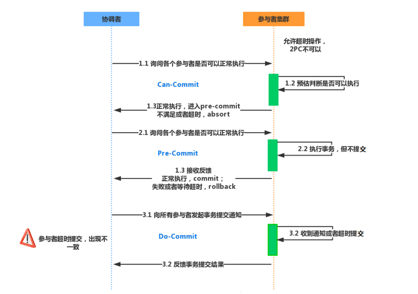

# 分布式一致性(consistency)

## CAP理论

> 对于分布式系统工程实践， CAP 理论更合适的描述是：**在满足分区容错的前提下，没有算法能同时满足数据强一致性和服务可用性**。

- **Consistency**：一致性，指强一致性（线性一致性）。如果一个写操作返回成功，那么之后的读请求都必须读到这个新数据

- **Availability**：可用性。系统提供的服务必须处于 **100% 可用**的状态，对于用户的每一个操作请求，系统总能够**在有限的时间内返回合理的响应**

- **Partition Tolerant**：网络分区容错性。当出现网络分区后，系统能够继续提供服务。

在出现网络分区后，会出现可用性和一致性的问题，我们必须要在这两者之间进行取舍：**CP** 或 **AP**。

### CP 架构

> 当网络分区出现后，为了保证一致性，就必须拒接请求，否则无法保证一致性：

CP 架构保证客户端在获取数据时一定是**最近的写操作，或者获取到异常信息**，绝不会出现数据不一致的情况。

- 当没有出网络分区时，系统 A 与系统 B 的数据一致，X=1。
- 将系统 A 的 X 修改为 2，X=2。
- 当出现网络分区后，系统 A 与系统 B 之间的数据同步数据失败，系统 B 的 X=1。
- 当客户端请求系统 B 时，为了保证一致性，此时系统 B 应拒绝服务请求，返回错误码或错误信息。

### AP 架构

当网络分区出现后，为了保证可用性，系统 B 可以返回旧值，保证系统的可用性：

- 当没有出网络分区时，系统 A 与系统 B 的数据一致，X=1。
- 将系统 A 的 X 修改为 2，X=2。
- 当出现网络分区后，系统 A 与系统 B 之间的数据同步数据失败，系统 B 的 X=1。
- 当客户端请求系统 B 时，为了保证可用性，此时系统 B 应返回旧值，X=1。

## BASE 理论

> 即便无法做到强一致性，但应该采用适合的方式保证最终一致性。

- **Basically Available**：基本可用，分布式系统在出现故障的时候，允许损失部分可用性，即保证核心可用。
  - 响应时间上的损失：时延增加；
  - 系统功能上的损失：服务降级；
- **Soft State**：允许系统存在中间状态，而该中间状态不会影响系统整体可用性。
  - 允许系统在不同节点的数据副本之间进行数据同步的过程存在延时；
- **Eventual Consistency**：最终一致性，系统中的所有数据副本经过一定时间后，最终能够达到一致的状态。

## 分布式事务协议

### 2PC(二阶段提交协议)

当一个事务跨越多个节点时，为了保持事务的 ACID 特性，需要引入一个作为**协调者**的组件来统一掌控所有节点（称作参与者）的操作结果并最终指示这些节点是否要把操作结果进行真正的提交（比如将更新后的数据写入磁盘等等）。

**算法思路可以概括为：**参与者将操作成败通知协调者，再由协调者根据所有参与者的反馈情报决定各参与者是否要提交操作还是中止操作。

基于以下假设：

- 存在一个节点作为**协调者**（Coordinator），其他节点作为参与者（Cohorts），且节点之间可以进行网络通信；
- 所有节点都采用**预写式日志**，且日志被写入后即被保持在可靠的存储设备上，即使节点损坏不会导致日志数据的消失；
- 所有**节点不会永久性损坏**，即使损坏后仍然可以恢复。

二阶段提交分为两阶段：

- **投票阶段**（Prepares）
  - 协调者向所有参与者询问是否可以执行提交操作，并开始等待各参与者的响应。
  - 参与者执行事务操作，如果执行成功就返回 Yes 响应，如果执行失败就返回 No 响应。
  - 如果协调者接受参与者响应超时，也会认为执行事务操作失败。
- **提交阶段**（Commit）
  - 如果第一阶段汇总所有参与者都返回 Yes 响应，协调者向所有参与者发出提交请求，所有参与者提交事务。
  - 如果第一阶段中有一个或者多个参与者返回 No 响应，协调者向所有参与者发出回滚请求，所有参与者进行回滚操作。

**缺点**：

- **单点故障**：一旦协调者发生故障，参与者会一直阻塞，特别是在第二阶段，协调者故障导致参与者锁定事务资源无法完成事务操作；
- **同步阻塞**：所有节点在执行操作时都是同步阻塞的，当参与者占有公共资源时，其他第三方节点访问公共资源不得不处于阻塞状态；
- **数据不一致**：第二阶段网络故障等原因导致只通知部分参与者，导致只有部分参与者提交事务，数据产生不一致；

问题：

- 协调者在第二阶段发送提交请求之后挂掉，而唯一接受到这条消息的参与者执行之后也挂掉：
  - 协调者通过选举协议产生新的协调者，但不确定已经执行过事务的参与者是执行的提交事务还是中断事务。
  - 协调者的预写日志只是本地存储，无法应用于新的协调者（可以通过Paxos/Raft 解决？）；

### 3PC(三阶段提交协议)

> 无论是 2PC 还是 3PC 都不能保证分布式系统中的数据 100% 一致。

**解决两阶段提交协议的缺点**而设计的。与两阶段提交不同的是，三阶段提交是**“非阻塞”协议**。

- 使得原先在两阶段提交中，参与者在投票之后，由于协调者发生崩溃或错误，而**导致参与者处于无法知晓是否提交或者中止的“不确定状态”所产生的可能相当长的延时的问题**得以解决。

分为三阶段：

- **CanCommit**：协调者向参与者发送 Commit 请求，参与者如果可以提交就返回 Yes 响应，否则返回 No 响应。

- **PreCommit**：协调者根据参与者在询问阶段的响应判断是否执行事务还是中断事务：

  - 如果所有参与者都返回 Yes，则执行事务。
  - 如果参与者有一个或多个参与者返回 No 或者超时，则中断事务。

  参与者执行完操作之后返回 ACK 响应，同时开始等待最终指令。

- **DoCommit**：协调者根据参与者在准备阶段的响应判断是否执行事务还是中断事务

  - 如果所有参与者都返回正确的 ACK 响应，则提交事务。
  - 如果参与者有一个或多个参与者收到错误的 ACK 响应或者超时，则中断事务。
  - 如果参与者无法及时接收到来自协调者的提交或者中断事务请求时，**会在等待超时之后，会继续进行事务提交**。

  协调者收到所有参与者的 ACK 响应，完成事务。

三阶段提交解决**二阶段提交中存在的由于协调者和参与者同时挂掉可能导致的数据一致性问题和单点故障问题**，并减少阻塞。

**三阶段提交的问题：**在提交阶段如果发送的是中断事务请求，但是由于网络问题，导致部分参与者没有接到请求。

- 参与者会在等待超时之后执行提交事务操作，这样这些由于网络问题导致提交事务的参与者的数据就与接受到中断事务请求的参与者存在数据不一致的问题。

### 基于MQ的2PC

RocketMQ 在4.3.0版中已经支持分布式事务消息，采用了***2PC（两阶段提交）+ 补偿机制（事务状态回查）***的思想来实现了提交事务消息，同时增加一个补偿逻辑来处理二阶段超时或者失败的消息。

正常事务消息的发送及提交的执行流程：

- 发送 Prepare 消息到消息中间件。
- 发送成功后，执行本地事务。
- **如果事务执行成功，则 Commit，消息中间件将消息下发至消费端**。
- **如果事务执行失败，则回滚，消息中间件将这条 Prepare 消息删除。**
- 消费端接收到消息进行消费，如果消费失败，则不断重试。

事务消息的补偿流程：

- 在网络闪断或者是应用重启的情况下，可能导致生产者发送的二次确认消息未能到达Broker服务端，**经过固定时间后**，Broker服务端将会对没有Commit/Rollback的事务消息（pending状态的消息）进行“回查”；
- 生产者收到回查消息后，检查回查消息对应的本地事务执行的最终结果；
- 生产者根据本地事务状态，再次提交二次确认给Broker，然后Broker重新对半事务消息Commit或者Rollback；

## 拜占庭将军问题

