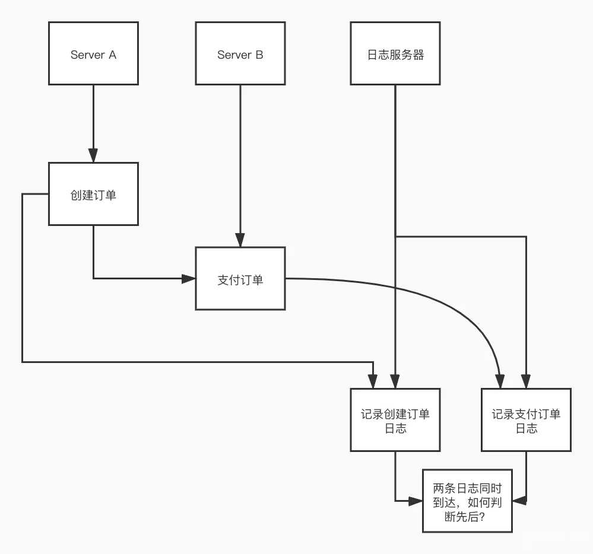
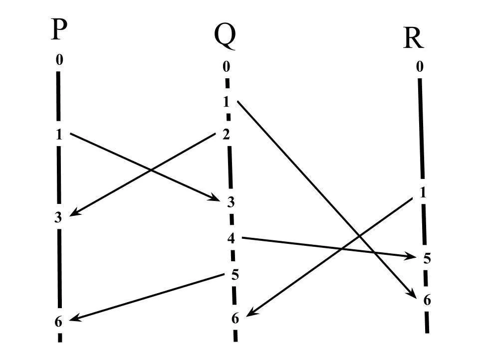
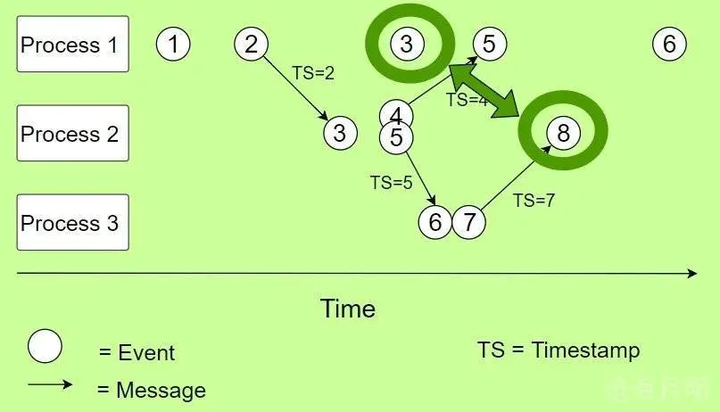

# 逻辑时钟

比如 **A，B，日志服务器** 三台机器，用户发起一个购买操作，首先第一个请求在 Server A 上面创建了订单，之后支付操作在 Server B 上进行。然后为了记录用户操作，Server A 和 Server B **异步**发送日志写入请求到达日志服务器。假设两条日志同时到达，那么日志服务器该如何区分先后顺序

绝对时间戳的问题：

- 即使定期进行 NTP 时间同步，不同机器内部时间计算也会产生误差，可能有些机器时间前进的快点，有些机器会慢点，这种现象也叫 *Clock Drift*；

## Logic Clock

引入逻辑时间，其中 Logic Clock 中最出名的就是 `Lamport Timestamp`。通过逻辑时间，我们可以判断不同事件的因果顺序关系。

**逻辑时钟指的是分布式系统中用于区分事件的发生顺序的时间机制**。

**逻辑时钟就是为了解决分布式系统中的时序问题，即如何定义a在b之前发生。**

分布式系统中按是否存在节点交互可分为**三类事件**，一类发生于**节点内部**，二是**发送事件**，三是**接收事件**。

**逻辑时钟 C** 说明：

- 对于任意事件a, b：如果$a -> b$（`->`表示a先于b发生），那么$C(a) < C(b)$；反之不然,，因为有可能是并发事件 
- 如果a和b都是进程Pi里的事件，并且a在b之前，那么Ci(a) < Ci(b)；
- 如果a是进程Pi里关于某消息的发送事件，b是另一进程Pj里关于该消息的接收事件，那么Ci(a) < Cj(b)；

**偏序**：

- 指存在“序”这个概念，满足**自反性、反对称性和传递性**；
- 不是任何两个元素之间都有这个序的先后关系；
- 比如集合之间的包含关系，就是一个偏序关系，但并不是任何两个集合之间都存在包含关系。

## Lamport Timestamp 

**Lamport逻辑时钟只保证因果关系（偏序）的正确性，不保证绝对时序的正确性。**

Lamport Timestamp 是一种衡量时间和因果关系的方法，算法的实现遵循以下规则：

- 每一台机器内部都有一个时间戳（Timestamp），初始值为 0。
- 机器执行一个事件（event）之后，该机器的 timestamp + 1。
- 当机器发送信息（message）给另一台机器，它会附带上自己的时间戳，如 **<messgae, timestamp>** 。
- 当机器接受到一条 message，它会将本机的 timestamp 和 message 的 timestamp 进行对比，选取大的 timestamp 并 +1。

**如果a发生在b之前(happened before)，记作 a -> b，则有C(a) < C(b)**。

**如果C(a) < C(b)，并不能说明a -> b，也就是说C(a) < C(b)是a -> b的必要不充分条件，即Lamport逻辑时钟只具备偏序关系**。

如何得到全序关系：

- 利用给进程编号，利用进程编号的大小来排序；
  - 假设a、b分别在节点P、Q上发生，Pi、Qj分别表示我们给P、Q的编号，如果 C(a) = C(b) 并且 Pi < Qj，同样定义为a发生在b之前，记作 a => b。
- Lamport逻辑时钟是一个正确的算法，**即有因果关系的事件时序不会错**，但并不是一个公平的算法，即**没有因果关系的事件时序不一定符合实际情况**。

## Vector Clock

Lamport时间戳帮助我们得到事件顺序关系，但还有一种顺序关系不能用Lamport时间戳很好地表示出来，那就是**同时发生关系**(concurrent)。

如下图所示，你其实无法单纯的通过 logic clock 比较来判断 Process 1 中的事件 3 和 Process 2 中的事件 8 是否有关系。

如果事件 3 执行时间延迟几秒，这不会影响到事件 8。所以两个事件互不干涉，为了判断两个事件是否为这种情况，我们引入了 Vector Clock（向量逻辑时间）。

### 算法实现

Vector Clock 是通过向量（数组）包含了一组 Logic Clock，里面每一个元素都是一个 Logic Clock。如上图，我们有 3 台机器，那么 Vector Clock 就包含三个元素，每一个元素的索引（index）指向自己机器的索引。

- 每一台机器都初始化所有的 timestamp 为 0。例如上面的例子，每一台机器初始的 Vector Clock 均为 `[0, 0, 0]` 。
- 当机器处理一个 event，它会在向量中将和自己索引相同的元素的 timestamp + 1。例如 1 号 机器处理了一个 event，那么 1 号机器的 Vector Clock 变为 `[1, 0, 0]` 。
- 每当发送 message 时，它会将向量中自己的 timestamp + 1，并附带在 message 中进行发送。如 **** 。
- 当一台机器接收到 message 时，它会把自己的 Vector Clock 和 message 中的 Vector Clock 进行逐一对比（每一个 timestamp 逐一对比），并将 timestamp 更新为更大的那个（类似于 Lamport Timestamp 的操作）。然后它会对代表自己的 timestamp + 1。

如下图所示：

2020-05-01-8ndGfw

由此我们也可以知道，如果  ，那么  的 Vector Clock 中的每一个元素都会小于  中的每一个元素。

**判断两个事件是否并行或独立**

回到刚刚判断两个事件是不是有关联，我们可以看到 Process 1 中的 `[3, 0, 0]` 和 Process 2 中的 `[2, 4, 2]` ，其中 3 > 2 而 0 < 4，0 < 2 。有些 timestamp 大于对方，而有些 timestamp 又小于对方，由此我们可以得知这两个事件是互不相干的。

### 缺陷

#### 系统伸缩（Scale）缺陷

其实 Vector Clock 对资源的伸缩支持并不是很好，因为对于一个 key 来说，随着服务器数量的增加，**Vector Clock 中向量的元素也同样增长**。假设集群有 1000 台机器，每次传递信息时都要携带这个长度为 1000 的 Vector，这个性能不太好接受。

### 非唯一缺陷

在正常的系统下面，假设所有的消息都是有序的（即同一台机器发送 消息 1 和 2 到另一台机器，另一台机器也会先接收到消息 1 再接收消息 2）。那么我们可以根据每一台机器的 Vector Clock 来恢复它们之间的计算（computation）关系，也就是每一种计算都有着对应自己独一无二的 Vector Clock。

但是，如果消息不是有序的，消息之间会‘超车‘（overtaking），那么问题就来了，看下图：

大家看看左右两张图，两种不一样的计算方式，但是最终  和  上面产生了相同的 Vector Clock。也就是说，相同的 Vector Clock 并不代表唯一的 computation。

这张图中，我们可以看看  节点中的 ，我们无法判断这个  是从  那边的  传递过来还是  自己处理了一个事件，在自己  的基础上面 +1 。

**解决办法 1**

在 Vector Clock 中添加事件类型，例如用内部（internal），发送（send），接收（receive）3 种事件表明 Vector Clock。但是这样的话还是有问题，

我们标明了 send 和 receive 两种事件，但是结果还是不同的 computation 产生了相同的 Vector Clock。

**解决办法 2**

将 Vector Clock 改为既包含接收到消息的时间和本地时间。例如下面这个图：

将左边图改为 %2Ci%3A(%3C1%2C0%3E%2C%3C3%2C2%3E%2Cj%3A(%3C2%2C0%3E)%2C%3C3%2C3%3E)) ，右边图中变为 %2Ci%3A(%3C2%2C0%3E%2C%3C3%2C2%3E%2Cj%3A(%3C1%2C0%3E)%2C%3C3%2C3%3E)) 。

通过这种方法，我们能够确定每一种 computation 有着唯一的 Vector Clock。虽然这种会导致 Vector Clock 体积增长了一倍。

当然这种方法也不一定完全需要，因为只要我们能够保证消息发送到达的有序，即不产生消息超车（Overtaking）的情况下，原来的 Vector Clock 也够用了