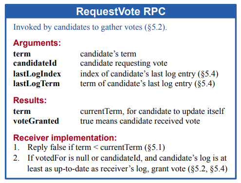
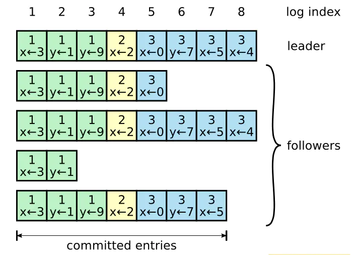
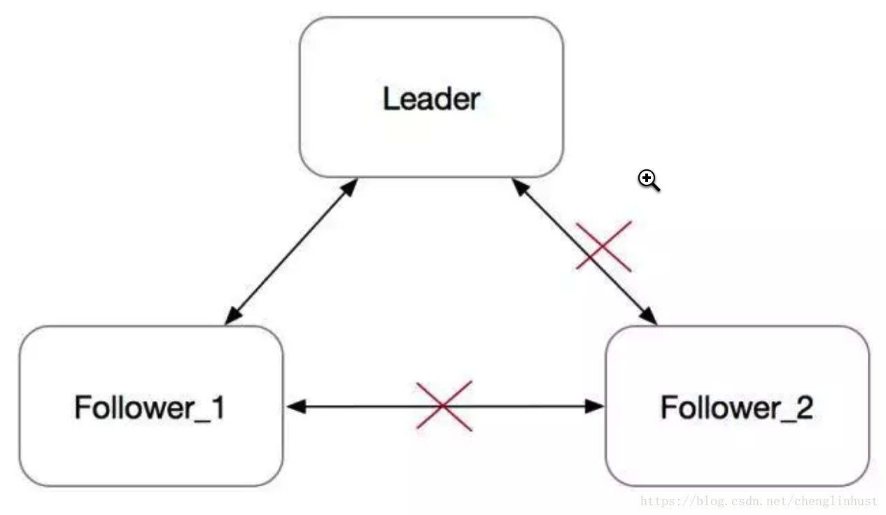

[toc]

# Raft 算法

复制状态机（Replicated State Machine）：集群中的每台机器的状态机，通过执行相同的日志序列，将运算得到一致的最终状态。

Raft 实现一致性的方式是：首先选举出一个集群领导者，然后让它全权管理日志。

节点的状态：*Leader*、*Follower*和*Candidate*。状态流转图示：

Raft 把时间分割成任意长度的任期（term，作为逻辑时钟），任期用**连续的整数**标记，每一段任期从一次选举开始，一个或者多个 candidate 尝试成为 leader ：

- 如果一个 candidate 赢得选举，然后他就在该任期剩下的时间里充当 leader ；
- 在某些情况下，一次选举无法选出 leader 。在这种情况下，这一任期会以没有 leader 结束；
- 一个新的任期（包含一次新的选举）会很快重新开始；
- Raft 保证了在任意一个任期内，最多只有一个 leader 。

每一个服务器节点存储一个**当前任期号**，该编号随着时间单调递增：

- 服务器之间通信的时候会交换当前任期号：
- 如果一个服务器的当前任期号比其他的小，该服务器会将自己的任期号更新为较大的那个值；
- 如果一个 candidate 或者 leader 发现自己的任期号过期了，它会立即回到 follower 状态；
- 如果一个节点接收到一个包含过期的任期号的请求，它会直接拒绝这个请求。

## 状态

### Follower

- 节点开始启动时，起始状态为*Follower*，只要能从*leader*或者*candidate*接收消息，则一直保持状态为*follower*；
- 响应*candidates*和*leader*的Rpc；
- Client请求*follower*，*follower*会重定向给*leader*；
- 如果在选举超时时间内没有收到现任*Leader*的AppendEntries的RPC或授予候选人投票权？？将自身状态转换为Candidate；

### Candidate

- 状态只存在`Leader`选举期间；

### Leader

- 周期性向Follower发送心跳（不包含日志条目的AppendEntires RPC），维持*Leader*状态；

## 领导者选举

*Follower* -> *Condidate* 

- 增加自己的**当前任期号**；

- 投票给自己；
  
- 并行地向集群中的其他服务器节点发送 RequestVote RPC（让其他服务器节点投票给它）；
  
  - 对于同一个任期，每个服务器节点只会投给一个 candidate ，按照先来先服务（first-come-first-served）的原则；
  
- 一直保持candidate状态，直到：
  - 自己赢得了这次的选举（收到过半的投票）；
    
    - 状态变为*Leader*，会向其他的服务器节点**发送心跳消息**来确定自己的地位并阻止新的选举。
  - 其他的服务器节点成为 leader；
    - 会收到另一个声称自己是 leader 的服务器节点发来的 AppendEntries RPC ；
    - 如果这个 leader 的任期号（包含在RPC中）不小于 candidate 当前的任期号，那么 candidate 会承认该 leader 的合法地位并回到 follower 状态；
    - 如果 RPC 中的任期号比自己的小，那么 candidate 就会拒绝这次的 RPC 并且继续保持 candidate 状态。
  - 一段时间之后没有任何获胜者，如有多个 follower 同时成为 candidate ，那么选票可能会被瓜分以至于没有 candidate 赢得过半的投票。
    - 每一个候选人都会超时，然后通过增加当前任期号来开始一轮新的选举；
    
      
    

**随机选举超时时间**避免无限重复该情况；

- Follower有不同的选举超时时间，在大多数情况下只有一个服务器会选举超时，在其它节点超时前赢得选择并发送心跳；

## 日志复制

*Leader*

- leader 发起，用来**复制日志**和提供一种**心跳机制**；
- 客户端的每一个请求都包含一条将被复制状态机执行的指令，**并行的发起 AppendEntries RPC** 给其他的服务器，让它们复制该条目；
- 当该条目被**安全地复制**（下面会介绍），leader 会应用该条目到它的状态机中（状态机执行该指令）然后把执行的结果返回给客户端。

- 如果 follower 崩溃或者运行缓慢，或者网络丢包，领导人会不断地重试 AppendEntries RPC（即使已经回复了客户端）直到所有的 follower 最终都存储了所有的日志条目。

Raft 算法保证所有**已提交的日志条目都是持久化**的并且最终会被所有可用的状态机执行。

Raft 算法保证所有已提交的日志条目都是持久化的并且最终会被所有可用的状态机执行。一旦创建该日志条目的 **leader 将它复制到过半的服务器上，该日志条目就会被提交**（例如条目 7）。同时，**leader 日志中该日志条目之前的所有日志条目也都会被提交**，包括由其他 leader 创建的条目。

Follower 一旦知道某个日志条目已经被提交就会将该日志条目应用到自己的本地状态机中（按照日志的顺序）。

日志匹配特性：

- 如果不同日志中的两个条目拥有相同的索引和任期号，那么他们存储了相同的指令。
- 如果不同日志中的两个条目拥有相同的索引和任期号，那么他们之前的所有日志条目也都相同。

## 安全性

- 保证了对于给定的任意任期号， leader 都包含了之前各个任期所有被提交的日志条目。

- 保证新 leader 在当选时就包含了之前所有任期号中已经提交的日志条目，不需要再传送这些日志条目给新 leader 。

- Raft 使用投票的方式来阻止 candidate 赢得选举除非**该 candidate 包含了所有已经提交的日志条目**。

- RequestVote RPC 中包含了 candidate 的日志信息，如果投票者自己的日志比 candidate 的还新，它会拒绝掉该投票请求。
  - Raft 通过比较两份日志中最后一条日志条目的索引值和任期号来定义谁的日志比较新。如果两份日志最后条目的任期号不同，那么任期号大的日志更新。如果两份日志最后条目的任期号相同，那么日志较长的那个更新。

- 当 leader 复制之前任期内的日志条目时，这些日志条目都保留原来的任期号。
- Raft 永远不会通过计算副本数目的方式来提交之前任期内的日志条目：
  - 只有 leader 当前任期内的日志条目才通过计算副本数目的方式来提交；一旦当前任期的某个日志条目以这种方式被提交，那么由于日志匹配特性，之前的所有日志条目也都会被间接地提交。

## Follower 和 candidate 崩溃

- RequestVote 和 AppendEntries RPCs 都会失败。Raft 通过无限的重试来处理这种失败；如果崩溃的机器重启了，那么这些 RPC 就会成功地完成；
- Raft 的 RPCs 都是幂等的，所以这样的重试不会造成任何伤害。
  - 一个 **follower 如果收到 AppendEntries 请求但是它的日志中已经包含了这些日志条目，它就会直接忽略这个新的请求中的这些日志条目**。

## 定时（timing）和可用性

Leader 选举是 Raft 中定时最为关键的方面。 只要整个系统满足下面的时间要求，Raft 就可以选举出并维持一个稳定的 leader：

> 广播时间（broadcastTime） << 选举超时时间（electionTimeout） << 平均故障间隔时间（MTBF）

- 广播时间指的是一个服务器并行地发送 RPCs 给集群中所有的其他服务器并接收到响应的平均时间；
- 平均故障间隔时间就是对于一台服务器而言，两次故障间隔时间的平均值；

Raft 的 RPCs 需要接收方将信息持久化地保存到稳定存储中去，所以广播时间大约是 0.5 毫秒到 20 毫秒之间，取决于存储的技术。因此，**选举超时时间可能需要在 10 毫秒到 500 毫秒之间**。

## 集群成员变更

> 图示：直接从一种配置转到另一种配置是不安全的，因为各个机器会在不同的时候进行转换。在这个例子中，集群从 3 台机器变成了 5 台。不幸的是，存在这样的一个时间点，同一个任期里两个不同的 leader 会被选出。一个获得旧配置里过半机器的投票，一个获得新配置里过半机器的投票。

在 Raft 中，集群先切换到一个过渡的配置，我们称之为联合一致（joint consensus）；一旦联合一致已经被提交了，那么系统就切换到新的配置上。联合一致结合了老配置和新配置：

- 日志条目被复制给集群中新、老配置的所有服务器。
- 新、旧配置的服务器都可以成为 leader 。
- 达成一致（针对选举和提交）需要分别在两种配置上获得过半的支持。

服务器总是使用它日志中最新的配置，无论该配置日志**是否已经被提交**？

三个问题：

1）

2）

3）

当服务器认为当前 leader 存在时，服务器会忽略RequestVote RPCs 。特别的，当服务器在最小选举超时时间内收到一个 RequestVote RPC，它不会更新任期号或者投票。这不会影响正常的选举，每个服务器在开始一次选举之前，至少等待最小选举超时时间。相反，这有利于避免被移除的服务器的扰乱：如果 leader 能够发送心跳给集群，那它就不会被更大的任期号废黜。

## 日志压缩

快照技术是日志压缩最简单的方法

增量压缩方法，例如日志清理或者日志结构合并树（log-structured merge trees，LSM 树）

通过写时复制的技术，这样新的更新就可以在不影响正在写的快照的情况下被接收

## PreVote

在Basic Raft算法中，当一个Follower与其他节点网络隔离，如下图所示：

Follower_2在electionTimeout没收到心跳之后，会发起选举，并转为Candidate。每次发起选举时，会把Term加一。由于网络隔离，它既不会被选成Leader，也不会收到Leader的消息，而是**会一直不断地发起选举，Term会不断增大**。

一段时间之后，这个节点的Term会非常大。在网络恢复之后，这个节点会把它的Term传播到集群的其他节点，导致其他节点更新自己的term，变为Follower。然后触发重新选主，但这个旧的Follower_2节点由于其日志不是最新，并不会成为Leader。整个集群被这个网络隔离过的旧节点扰乱，显然需要避免的。

Raft作者博士论文《CONSENSUS: BRIDGING THEORY AND PRACTICE》的第9.6节 "Preventing disruptions when a server rejoins the cluster"提到了PreVote算法的大概实现思路。

在PreVote算法中，**Candidate首先要确认自己能赢得集群中大多数节点的投票，这样才会把自己的term增加，然后发起真正的投票**。其他投票节点同意发起选举的条件是（同时满足下面两个条件）：

- **没有收到有效领导的心跳，至少有一次选举超时。**
- **Candidate的日志足够新（Term更大，或者Term相同raft index更大）。**

PreVote算法解决了网络分区节点在重新加入时，会中断集群的问题。在PreVote算法中，网络分区节点由于无法获得大部分节点的许可，因此无法增加其Term。然后当它重新加入集群时，它仍然无法递增其Term，因为其他服务器将一直收到来自Leader节点的定期心跳信息。一旦该服务器从领导者接收到心跳，它将返回到Follower状态，Term和Leader一致。

## Client

当客户端第一次启动的时候，它会随机挑选一个服务器进行通信。如果客户端第一次挑选的服务器不是 leader ，那么该服务器会拒绝客户端的请求并且提供关于它最近接收到的领导人的信息（AppendEntries 请求包含了 leader 的网络地址）。如果 leader 已经崩溃了，客户端请求就会超时；客户端之后会再次随机挑选服务器进行重试。

## State Machine

状态机，应用 logEntry，可以通过logEntry恢复state machine的内存状态。