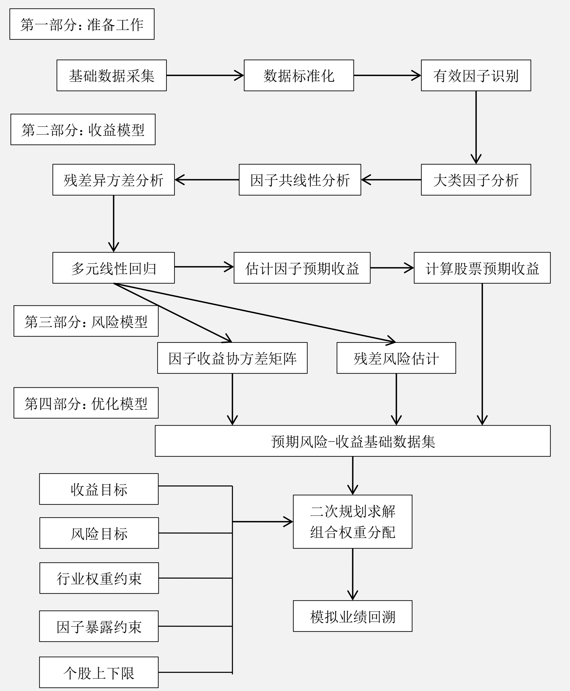

# 多因子模型

## 模型和概念

**多因子模型方程：**
$$
\tilde{r}_j = \sum_{k=1}^K{X_{jk}*\tilde{f}_k} + \tilde{u}_j \\
𝑋_{𝑗𝑘}: 股票𝑗在因子𝑘上的因子暴露（因子载荷）\\
\tilde{f}_𝑘:因子𝑘的因子收益 \\
\tilde{u}_𝑗: 股票𝑗的残差收益
$$
多因子模型有三种**主要表现形式**：

- 宏观经济因子模型：可观察到的**宏观经济数据序列**，比如通货膨胀率、利率等指标，作为股票市场收益率变动的主要解释变量。  
- **基本面因子模型**：使用可观察到的股票自身的基本属性，比如分红比例、估值水平、成长性、换手率等指标，作为股票市场收益率变动的主要解释变量。基本面因子主要是进行**横截面分析**，确定股票收益率对因子的敏感性（Beta 值）
- ，基本面因子一般可以归纳为**基本面类、估值类、市场类**。
- 统计因子模型：从股票**收益率的协方差**矩阵中提取统计因子，作为股票市场收益率变动的主要解释变量。常见的统计分析方法有主成分分析、最大似然分析和预期最大化分析。

**基本面因子模型**

主流的研究模型。假设： 具有类似“属性”的股票，在市场上应该有相似的收益率。  

**多因子模型识别这些共同的基本面因子，并且估计收益率对这些因子的敏感性，得出股票或者组合的预期收益率，最后通过风险模型，根据投资者的收益—风险偏好挑选合适的股票并进行权重分配。**

假设一个投资组合由𝑁个股票组成，它们在组合中的权重分别是$ℎ_{p1}, ℎ_{p2}, … , ℎ_{p𝑁}$，则组合的收益率为：
$$
\tilde{r_p} = \sum_{k=1}^K{\tilde{X_{pk}} * \tilde{f_k}} + \sum_{j=1}^N{h_{pj} * \tilde{u_j}} \\
其中，\tilde{𝑋_{p𝑘}} = \sum_{j=1}^N{ℎ_{p𝑗}} ∗ 𝑋_{𝑗𝑘}
$$
**多因子模型风险预测**

对于一个包含𝑁只股票和𝐾个因子的系统，多因子模型本质上是将对于𝑁只股票的收益—风险预测转变成对于𝐾个因子的收益—风险预测。  

**假设残差收益率$\tilde{𝑢_𝑗}$与因子收益率$\tilde{f_𝑘}$独立，并且不同股票的残差收益率之间也互相独立**。在多因子模型的框架下，市场的风险结构变为：
$$
V_{i,j}=\sum_{k1,k2=1}^{K}{X_{i,k1} * F_{k1,k2} * X_{j,k2}} + \Delta_{i,j} \\
V_{i,j}: 股票𝑖和股票𝑗的协方差 \\
X_{i,k1}: 股票𝑖对因子𝑘1 的暴露度（因子载荷） \\
F_{k1,k2}: 因子𝑘1和因子𝑘2之间的收益率协方差 \\
\Delta_{i,j}: 股票𝑖和股票𝑗之间残差的协方差， 𝑖 ≠ 𝑗时为 0
$$
对于任意一个投资组合𝑃都可以用一个𝑁维向量$ℎ_p$来描述，其中$ℎ_p$是组合𝑃在𝑁只股票上的持仓权重。则组合𝑃的因子暴露度是：

$$
x_p = X^T * h_p
$$
组合𝑃的方差为：

$$
\sigma_p^2 = 𝑥_p^𝑇 ∗ 𝐹 ∗ 𝑥_p + ℎ_p^𝑇 ∗ ∆ ∗ ℎ_p = ℎ_p^𝑇 ∗ 𝑉 ∗ ℎ_p
$$
**多因子模型风险分解**

影响股票收益的因子按照逻辑可以分成三种类型：  

- 市场风险：牛市和熊市，涉及所有股票；
- 行业风险：相同或相似业务的公司的股票；
- 风格风险：除上述两种外，股票市场结构表现在一定时期内呈现强烈的风格特征。
  - 暂分为12类的风格因子。

## 构建流程

### **构建流程图**

**残差异方差分析**：如果回归的残差项具有不同的方差，则称回归模型存在**异方差**。如果存在异方差，则传统的最小二乘回归得到的参数估计量不是有效估计量，所以在进行多元线性回归之前必须进行残差的异方差分析。 根据 Barra 的文档， 可以采用**个股流通市值的平方根作为权重进行加权最小二乘法回归**，经实践在大部分截面期上可以消除异方差的影响；  

### 准备工作

#### **基础数据采集**

主要指**风格因子**的基础数据采集。

- 确定备选因子池；
- 确定因子的具体计算方法。

| 大类因子                                  | 具体因子                     | 因子描述                           |
| ----------------------------------------- | ---------------------------- | ---------------------------------- |
| 估值因子 （Value Factor）                 | EP                           | 净利润（TTM， 过去12个月） /总市值 |
|                                           | EPcut                        | 扣除非经常性损益后净利润/总市值    |
|                                           | BP                           | 净资产/总市值                      |
|                                           | SP                           | 营业收入/总市值                    |
|                                           | NCFP                         | 净现金流/总市值                    |
|                                           | OCFP                         | 经营性现金流/总市值                |
|                                           | FCFP                         | 自由现金流/总市值                  |
|                                           | DP                           | 分红/总市值                        |
| 成长因子 （Growth Factor）                | sales_growth_q               | 营业收入增长率_当季同比            |
|                                           | sales_growth_ttm             | 营业收入增长率_TTM 同比            |
|                                           | sales_growth_3y              | 营业收入增长率_三年复合增长率      |
|                                           | profit_growth_q              | 扣非后净利润增长率_当季同比        |
|                                           | profit_growth_ttm            | 扣非后净利润增长率_TTM 同比        |
|                                           | profit_growth_3y             | 扣非和净利润增长率_三年复合增长率  |
|                                           | operationcashflow_growth_q   | 经营性现金流增长率_当季同比        |
|                                           | operationcashflow_growth_ttm | 经营性现金流增长率_TTM 同比        |
|                                           | operationcashflow_growth_3y  | 经营性现金流增长率_三年复合增长率  |
| 财务质量因子 （Financial Quality Factor） | roe_q                        | ROE_当季                           |
|                                           | roe_ttm                      | ROE_TTM                            |
|                                           | roa_q                        | ROA_当季                           |
|                                           | roa_ttm                      | ROA_TTM                            |
|                                           | grossprofitmargin_q          | 毛利率_当季                        |
|                                           | grossprofitmargin_ttm        | 毛利率_TTM                         |
|                                           | profitmargin_q               | 扣非后利润率_当季                  |
|                                           | profitmargin_ttm             | 扣非后利润率_TTM                   |
|                                           | assetturnover_q              | 资产周转率_当季                    |
|                                           | assetturnover_ttm            | 资产周转率_TTM                     |
|                                           | operationcashflowratio_q     | 经营性现金流/净利润_当季           |
|                                           | operationcashflowratio_ttm   | 经营性现金流/净利润_TTM            |
| 杠杆因子 （Leverage Factor）              | marketvalue_leverage         | （市值+优先股+长期负债） /市值     |
|                                           | financial_leverage           | 总资产/普通股权益                  |
|                                           | debtequityratio              | 长期债务/普通股权益                |
|                                           | cashration                   | 现金比率                           |
|                                           | currentratio                 | 流动比率                           |
| 规模因子 （Size Factor）                    | ln_capital                                   | 市值对数                          |
| 动量因子 （Momentum Factor）                | HAlpha                                       | 个股60个月收益对沪指回归的 Alpha  |
|                                             | relative_strength_1m         | 最近一个月收益率 |
|                                             | relative_strength_2m         | 最近两个月收益率 |
|                                             | relative_strength_3m         | 最近三个月收益率 |
|                                             | relative_strength_6m         | 最近六个月收益率 |
|                                             | relative_strength_12m        | 最近十二个月收益率 |
| 波动率因子 （Volatility Factor）            | high_low_1m                                  | 最高价/最低价（最近一个月内价格） |
|                                             | high_low_2m                  | 最高价/最低价（最近两个月内价格） |
|                                             | high_low_3m                  | 最高价/最低价（最近三个月内价格）            |
|                                             | high_low_6m                  | 最高价/最低价（最近六个月内价格） |
|                                             | high_low_12m                 | 最高价/最低价（最近十二个月内价格） |
|                                             | std_1m                       | 最近一个月的日收益率标准差 |
|                                             | std_2m                       | 最近两个月的日收益率标准差 |
|                                             | std_3m                       | 最近三个月的日收益率标准差 |
|                                             | std_6m                       | 最近六个月的日收益率标准差 |
|                                             | std_12m                      | 最近十二个月的日收益率标准差 |
|                                             | ln_price                     | 股价取对数 |
|                                             | beta_consistence             | 个股60个月收益对沪指回归 beta 乘以残差标准差 |
| 换手率因子 （Turnover Factor）              | turnover_1m                                  | 最近一个月换手率                  |
|                                             | turnover_2m                  | 最近两个月换手率 |
|                                             | turnover_3m                  | 最近三个月换手率 |
|                                             | turnover_6m                  | 最近六个月换手率 |
|                                             | turnover_12m                 | 最近十二个月换手率 |
| 改进的动量因子 （Modified Momentum Factor） | weighted_strength_1m                         | 最近一个月换手率加权日均收益率    |
|                                             | weighted _strength_2m        | 最近两个月换手率加权日均收益率 |
|                                             | weighted _strength_3m        | 最近三个月换手率加权日均收益率 |
|                                             | weighted _strength_6m        | 最近六个月换手率加权日均收益率 |
|                                             | weighted_strength_12m        | 最近十二个月换手率加权日均收益率 |
| 分析师情绪因子 （Sentiment Factor）         | rating_average                               | Wind 平均评级                     |
|                                             | rating_change                | Wind 评级：（上调数-下调数） /总评级数       |
|                                             | rating_targetprice           | Wind 一致目标价/现价-1 |
| 股东因子 （Shareholder Factor）             | holder_avgpct                                | 户均持股比例                      |
|                                             | holder_avgpctchange_half     | 户均持股比例过去半年增长率 |
|                                             | holder_avgpctchange          | 户均持股比例过去一年增长率 |
| 技术因子 （Technical Factor）               | macd                                         | macd                              |
|                                             | dif                          | dif |
|                                             | dea                          | de |

#### 数据标准化

因子的量纲不一致，采用标准化处理：

- 直接对因子载荷原始值进行标准化； 或
  - 保留因子载荷之间的原始分布关系，但回归时会受极端值影响；
- 先将因子载荷原始值转为排序值，再进行标准化。
  - 标准化后的分布是正态分布，容易看出因子载荷和收益率间的相关性的方向。

**因子载荷原始值标准化**

**中位数去极值法**
$$
\tilde{x_i}=\begin{cases}x_M+n*D_{MAD}, \quad if \quad x_i>x_M+n*D_{MAD} \\
x_M-n*D_{MAD}, \quad if \quad x_i < x_M+n*D_{MAD}\\
x_i, \qquad\qquad\qquad\qquad\qquad\qquad else 
\end{cases} \\
x_M: 序列x_i的中位数 \\
D_{MAD}: 序列|x_i-x_M|的中位数 \\
\tilde{x_i}: x_i去极值修正后的值
$$

数据去极值后的序列再进行标准化：

$$
\tilde{x_i}=\frac{x_i-u}{\sigma} \\
u:序列x_i的均值 \\
\sigma: 序列x_i的标准差 \\
\tilde{x_i}:序列x_i标准化之后的值
$$
**因子载荷排序值标准化**

第一步将原始序列转换为序关系序列；
$$
\tilde{x_i}= rank(x_i) \\
\tilde{x_i}: x_i在序列中的排序值
$$
第二步标准化方法与前面的标准化方法一致。  

#### 有效因子识别

步骤一：**单因子回归确定每个因子每期的因子收益**

市场风险、行业风险、风格风险是影响股票收益最主要的三种因素，**在验证风格因子有效性时， 必须考虑市场因子和行业因子的影响**。对于市场因子和行业因子的处理方式有两种：

1. 市场因子和行业因子同时纳入模型；
2. 仅**纳入行业因子**，而将市场因子包含在行业因子中。  

采用第二种的单因子回归模型如下
$$
\tilde{r_j^t}=\sum_{s=1}^S{X_{js}^t}*\tilde{f_s^t}+X_{jk}^t*\tilde{f_k^t}+\tilde{u_j^t} \\
\tilde{r_j^t}: 股票j在第t期的收益率 \\
X_{js}^t: 股票j在第t期在行业s上的暴露 \\
\tilde{f_s^t}: 行业s在第t期的收益率 \\
X_{jk}^t: 股票j在第t期在行业k上的暴露 \\
\tilde{f_k^t}: 因子k在第t期的收益率 \\
\tilde{u_j}: 股票j的残差收益率
$$
因子$X_{js}^t$是个0-1哑变量，即如果股票j属于行业s，则暴露度为1，否则为0。有的模型，可以对公司所属行业进行拆分，0.5属于行业a，0.5属于行业b。

行业分类有两种：1）GICS风格的行业分类，可以参考中证指数公司发布的中证行业指数系列；2）本土行业分类，可以参考中信行业指数系列。

步骤二：**因子收益率序列t检验**(TODO)

$\tilde{f_k^t}$是因子k在第t期的收益率，需要**确定因子k在第t期是否和股票收益率显著相关**，即$\tilde{f_k^t}$显著不为0，对$\tilde{f_k^t}$进行t检验：
$$
t = \frac{\tilde{x}-u}{\sigma/\sqrt{n-1}} \\
t: x的t统计量 \\
\tilde{x}: 样本的均值 \\
u: 总体的均值 \\
\sigma: 样本标准差 \\
n: 样本的容量 \\
$$

- t值绝对值序列的均值 ：每一期的截面回归，都可以得到一个因子收益率$\tilde{f_k^t}$的*t*值；
- t值绝对值序列大于2的比例 : 避免少数数值特别大的样本值拉高均值；
- 因子收益率$\tilde{f_k}^t$序列的t值检验 （TODO：区别是啥？）：观察因子收益率序列的方向一致性。

有效因子：

- 收益类因子：$\tilde{f_k}^t$的t值显著不为0，且方向性相对明确。
- 风险类因子：$\tilde{f_k}^t$的t值在0附近，收益率方向相对不明确。

步骤三： **辅助鉴别之因子 IC 值**

因子𝑘的 IC 值一般是指**个股第𝑇期在因子𝑘上的暴露度与𝑇 + 1期的收益率的相关系数**，评价该因子进行收益率预测的稳定性。因子收益率本质上是个斜率，不能代表任何稳健性的信息。

> 因子t值和IC之间具有某种正相关关系。

注：在因子标准化处理之后，在每个截面期上用其做因变量对市值因子及行业因子等做线性回归，取残差作为因子值的一个替代，这种做法可以消除因子在行业、板块、市值等方面的偏离。  

步骤四： **辅助鉴别之因子打分法回测**

依照因子值对股票进行打分，构建投资组合回测，是最直观的衡量指标优劣的手段。  

在某个截面期上，可以根据一个或几个因子值对个股进行打分，将所有个股依照分数进行排序，然后分为**𝑁个投资组合，进行回测**。  

### 收益模型

#### 大类因子分析

同类因子可能才能在较强的相关性，多元线性回归时造成多重共线性（指回归模型中的解释变量之间由于存在精确相关关系或高度相关性而使模型估计失真不准）。

步骤一：**同类型因子的相关性检验**

同类型的𝐾候选因子，向前选取𝑀个月的数据作为样本：

1. 按月计算出因子载荷之间的相关系数矩阵和每个因子收益率：
   $$
   \rho^t=\left[\begin{matrix}1 &\rho_{12}^t &\cdots &\rho_{1K}^t \\
   \rho_{21}^t &1 &\cdots &\cdots \\
   \vdots &\vdots &\ddots &\cdots \\
   \rho_{K1}^t &\cdots &\cdots &1
   \end{matrix}\right]
   $$

2. 根据M个月的相关系数进行检验，检验方法包括相关系数绝对值的均值、中位数、t检验等。
   $$
   \sum_{t=1}^M|\rho_{ij}^t| / M \\
   median(|\rho_{ij}^t|) t = 1, 2, ...M \\
   t = \frac{\overline{|\rho_{ij}^t|} - u}{\sigma / \sqrt{M-1}}
   $$

步骤二：**因子取舍或因子合成**

对于相关性较高的因子集合，需要进行处理。

- 因子取舍：根据因子有效性进行排序，调优有效的因子进行保留；
- 因子合成：尽可能保留因子有效信息:
  - 等权法：因子等权重地进行合成新的因子，再重新进行标准化；
  - 历史收益率加权法：因子按照各自历史收益率作为权重，进行合成，在重新标准化；
    - 获得最大解释力的大类因子，但共线性问题导致回归算出因子收益率不稳定。
  - 历史信息比例加权法：因子按照历史IC值对因子载荷进行合成。
    - 考虑历史率和波动率，更加稳健。
  - 主成分分析：对因子集合进行主成分分析，集合收益率排序选择一个或几个主成分的组合系数作为权重合成大类因子。
    - 偏技术分析，指标可能无特殊的经济学含义。适度采用。

#### 因子共线性分析

针对不同类型的因子的共线性分析。

**经济含义不同的因子，存在明显相关性，只能有所取舍，保留更加显著的因子，而舍弃不显著的因子。**

#### 残差异方差分析

同方差：为了保证回归参数估计量具有良好的统计性质，**经典线性回归模型**的一个重要假定：**总体回归函数中的随机误差项满足同方差性**，即它们都有相同的方差。  

如果不满足假定，即**随机误差项具有不同的误差，则称线性回归存在异方差性**。

回归模型：
$$
\tilde{r_j}=\sum_{k=1}^K{X_{jk}*\tilde{f_k}}+\tilde{u_j}
$$
如果残差项的条件方差相同，即 $Var(\tilde{u_𝑗}|𝑋_{𝑗1}, 𝑋_{𝑗2}, … 𝑋_{𝑗𝐾}) = \sigma^2$，则称为同方差性；

如果残差项的条件方差不相同，即$Var(\tilde{u_𝑗}|𝑋_{𝑗1}, 𝑋_{𝑗2}, … 𝑋_{𝑗𝐾}) = \sigma_j^2$，则称为异方差性。 

异方差性对普通最小二乘法（Ordinary Least Square， OLS）估计的影响，主要有三点：

1. 回归系数的 OLS 估计量仍然是无偏的、一致的、并且**不影响$𝑅^2$**和调整的$𝑅^2$。

2. **回归标准差的估计不再是无偏的**，从而回归系数 OLS 估计量的方差不再是无偏的，OLS 估计量不再是有效的和渐近有效的。

3. 𝑡统计量不服从𝑡分布， 𝐹统计量也不服从𝐹分布，从而无进行假设检验和区间估计，也无法进行区间预测。

对于模型是否存在异方差的检验，可以采用 Breusch-Pagan test 或者 White test 两种方法。

**Breusch-Pagan test**
$$
Y = \beta_0 + \beta_1*X_1 + ... + \beta_K*X_K + u \\
Var(u|X_1, ..., X_K)=E(u^2|X_1, ..., X_K)=\alpha_0 + \alpha_1 * X_1 +...+\alpha_K*X_K + v
$$
首先根据模型1估计出$\tilde{u^2}$，然后以$\tilde{u^2}$为因变量，得到$R_u^2$
$$
\tilde{u^2}=\alpha_0 + \alpha_1 * X_1 +...+\alpha_K*X_K + v
$$
计算模型的F统计量，或者构造统计量$LM=nR_u^2\sim\chi^2(K)$

对于$𝐻_0: 𝛼_1 = 0, 𝛼_2 = 0 … , 𝛼_𝐾 = 0$，如果𝐹统计量或者𝐿𝑀统计量是显著的，则拒绝原假设，
说明模型存在异方差。

**White Test** (TODO)

对于存在异方差的模型，采用加权最小二乘法（WLS）。

- 已知方差：（TODO）
- 未知方差：估计异方差的函数形式，属于可行的广义最小二乘法。

#### 多元线性回归

因子集的转换步骤：
1. 因子集𝐹1：最原始的因子集；
2. 因子集𝐹2：对𝐹1有效因子筛选后的因子集；
3. 因子集𝐹3：对𝐹2大类因子分析，经过因子取舍或者因子合成之后的因子集；
4. 因子集𝐹4：对𝐹3进行多重共线性分析，取舍之后的最终因子集。

在对因子集𝐹4做残差的异方差分析处理之后，就可以正式进行多元线性回归，估计每期的因
子收益序列。

$$
\tilde{r_j^t}=\sum_{s=1}^S{X_{js}^t}*\tilde{f_s^t}+X_{jk}^t*\tilde{f_k^t}+\tilde{u_j^t} \\
\tilde{r_j^t}: 股票j在第t期的收益率 \\
X_{js}^t: 股票j在第t期在行业s上的暴露 \\
\tilde{f_s^t}: 行业s在第t期的收益率 \\
X_{jk}^t: 股票j在第t期在行业k上的暴露 \\
\tilde{f_k^t}: 因子k在第t期的收益率 \\
\tilde{u_j}: 股票j的残差收益率
$$
经典回归模型的基本假设：

1. 参数的线性性： 回归模型对于参数而言是线性的；

2. 样本的随机性： 样本是从总体中随机抽样得到的；

3. 不存在完全共线性：每个解释变量具有一定变异并且自变量之间不存在完全的线性相关关系；
   
4. 零条件均值： $E(u_j|X_{1j}, X_{2j}, ... , X_{Kj}) = 0$；

5. 同方差性： $Var(u_j|X_{1j}, X_{2j}, ... , X_{Kj}) = \sigma^2$；

6. 正态性： $u_j$独立于所有变量，并且$u_j \sim N(0, \rho^2)$。

所以前面的大类因子分析，因子共线性分析，残差异方差分析，**本质都是让因子能够满足经典回归模型的基本假设**。

**估计因子预期收益**

多元线性回归，可以得到所有因子的历史收益率序列（$\tilde{f_K^T}，k=1,2,\cdots, K;t=1,2,\cdots,T$）
$$
F=\left[\begin{matrix}
\tilde{f_1^1} &\tilde{f_2^1} &\cdots &\tilde{f_K^1} \\
\tilde{f_2^1} &\tilde{f_2^2} &\cdots &\tilde{f_K^2} \\
\vdots &\vdots &\ddots &\vdots \\
\tilde{f_1^T} &\cdots &\cdots &\tilde{f_K^T}
\end{matrix}\right]
$$
对 T+1 期因子的预期收益率的估计，可以采用以下几种方式：

1. 历史均值法：用前N期因子历史收益率的均值作为T+1期因子的预期收益率
   $$
   \tilde{f_k^{T+1}}=\frac{\sum_{t=T-n+1}^T{\tilde{f_k^t}}}{N}
   $$
   一般情况下，N的取值为36或60，即前36个月或60个月的均值。

2. 指数加权移动平均法(EWMA)：越近的观测值权重越大，越远的观测值权重越轻。
   $$
   EWMA(t)=\lambda*\tilde{f_k^t}+(1-\lambda)*EWMA(t-1), t=1,2,\cdots,n \\
   \tilde{f_k^{T+1}}=EWMA(t) \\
   EWMA(t) : t时刻的修正估计量 \\
   \tilde{f_k^t} : t时刻的因子收益率观察值 \\
   \lambda : 权重因子
   $$

3. 时间序列预测法（TODO）

   3.1 $AR(q)$，自回归模型

   3.2 $MA(p)$，移动平均模型

   3.3 $ARMA(q,p)$，自回归移动平均模型，是*AR*和*MA*的组合。

   *ARIMA*是*ARMA*模型在时间序列一阶差分上的应用。
   
4. 滤波法提取趋势项：HP滤波法提取因子历史累计收益率的趋势项，以滤波曲线的终值除以样本期的长度作为因子的预期收益率。

   - 人工参数少，获取因子收益率长期变化规律的同时能尽量消除噪声的影响。

其它预测模型，还有如ARCH、GARCH、滤波、神经网络、遗传算法等。

注：在对T+1期因子预期收益做估计时，需要考虑因子收益率方向的约束条件。如果相反，则需要置0处理。

**计算股票预期收益**

估算出𝑇+1期的因子收益率向量($\tilde{f_1^{T+1}}, \tilde{f_2^{T+1}}, ... , \tilde{f_k^{T+1}}$)后，以及计算出𝑇 + 1期的因子载荷矩
阵：  
$$
X^{T+1}=\left[\begin{matrix}
X_{11}^{T+1} &X_{12}^{T+1} &\cdots &X_{1K}^{T+1} \\
X_{21}^{T+1} &X_{22}^{T+1} &\cdots &X_{2K}^{T+1}\\
\vdots &\vdots &\ddots &\vdots\\
X_{N1}^{T+1} &\cdots &\cdots &X_{NK}^{T+1}
\end{matrix}\right]
$$

根据模型
$$
\tilde{r_j^{T+1}}=\sum_{k=1}^{K}{X_{jk}^{T+1}*\tilde{f_k^{T+1}}}
$$
可以计算出T+1期每只股票的预期收益率向量($\tilde{r_1^{T+1}}，\cdots, \tilde{r_N^{T+1}}$)。

### 风险模型

**多因子模型的风险分解**

多因子风险模型的主要观点是，股票的收益率可以被一组共同因子和一个仅与该股票有关的特异因子解释，即任何股票的收益率来自两个方面：共同（因子）部分，特异部分。  

组合收益率：

- 业绩基准收益率
- 主动收益率（主动超额收益率)
  - 特定主动收益率(特异部分)
  - 因子主动收益率（共同部分)
    - 市场因子收益率
    - 行业因子收益率
    - 风格因子收益率

在多因子模型中，股票对于市场因子的因子暴露统一为1，对于行业因子的因子暴露时一个0-1哑变量（如果股票属于某一行业为1，否则为0）。多因子模型本质上是个统计套利模型，不适合对市场因子和行业因子进行收益预测和风险管理。其关注的**重点是风格因子的收益预测和风险管理。**

国内市场多因子模型最流行的用法是：

- 通过股指期货对冲组合的市场风险（市值对冲）；
- 通过行业中性对冲组合的行业风险（以业绩基准的行业权重为基准进行对齐，即组合在每个行业上的权重分配与业绩基准一致）。

#### 因子协方差矩阵

#### 残差风险估计

### 优化模型

#### 二次规划

#### 收益目标和风险目标

#### 个股上下限约束

#### 行业权重约束

#### 因子暴露约束

### 多因子模型的绩效分析

#### 常用的业绩分析指标

#### 收益率回归

#### 基于多因子的业绩回归

#### 业绩归因方式

