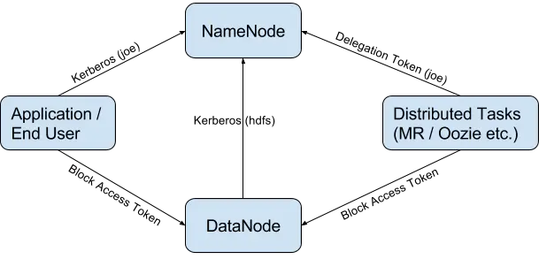
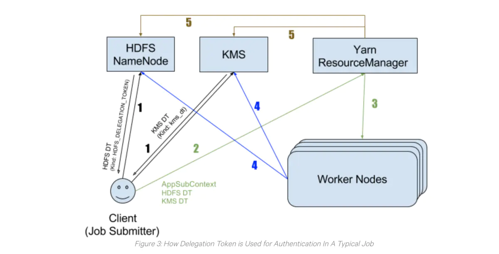

# Hadoop 安全

## Authentication

默认NameNode和ResourceManager不需要认证，即使用户没有服务端超级用户的权限，但用户可以在客户端可以用超级用户进行任意操作。

在这种Simple Auth机制下，Client端提取本地OS login username发送给Server，Server毫无保留地接受username，并以此身份运行Job。实际上，Hadoop本身没有做任何认证。


### Hadoop Auth

Hadoop Auth是一个Java库，它由一个客户机和一个服务器组件组成，用于为HTTP启用Kerberos SPNEGO身份验证。

Hadoop默认支持的身份验证机制包括Simple验证(也称为伪身份验证)和Kerberos SPNEGO身份验证，还有其他的验证方式（LDAP等）。


## Hadoop Security简单介绍

在2010年，安全特性被加入Hadoop（[HADOOP-4487](https://issues.apache.org/jira/browse/HADOOP-4487)），主要实现下面两个目标：

1. 拒绝未授权的操作访问HDFS中的数据。
2. 在实现1的基础上，避免太大的性能损耗。

为了实现第一个目标，我们需要保证：

1. 任何一个客户端要访问集群必须要经过认证，以确保它就是自己声称的身份。
2. 集群中任何服务器，需要被认证为集群中的一部分。

Kerberos被选作基础的认证服务。其它的机制，如：Delegation Token, Block Access Token, Trust等被加入当做Kerberos的补充。特别是Delegation Token机制被引入，其主要用以实现第二个目标（详情见下一节）。




### RPC

Hadoop RPC中采用**SASL**（Simple Authentication and Security Layer，简单认证和安全层）进行安全认证，具体认证方法涉及Kerberos和DIGEST-MD5两种。

- **Kerberos**用于在客户端和服务器端之间建立一条安全的网络连接，之后客户端可通过该连接从服务器端获取一个密钥。由于该密钥仅有客户端和服务器端知道，因此，接下来客户端可使用该共享密钥获取服务的认证。
- 共享密钥进行安全认证（使用**DIGEST-MD5**协议），它只涉及认证双方而不必涉及第三方应用（比如Kerberos中的KDC），将基于共享密钥生成的安全认证凭证称为令牌（Token）。


## Hadoop中**Token**

- Delegation Tokens在其它服务中的应用，如：Apache Oozie, Apache Hive, and **Apache Hadoop’s YARN RM**，这些服务都是用Delegation Tokens认证机制。
- Block Access Token：client在访问HDFS上的文件时，首先需要和NameNode通信，获取该文件的Block位置信息。然后直接和DataNode通信访问这些Blocks。访问权限的检查是在NameNode端完成。但是，**client直接访问DataNode中的Block数据，这也需要做权限认证**。Block Access Tokens就是用来解决这一问题。Block Access Tokens是由NameNode发布给Client，然后由Client发送给DataNode。Block Access Tokens的生命周期很短（默认10小时），并且不能更新。也就意味着如果一个Block Access Token过期，那么client必须重新获取一个新的token。
- Authentication Token：Hadoop中还有一种机制称为：Authentication Token，主要目的是实现一种更轻量级、高可扩展的认证方案。类似于client和server端的cookie。Authentication Tokens由server端授权，且无法更新以及仿冒他人。和Delegation Tokens不同的是，server端不需要单独存储Authentication Tokens.

在Hadoop中，令牌与Kerberos之间没有任何依赖关系，Kerberos仅仅是进行用户身份验证的第一道防线，**用户完全可以采用其他安全认证机制替换Kerberos**。因此，基于令牌的安全机制具有更好的灵活性和扩展性。

### Delegation Token

只使用Kerberos实现认证机制，但会有一定问题，尤其是应用在像Hadoop这样的分布式系统中。想像一下，对于每个MapReduce任务，如果所有的任务都需要使用TGT (Ticket Granting Ticket)通过Kerberos来进行认证，KDC（Kerberos Key Distribution Center）将很快成为系统瓶颈。


Delegation Tokens作为Kerberos的一个补充，实现了一种轻量级的认证机制。Kerberos是三方认证协议，而Delegation Tokens只涉及到两方。

Delegation Tokens的认证过程如下：

1. client通过Kerberos与Server完成认证，并从server获取相应的Delegation Tokens。
2. client与server之间后续的认证都是通过Delegation Tokens，而不进过Kerberos。

考虑到高可用性，Delegation Tokens会被server进行持久化。HDFS NameNode将Delegation Tokens持久化到元数据中（又称为：fsimage and edit logs），KMS会将其以ZNodes形式持久化到ZooKeeper中。即使服务重启或故障切换，Delegation Tokens也会一直可用。

### server端的Delegation Tokens

server端（HDFS NN和KMS）主要负责：

1. 发布Delegation Tokens，并保存用以验证。
2. 响应更新Delegation Tokens请求。
3. 当client端执行删除操作或token过期时，移除Token。
4. 通过验证client提供的Tokens和server端存储的token是否一致，来对client进行认证。

Delegation Token主要由两部分组成：**public部分和private部分**，在Server端以<key，value>形式存储在hashmap中，其中public部分作为key，private部分作为value。

只有Delegation Token的renewer(renew-interval，默认24小时）可以在token过期前进行更新操作。每次更新过后，token的过期时间会延长一个更新周期（renew-interval），直到**token达到最大生命周期**（默认7天）。


### client端的Delegation tokens

client主要负责：

1. 从server端请求一个新的Delegation Tokens，请求同时可以指定token的更新者（renewer）。
2. 更新Delegation Tokens（如果client将自己指定为renewer），亦或请求别的组件更新token（指定的renewer）
3. 向server发送取消Delegation Tokens的请求。
4. 提供Delegation Tokens供server进行认证。


### Example: Delegation Tokens的生命周期



图中通常有5个步骤：

1. client希望在集群中运行一个job，它分别从NameNode和KMS获取HDFS Delegation Token和KMS Delegation Token。
2. client将作业提交到YARN资源管理器（RM），同时提交的还有step1中获取的Delegation Token以及[ApplicationSubmissionContext](https://github.com/cloudera/hadoop-common/blob/cdh5-2.6.0_5.13.0/hadoop-yarn-project/hadoop-yarn/hadoop-yarn-api/src/main/java/org/apache/hadoop/yarn/api/records/ApplicationSubmissionContext.java#L38)。
3. YARN RM通过更新操作来核实接收的Token，随后，YARN启动job，并将其和Delegation Tokens一同分发到各个worker节点上。
4. 每个工作节点中的Task利用这些Token来进行认证，比如：需要访问HDFS上数据时，使用HDFS Delegation Token进行认证。需要解密HDFS加密区的文件时，使用KMS Delegation Token。
5. job结束后，RM则取消该job的Delegation Tokens。


### 长时间运行的应用

Delegations Tokens超过其最大生命周期后无法被更新，那么如果一个任务需要运行时间比token的最大生命周期还要长怎么办？

- Hadoop无法通过现有的配置解决这一问题；

- 对于spark-submit提交的任务，Spark已经实现一些"神奇"的参数，Spark获取Delegation Tokens，并用它做认证，但Spark在token将要过期时并不会更新tokens，而是获取一个新的token。这就可以让应用永远地运行下去。**需要为spark应用生成Kerberos keytab文件。**

- 长耗时作业，你应该考虑利用[YARN documentation about long-lived services](https://hadoop.apache.org/docs/stable/hadoop-yarn/hadoop-yarn-site/YarnApplicationSecurity.html#Securing_Long-lived_YARN_Services)中描述的机制，或者为token更新者增加一些自定义逻辑，用来在现有tokens即将过期时，重新获取delegation tokens。

  

### 2.7.1 Bug

[**Failed to Update HDFS Delegation Token for long running application in HA mode**](https://issues.apache.org/jira/browse/HDFS-9276)

- NameNode HA
- Kerberos
- HDFS Delegation Token


## Hadoop Key Management Server (KMS) 

Hadoop Key Management Server（KMS）是一个基于HadoopKeyProvider API编写的**密钥管理服务器**。他提供了一个client和一个server组件，client和server之间基于HTTP协议使用REST API通信。

Client是KeyProvider的实现，使用KMS HTTP REST API与KMS交互。KMS和它的client有内置的安全机制，支持HTTP SPNEGO Kerberos认证和HTTPS安全传输。

KMS是一个Java Jetty Web应用程序。

Kms和Hdfs配合使用的作用旨在补全hdfs权限管控的安全漏洞，正常使用hdfs时，用户感觉不到文件加密的存在，所以叫**“hdfs透明加密”**。


## Hadoop安全(security)模式

> When Hadoop is configured to run in secure mode, each Hadoop service and each user must be authenticated by Kerberos.

### Authentication


#### Hadoop Daemons的用户账户

| User:Group    | Daemons                                             |
| :------------ | :-------------------------------------------------- |
| hdfs:hadoop   | NameNode, Secondary NameNode, JournalNode, DataNode |
| yarn:hadoop   | ResourceManager, NodeManager                        |
| mapred:hadoop | MapReduce JobHistory Server                         |

#### Hadoop Daemons的Kerberos principals

每个Hadoop服务实例必须使用其Kerberos **principal** 和 **keytab** 文件位置进行配置。

- HDFS：NameNode，Secondary NameNode，DataNode 
- YARN：ResourceManager，NodeManager 
- MapReduce JobHistory Server

#### 将Kerberos principals映射为OS 用户账户

**hadoop.security.auth_to_local**：指定映射规则

- RULE:exp ：
- DEFAULT ：

**hadoop.security.auth_to_local.mechanism**：

- `hadoop` ：
- `MIT` ：

示例：

```xml
<property>
  <name>hadoop.security.auth_to_local</name>
  <value>
    RULE:[2:$1/$2@$0]([ndj]n/.*@REALM.\TLD)s/.*/hdfs/
    RULE:[2:$1/$2@$0]([rn]m/.*@REALM\.TLD)s/.*/yarn/
    RULE:[2:$1/$2@$0](jhs/.*@REALM\.TLD)s/.*/mapred/
    DEFAULT
  </value>
</property>
```

#### 用户映射到用户组

hadoop.security.group.mapping

https://hadoop.apache.org/docs/current/hadoop-project-dist/hadoop-common/GroupsMapping.html


### [Service Level Authorization](https://hadoop.apache.org/docs/current/hadoop-project-dist/hadoop-common/ServiceLevelAuth.html)


### [Authentication for Web Consoles](https://hadoop.apache.org/docs/current/hadoop-project-dist/hadoop-common/HttpAuthentication.html)


### Data Confidentiality