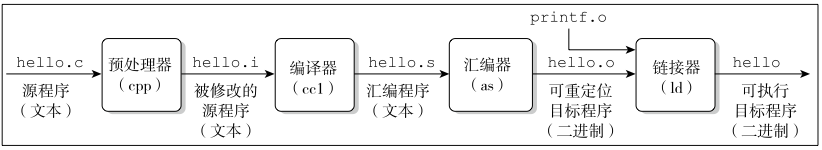

# 编译、加载和链接

源文件到可执行目标文件：

- 预处理（.i文件）：`gcc -E hello.c -o hello.i`

  - 将`#include`包含的文件直接插入到程序文本中，宏定义替换等

- 编译（.s文件）：  gcc -S hello.c -o hello.s

- - 生成汇编文件；

- 汇编（.o文件）：gcc -c hello.c -o hello.o

- - 可重定位目标程序，翻译成机器语言指令；

- 链接阶段：gcc hello.c -o hello

- - 可执行目标程序，链接其它的.o文件

## 静态链接和动态链接

- 静态链接：(.a )

- - `ar`命令的`-t`参数查看静态库的组成，`ar -t libg.a`；
  - 浪费空间；库函数的代码修改，需要重新进行编译链接（bug修复）；执行速度快（没有搜索加载的过程）；

- 动态链接：(.so)

- - 把程序按照模块拆分成各个相对独立部分，在程序运行时才将它们链接在一起形成一个完整的程序

## 编译

### gcc 和 g++

`gcc`：默认处理 C 语言源代码

- 当使用 `gcc` 编译 C++ 源代码时，可能需要手动指定一些参数（如 `-lstdc++`）来确保正确的链接。

`g++`：默认处理 C++ 语言源代码。

- 链接 C++ 标准库，默认启用了与 C++ 相关的选项，如 RTTI（运行时类型识别）、异常处理等

### -g 

gcc 的 **-g** ，并且根据调试工具的不同，还能直接选择更有针对性的说明，比如 -ggdb 。-g是一个编译选项，即在源代码编译的过程中起作用，让gcc把更多调试信息（也就包括符号信息）收集起来并将存放到最终的可执行文件内。 

### -rdynamic 

连接选项 ，指示连接器把所有符号（而不仅仅只是程序已使用到的外部符号）都添加到动态符号表（即.dynsym表）里，以便那些通过 dlopen() 或 backtrace() （这一系列函数使用.dynsym表内符号）这样的函数使用。

### -fPIC/-shared

-fPIC 作用于编译阶段，告诉编译器产生与位置无关代码(Position-Independent Code)，则产生的代码中，**没有绝对地址，全部使用相对地址，故而代码可以被加载器加载到内存的任意位置，都可以正确的执行。这正是共享库所要求的，共享库被加载时，在内存的位置不是固定的。**

GCC来看，shared应该是包含fPIC选项的，但似乎不是所以系统都支持，所以最好显式加上fPIC选项

### -D_REENTRANT

> `_REENTRANT` 宏可能已经被废弃或替换为其他机制（如 `-pthread` 编译选项）

在一个多线程程序里，默认情况下，只有一个`errno`变量供所有的线程共享。在一个线程准备获取刚才的错误代码时，该变量很容易被另一个线程中的函数调用所改变。类似的问题还存在于`fputs`之类的函数中，这些函数通常用一个单独的全局性区域来缓存输出数据。

可重入代码可以被多次调用而仍然工作正常。编写的多线程程序，通过**定义宏_REENTRANT**来告诉编译器我们需要可重入功能。

- 这个宏的定义必须出现于程序中的任何`#include`语句之前。

`_REENTRANT`为我们做三件事情，并且做的非常优雅：

- **定义可重入的函数版本**：函数名后面添加`_r`字符串，如函数名 `gethostbyname` 变成 `gethostbyname_r`。

- **转换宏实现的函数**：`stdio.h`中原来以宏的形式实现的一些函数将变成可安全重入函数
- **改变错误处理**：在`error.h`中定义的变量error现在将成为一个函数调用，安全的多线程方式来获取真正的errno的值

### -I (大写的i)

include头文件的路径

### -l（小写的l）

链接的lib库的名字

### -L

lib库的搜索路径
