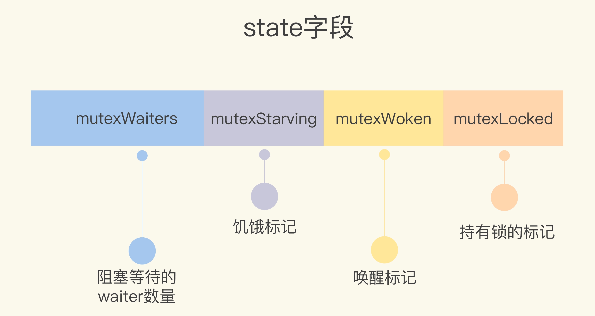

# 并发

 `sync` 包中提供了用于同步的一些基本原语，包括常见的 `sync.Mutex`、`sync.RWMutex`、`sync.WaitGroup`、`sync.Once` 和 `sync.Cond`；
> Go 中：
>
> - 赋值操作**不存在指令重排**的问题
>
> - 对变量的读和写（超过一个机器字的变量时）都**没有原子性**的保证

## 并发模型

> **Go语言的并发模型是基于CSP（Communicating Sequential Processes）**。
>
> - 通过 goroutine 和 channel 来完成

### goroutine

`go f(x, y, z)` 开启一个新的 goroutine 执行 f(x, y, z)

- `sync.Mutex` 解决线程互斥，`channel` 解决线程协作

## Go 内存模型

> https://go.dev/ref/mem

问题：

- Mutex 中对变量的访问，怎么确保拿到的是内存的值，而不是寄存器的旧值？
  - 特定的编译指令？


```go
var a string
var done bool

func setup() {
    a = "hello, world"      // A
    done = true
}

func main() {
    go setup()
    for !done {
    }
    print(a)                // B
}
```

这个例子，很并不能确保打印 “hello, world”，print(a) 执行的时候 a 是可能没有赋值的，没有任何规则保证 A <= B 这个顺序。

- a="hello, world" 和 done=true 这两行代码的实际执行顺序并没有任何保证哈，cpu 是可以乱序执行的；
- 更糟糕的，main 程序很有可能会死循环，因为 done 的赋值是在另一个并发的 goroutine 里，并且**没有确保被 main 函数可见**。


### Happen Before保证

#### go routine

> The `go` statement that starts a new goroutine is **synchronized** before the start of the goroutine's execution.

go routine 启动前，其前面执行的代码肯定已经执行完成；

#### channel

在有缓冲的通道时候向通道**写入**一个数据总是 happen before 这个数据被从通道中**读取**完成

- 多个goroutine中对共享变量的并发访问变成了可预见的串行化操作

无缓冲的通道来说从通道**读取**元素 happen before 向通道发送**写入**数据完成


#### Lock

>  sync.Mutex（互斥锁）和 sync.RWMutex（读写锁）

锁变量 L，第 n 次调用 `L.Unlock()` 逻辑先于（结果可见于）第 m 次调用 `L.Lock()` 操作（n <= m）。

- 如第 1 次的解锁可见于第二次的加锁；

`sync.RWMutex` 类型的锁变量 L，说的是 `L.Unlock( )` 可见于 `L.Rlock( )` ，第 n 次的 `L.Runlock( )` 先于 第 n+1 次的 `L.Lock()` （n <= m）。。


#### atomic

Golang 中的 atomic 是 SC 最强语义的，不允许存在任何的重排。


## Mutex

> Go 标准库中的 Mutex 是不可重入。
>
> - Mutex 本身并没有包含持有这把锁的 goroutine 的信息
> - 锁可以被未持有的 goroutine 释放，因此要遵循**“谁申请，谁释放**”的原则

```go
func (m *Mutex) Lock() {
	// Fast path: grab unlocked mutex.
	if atomic.CompareAndSwapInt32(&m.state, 0, 1) {
		return
	}
	// Slow path (outlined so that the fast path can be inlined)
	m.lockSlow()
}
func (m *Mutex) Unlock() {
	// Fast path: drop lock bit.
	new := atomic.AddInt32(&m.state, -mutexLocked)
	if new != 0 {
		// Outlined slow path to allow inlining the fast path.
		// To hide unlockSlow during tracing we skip one extra frame when tracing GoUnblock.
		m.unlockSlow(new)
	}
}

```

其实现细节：

- spin 机制针对临界区执行短的场景；

- 通过信号量来阻塞未申请到锁的 goroutine；





### 使用

禁止：

- Copy 已使用的 Mutex：Mutex 是有状态的；
- 重入（持有锁的情况下再调用lock）：Mutex 不支持重入，因为未记录持有锁的 goroutine 信息；


## Once

> 实现单例

