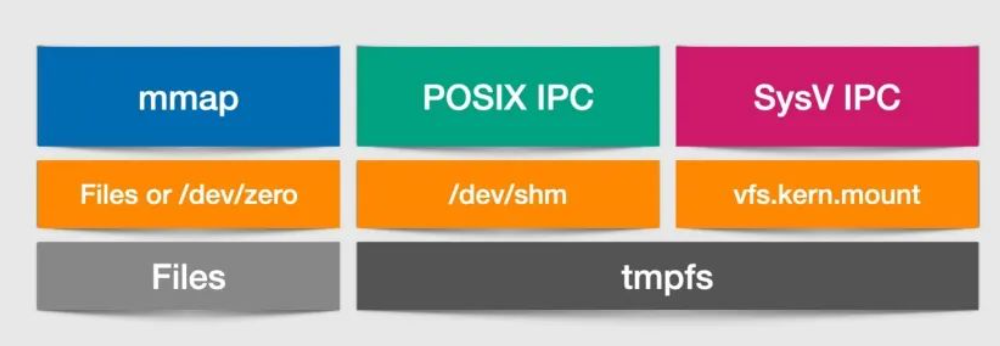

# Unix

## 内存共享

`golang.org/x/sys/unix` 提供了 unix 底层 API，下面以这个库展示使用 mmap 共享内存。



### mmap

`unix` 提供了 `Mmap/Munmap` 方法，对某个文件进行映射

```go
func AttachShmWithMmap(f *os.File, offset int64, length int, prot int, flags int) (ShardData, error) {
 data, err := unix.Mmap(int(f.Fd()), offset, length, prot, flags)
 if err != nil {
  return ShardData{}, err
 }
 return ShardData{data: data}, nil
}

func DetachShmWithMmap(data ShardData) error {
 return unix.Munmap(data.data)
}

f, err := os.OpenFile("./block", os.O_RDWR, 0666)
if err != nil {
 panic(err)
}
defer f.Close()

initData := make([]byte, 1024)
if _, err = f.Write(initData); err != nil {
 panic(err)
}

data, err := AttachShmWithMmap(f, 0, 1024, unix.PROT_WRITE|unix.PROT_READ, unix.MAP_SHARED)
if err != nil {
 panic(err)
}
defer DetachShmWithMmap(data)
```

### SysV

> 基于 tmpfs

SysV 为每一块内存设定以一个唯一的 int 类型 key，可以使用相同的 Key 获取同一个内存段。只要两个程序使用了相同 key，便可以实现内存段的共享。

SysV 的主要 Api 是四个函数：

1. `shmget`：创建一个新的共享内存外，也可用于打开一个已存在的共享内存
2. `shmat`：使用前，附加（attach）内存到进程的地址空间中
3. `shmdt`：使用后，使共享内存区域与该进程的地址空间分离（detach）
4. `shmctl`：共享内存控制（加锁、删除等）

```go
func AttachShmWithSysV(key, size, flag int) (ShardData, error) {
 id, err := unix.SysvShmGet(key, size, flag)
 if err != nil {
  return ShardData{}, err
 }

 data, err := unix.SysvShmAttach(id, 0, 0)
 if err != nil {
  return ShardData{}, err
 }

 return ShardData{id: id, data: data}, nil
}

func DetachShmWithSysV(data ShardData) error {
 if err := unix.SysvShmDetach(data.data); err != nil {
  return err
 }

 _, err := unix.SysvShmCtl(data.id, unix.IPC_RMID, nil)
 if err != nil {
  return err
 }
 return nil
}
```

### POSIX

POSIX 共享内存一定程度上也是为了弥补上述两种共享内存的不足：

1. SysV 使用了一个黑盒的（不可见的 tmpfs）的唯一 key，这点和基于文件描述符的 Unix IO 模型不符
2. mmap 虽然方便，但是却需要创建一个多进程共享的文件，如果共享的内容无持久化需求，这白白浪费了 IO 资源

POSIX 通过折中的方式进行解决，就是使用挂载于 `/dev/shm` 目录下的专用 tmpfs 文件系统（不再不可见），而且使用文件描述符，利用 `mmap` 对内存进行映射（或说 attach）。

 golang 官方库提供的 POSIX 共享内存接口，但由于 POSIX 共享内存的实现非常直白，直接在 `/dev/shm/` 目录下创建文件，使用 `mmap` 映射，就可以使 go 程序使用 POSIX 共享内存。