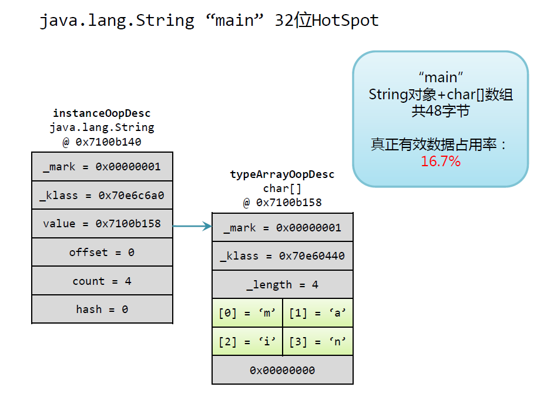

# 基础知识

- **对象的默认初始值都是null**，包括String，new String[]；

- **Iterator的删除元素方法是remove**，不会产生concurrentModify异常；

- **HashMap的key，value可以为null**，但是HashTable和ConcurrentHashMap都不可以；

- instanceof，多维数组是Object[]的类型，但不是int[]的类型，int[]是Object类型，但不是Object[]类型，基本类型也不是Object类型；

- System.**getProperty**("java.library.path") 参数可以通过**-D配置**，System.getEnv中获取当前环境的环境变量；

  - user.dir：**当前用户工作目录**，即当前执行java命令的路径

- **hashcode 和 equals方法**：

  1）如果o1.equals(o2)，那么o1.hashCode() == o2.hashCode()总是为true的。

  2）如果o1.hashCode() == o2.hashCode()，并不意味着o1.equals(o2)会为true。

- Java 对 **Interger的-128~127的对象进行缓存**，返回new Integer(321)是两个不同的对象；

- Thread.currentThread.getStackTrace()可以获得**当前调用栈**的数组StackTraceElement[]，可以获取方法名，文件名，行数等信息；

- StringBuffer被隐式使用，当String使用+操作时，显示使用StringBuilder或StringBuffer可以提升性能；StringBuffer线程安全；

- Java的**final字段不会自动类型提升**；private和static方法无法被重载；

- Thread状态getState, isAlive，**标记为DEAD状态的线程可能复活，不会被垃圾回收**；

- **双大括号可以用来实现实例的创建**（生成匿名类，然后将第二个括号里内容附在匿名类里），**单个大括号实现匿名类**；

  ```java
  // 慎用，匿名类会包含一个外围实例，造成内存泄漏的问题
  Set<Integer> set = new HashSet<Integer>() {{
      add(1);
      add(2);
  }};
  ```

- final修饰符的作用

  - 类：无法被继承
  - 方法：无法被子类覆盖
  - 变量：无法被重新赋值

- 获取到**类路径（classpath）下的资源路径**信息

  - ClassLoader.getResource(String classpathFilePath)，类似“双亲委派机制”，以 / 开头的资源是在ClassLoader目录下的资源，并非指的是当前应用的类加载路径下的资源。<font color="red">如果资源是位于classpath下的不要以 / 开头</font>；
  - Class<?>.getResource(String      classpathFilePath)，当路径信息不以 / 开头时，获取的是相对于当前类所在路径的相对资源；<font color="red">当路径信息以 / 开头时，则获取的是当前应用类加载路径下的资源</font>

- jar中的文件的获取方式：

  - 通过类装载器来来获定位资源

    `Icon myIcon = new ImageIcon(getClass().getResource("/com/directory.gif"))`

- Path用来获取路径：

  - Path.toAbsolutePath()获取**绝对路径**；
  - File.getCanonicalPath()获取**规范绝对路径**，将绝对路径中的".."和"."转换消除后的得到的路径

  - Path.toRealPath()获取**实际路径**，相对地址转绝对地址，.. 和 . 转为规范路径，符号链接转为实际路径；

- Runtime Exception 无需被 try-catch 或方法加声明；


## 函数

- Java重载的方法（同名但签名不一样的函数）的匹配是按照声明类型匹配形参类型，而不是靠实际类型；


**lombok.NonNull、javax.annotation.Nonnull** 和 **javax.validation.constraints.NotNull**的区别和使用场景：

- - **@NonNull**用在强制入参非空、属性非空的场景下，编译时会生成空指针检查的代码，如果不满足，则会抛出NullPointerException。
  - **@Nonnull**用在返回结果不为空的场景，主要由IDE识别并给出告警提示。
  - **@NotNull**主要用在Validator校验场景下，限制参数非空，如果不满足，则校验失败。

## 类和接口

### 基本知识

- 子类默认调用的是父类的无参构造函数，只有类没有构造函数时才会默认构造；
- 覆盖父类的方法时，访问权限不能变小（public > package > protected > private)；
- 接口默认就是abstract public，其成员函数默认是abstract public，其成员变量默认是static final；
- Java中**静态绑定**的情况：**调用类方法；初始化方法；私有方法**；其他都是动态绑定；
- **this()和super()都必须在构造函数的第一行**，不会同时出现；
- 内部类的实例创建：`Outer.Inner in = new Outer().new Inner()`；静态内部类的创建：`Outer.Inner in = new Outer.Inner()`；

### 函数式接口（JDK8）

- 一个函数式接口只有一个抽象方法(SAM，single abstract method)；
- Object 类中的 public abstract method 不会被视为单一的抽象方法；
- 函数式接口可以有默认方法和静态方法；
- 函数式接口可以用@FunctionalInterface 注解进行修饰。

### String

- Java中字符串采用**Unicode编码**，一个char占两个字节；
  
- \u是unicode编码；
  - Java String 采用 [UTF-16编码](../unicode.md)；

  - String的length方法返回的是Unicode的code units的数量；

  - String中的**charAt**和**codePointAt**方法；

  - 非基本平面的String遍历方式
  
  ```java
  // JDK 8, CharSequence#codePoints了返回IntStream
  "str".codePoints().forEach(c -> ...);
  ```

  String 的 **getBytes**方法，是将字符串转换为特定编码规则后的字节数组

  - 默认的是Charset.defaultCharset()；
  
- String的带Charset的构造方法，Charset指的是byte[]的编码方式；

- **InputStreamReader读取二进制文本数据流时，可以指定Charset；**

- String ”main"的内存占用图示：



### Files

java.nio.Files类，提供的文件的常见操作，如 创建、遍历、存在、删除、拷贝等静态方法；

- Files.list方法只遍历当前目录下的文件和目录，Files.walk方法遍历指定目录下的所有文件和目录，除非指定了最大深度


### Iterator

- Java中非线程安全的集合如ArrayList等，其Iterator是fail-fast机制，iterator遍历的时候，不可以进行添加或删除操作；
- 对于线程安全的如ConcurrentHashMap而言，Iterator在遍历底层数组。在遍历过程中，如果已经遍历的数组上的内容变化了，迭代器不会抛出ConcurrentModificationException异常。**如果未遍历的数组上的内容发生了变化，则有可能反映到迭代过程中**。这就是ConcurrentHashMap迭代器**弱一致**的表现。


## Java Time

```java
long t1 = System.currentTimeMillis();
long t2 = new Date().getTime();
long t3 = Calendar.getInstance().getTimeInMillis();
```

将提供自unix纪元以来的毫秒数，这是一个固定的时间点，不受本地时区影响；

**GMT**（Greenwich Mean Time，格林威治时间)是时区时间。

**UTC**（Coordinated Universal Time协调世界时）是个标准时间；UTC作为一个标准时间和各个时区时间换算

LocalDateTime 是没有时区概念的时间，ZonedDateTime是有时区概念的时间。

LocalDateTime.now(ZoneId.of("UTC")) 是根据UTC构建时间，默认是根据系统的时区创建时间；


## Blas

**Java Blas库：**

- **[jblas]([http://jblas.org](http://jblas.org/))** is based on BLAS and LAPACK；
- [Apache Commons Math](http://commons.apache.org/proper/commons-math/) for the most popular mathematics library in Java (not using netlib-java）；
- **[Breeze](https://github.com/scalanlp/breeze)** for high performance linear algebra in Scala and Spark (builds on top of netlib-java 1.1.2)；

免费版不再提供：

- [Matrix Toolkits for Java](https://github.com/fommil/matrix-toolkits-java/) for high performance linear algebra in Java (builds on top of netlib-java)；

- [**netlib-java**](https://github.com/fommil/netlib-java) is a wrapper for low-level BLAS, LAPACK and ARPACK（不再开发免费版）；


**底层库安装**：

- yum install atlas

- yum install lapack


**scala使用demo** 

```scala
import breeze.linalg.DenseMatrix  
val m = DenseMatrix.rand(100, 100)  
val res = m * m  
```

scala -cp spark-assembly-1.4.0-hadoop2.6.0.jar

看到有类似一下信息输出则表明blas安装并调用成功：

Dec 03, 2015 12:59:42 AM com.github.fommil.jni.JniLoader liberalLoad

INFO: **successfully** loaded /tmp/jniloader4368196623437279381netlib-native_system-linux-i686.so


## 加密解密

Java API

- `Cipher.getInstance(transformation)`，“算法/模式/填充”或“算法”，如 AES/CBC/PKCS5Padding；
  - PKCS7Padding：PKCS #7 填充字符串由一个字节序列组成，每个字节填充该填充字节序列的长度，0x01-0x08，根据最后一位知道填充字节数；
  - PKCS5Padding的blocksize为8字节，PKCS7Padding的blocksize可以为1到255字节；


## 子进程

> Process blocking reason: **The input stream and the error stream are separated, and if they are not processed, blocking will occur**.

- 创建的子进程的所有标准 io（即 stdin，stdout，stderr）操作通过三个流 (getOutputStream()，getInputStream()，getErrorStream()) 重定向到父进程；
- 有些本机平台仅针对标准输入和输出流提供有限的缓冲区大小，如果读写子进程的输出流或输入流迅速出现失败，则可能导致子进程阻塞，甚至产生死锁；
- 标准输出流和错误流如果处理不当，其**缓冲区不能被及时清除而被塞满，则进程被阻塞**，即使调用Process.destory()也未必能销毁被阻塞的子进程


解决方案：

- 并发获取Process的输出流和错误流；
- 将错误流重定向到输出流；


测试代码见[代码库](https://gitee.com/luckyQQQ/lifelearning/blob/master/java/jvm/process/src/main/java/com/xliu/lifelearning/cs/jvm/process/SubProcessOutStreamBlock.java)


## 容器

### CPU/Memory

使用 java 8u191+ 或者 JDK 10之后的版本，默认开启`+XX:-UseContainerSupport`；

- JVM知道在Docker容器中运行，并将提取特定于容器的配置信息（已分配给容器的CPU数量和总内存），而不是从宿主机提取；