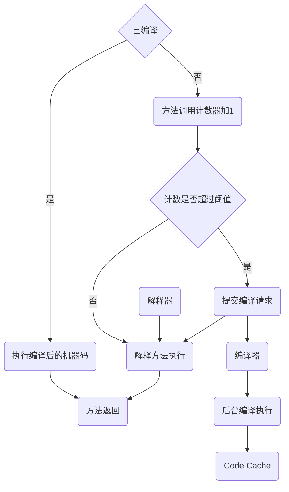

# 字节码

## 编译过程


## 执行

> 热机的流量切换时，防止**冷机状态的服务器无法承载流量**而假死。

字节码通过类加载过程加载到 JVM环境后，才可以执行：

- 解释执行
- JIT 编译执行
- JIT 编译与解释混合执行




## 字节码增强

### ASM

[**asm**](https://asm.ow2.io/) 提供一个简单易用的library来实现对java字节码的操作，业界的btrace 和 [arthas](https://link.zhihu.com/?target=https%3A//alibaba.github.io/arthas/)均是通过它实现了运行时trace的功能。

- 提供了ClassReader，ClassVisitor，ClassWriter分别对java字节码进行读，遍历，写的操作；
- 用户可以通过实现自己的Visitor对应的VisitXXX方法来达到对指定遍历对象的自定义操作。

#### 使用


### Apache Common BCEL

> [Apache Commons Bytecode Engineering Library](https://github.com/apache/commons-bcel)


#### 使用

```xml
<dependency>
  <groupId>org.apache.bcel</groupId>
  <artifactId>bcel</artifactId>
  <version>6.5.0</version>
</dependency>
```


