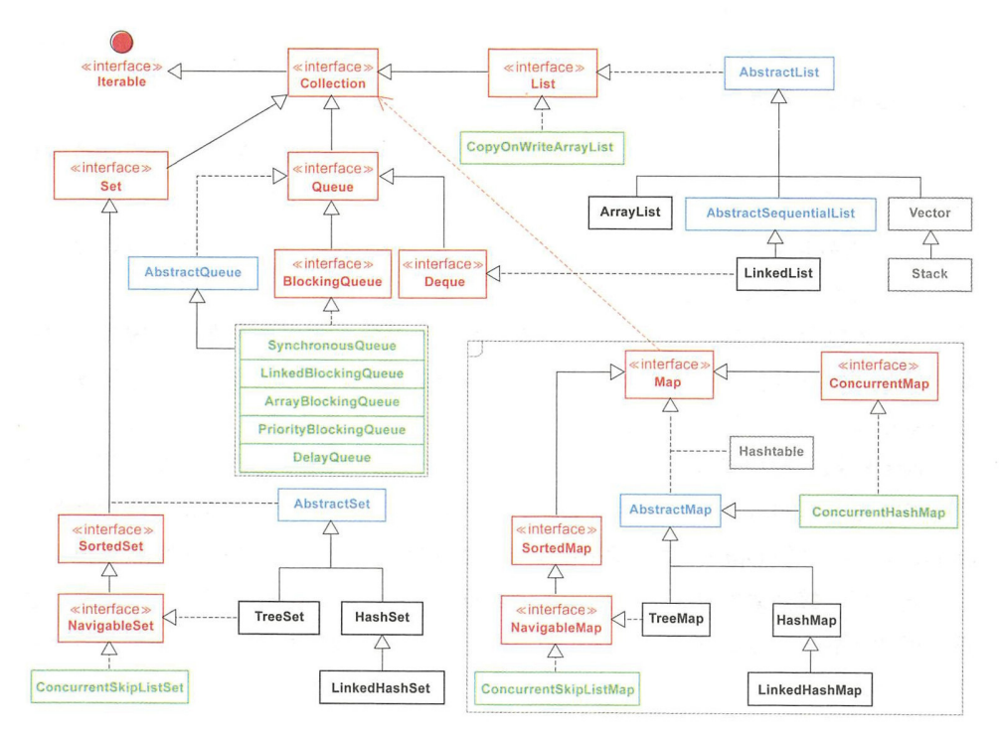

# 线程集合

JDK 1.8 中的 Java 集合框架图（List/Queue/Set/Map）：

- 红色代表接口；蓝色代表抽象类；绿色代表并发类；灰色代表早期线程安全类（已废弃）。

## Map

TreeMap 实现原理（TODO） 

HashMap 实现原理（TODO）

## 同步容器类（废弃)

### Vector、Hash Table、Stack

Vector是ArrayList的所有操作加锁，Hash Table是HashMap的所有操作加锁

## 并发容器

> 1. 通过并发容器来替代同步容器，可以极大提高伸缩性并降低风险。
> 2. 迭代器不会抛出ConcurrentModificationException，不需要再迭代时对容器加锁；

### Map

#### ConcurrentHashMap

替代同步且基于散列的Map。

- 采用分段锁（Lock Striping）；
- 弱一致性的迭代器；
- `size`和`empty`操作被弱化，只是个估计值；

实现原理（TODO）：

#### ConcurrentSkipListMap

同步的SortedMap。

### Set

#### CopyOnWriteArraySet

同步的Set。

- **当迭代操作远远多于修改操作时使用**，复制底层数组需要一定开销，如事件通知系统；

#### ConcurrentSkipListSet

同步的SortedSet。

### List

#### CopyOnWriteArrayList

用于在遍历时替代同步的List。

### TransferQueue

### BlockingQueue

> 1. 阻塞的take和put方法，以及支持定时的offer和poll方法；
> 2. 支持任意数量的生产者和消费者；
> 3. 在构建高可用应用时，有界队列是种强大的资源管理工具，防止内存移除，代码更加健壮；

#### LinkedBlockingQueue

- 基于链表实现的阻塞队列，FIFO；
- **读取和插入操作所使用的锁是两个不同的lock**，它们之间的操作互相不受干扰，因此两种操作可以并行完成，因此其吞吐量较高；

#### ArrayBlockingQueue

- 基于数组实现的阻塞队列，FIFO；

#### PriorityBlockQueue

- 优先级排序的Queue，支持自定义的比较规则；

#### SynchronousQueue

- 不为队列中元素维护存储空间，而是维护一组线程等待着将元素加入或移除队列；
- put和take会一直阻塞，知道另一个线程准备好参与到交付种；
- 仅当有足够多的消费者，且总有一个消费者准备好获取交付的工作时，才使用；

#### LinkedTransferQueue

- 基于CAS操作的无锁；
- 让生产者直接给等待的消费者传递信息，不用将元素存储到队列；

### BlockingDeque

> 1. 双端阻塞队列，在队列头和尾进行数据插入和移除；
> 2. 适用于”工作密取“（work stealing），既是生产者又是消费者的场景；

在 工作密取 模式中，每个消费者有其单独的工作队列，如果它完成了自己双端队列中的全部工作，那么它就可以从其他消费者的双端队列末尾秘密地获取工作。

- 多个线程不会因为在同一个工作队列中抢占内容发生竞争；
- 大多数时候，只是访问自己的双端队列。即使要访问另一个队列时，也是从队列的尾部获取工作，降低了队列上的竞争程度。

#### LinkedBlockingDeque

#### ConcurrentLinkedDeque

- 无界的双端队列；

