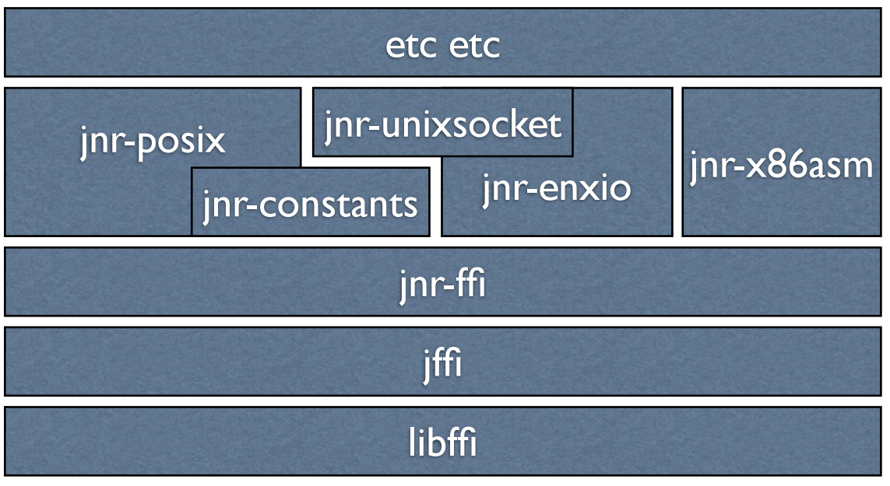

[toc]

# Java Native

## JNI

标准的Java native通信工具，但复杂度高，需要很多native code到java的回调。

详见 [JNI 使用文档](./jni.md)

- 性能最好，但是使用比较复杂；
- Alluxio 使用 [JNI-Fuse](https://github.com/maobaolong/jnifuse) 替代 [JNR-Fuse](https://github.com/SerCeMan/jnr-fuse)；

## JNA

> https://github.com/java-native-access/jna

- **基于libffi；**
- 相较于JNR，更为成熟；
- 不需要JNI代码 ，只需要定义接口和函数（匹配）；
- **基于反射**，**数据转换从本地代码跳到 Java 代码非常昂贵；**

## JNR

> https://github.com/jnr/jnr-ffi

- 基于libffi，但使用**字节码生成**技术而不是反射；

## LibFFI

> https://github.com/libffi/libffi

`libffi`还提供了可移植的高级语言接口，可以不使用函数签名间接调用C函数。比如，脚本语言`Python`在运行时会使用`libffi`高级语言的接口去调用C函数。`libffi`的作用类似于一个动态的编译器，**在运行时就能够完成编译时所做的调用惯例函数调用代码生成**。
