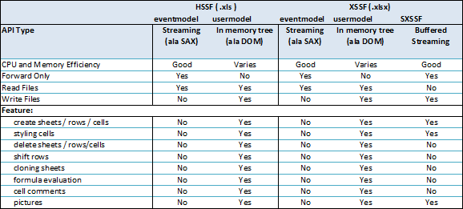

[toc]

# 表格处理

## CSV

- [opencsv](http://opencsv.sourceforge.net/) ；
- [Apache Commons CSV](https://commons.apache.org/proper/commons-csv/)；

## Excel

### Apache POI（MicroSoft(Word/Excel/PPT)）

Apache POI是Apache组织提供的针对微软office（主要针对Excel）进行导入和导出操作的开源工具包。

xlsx 格式基于 XML, 其处理时的内存占用要高于处理 xls 格式所需要的内存。

**HSSF 处理 xls 格式文件；**

**XSSF 处理 xlsx 格式文件；**

### EasyExcel(Alibaba)

https://github.com/alibaba/easyexcel

