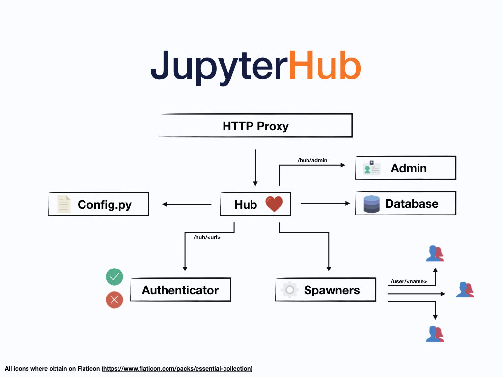

[toc]

# Jupyter-Hub



系统组件：

- a **Hub** (tornado process) that is the heart of JupyterHub
- a **configurable http proxy** (node-http-proxy) that receives the requests from the client’s browser
- multiple **single-user Jupyter notebook servers** (Python/IPython/tornado) that are monitored by Spawners
- an **authentication class** that manages how users can access the system


## 原理

启动jupyterlab时，如果用户不存在，默认是会创建？

### Authenticator

默认使用PAMAuthenticator，用用户名和密码进行Linux系统用户认证。

LocalAuthenticator/PAMAuthenticator可以通过以下配置，允许自动创建系统用户：

```
c.LocalAuthenticator.create_system_users = True
```

### Spawner

默认是LocalProcessSpawner，使用系统用户启动jupyter_labhub进程；


## 安装

[Install JupyterHub and JupyterLab from the ground up]([https://jupyterhub.readthedocs.io/en/stable/installation-guide-hard.html#install-jupyterhub-and-jupyterlab-from-the-ground-up)


## Custom Proxy

configurable-http-proxy (CHP)

In general, for a proxy to be usable by JupyterHub, it must:

1. support websockets without prior knowledge of the URL where websockets may occur
2. support trie-based routing (i.e. allow different routes on `/foo` and `/foo/bar` and route based on specificity)
3. adding or removing a route should not cause existing connections to drop

Optionally, if the JupyterHub deployment is to use host-based routing, the Proxy must additionally support routing based on the Host of the request.


## Custom Authenticators

[REMOTE_USER Authenticator](https://github.com/cwaldbieser/jhub_remote_user_authenticator) 


## Custom Spawner


### SystemdSpawner

> ```
> # systemd v211以上，支持安全特性需要systemd v227
> $ systemctl --version | head -1
> systemd 231
> ```

- 支持cpu/memory配置：cgroup；
- 支持动态用户，不需要本地有对应的系统用户；(systemd 235以上)
  - http://0pointer.net/blog/dynamic-users-with-systemd.html
  - 配置状态存储的目录，保存会话状态


### YarnSpawner

将spanwer启动在Yarn上。

- 用户创建问题：jupyterlab中的文件存储的路径？
  - 

- 代理用户机制：hadoop允许使用特定用户如'juyterhub'模拟任何用户；

- 状态存储问题：
  - [jupyter-hdfscm](https://jcrist.github.io/hdfscm/) 将 notebook 存储在HDFS上；

- Python环境问题：
  - 每个节点一样的Python环境；
  - 或者Conda打包环境，上传到HDFS，然后作为Container资源被下载；

