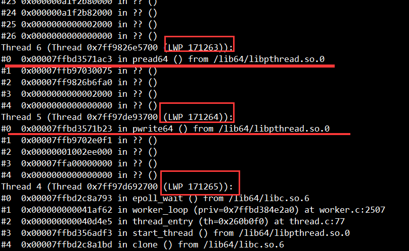
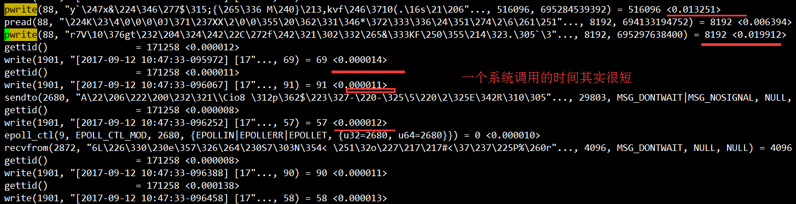
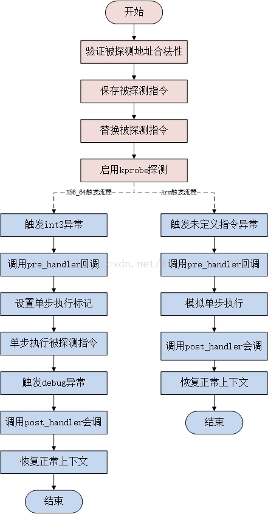
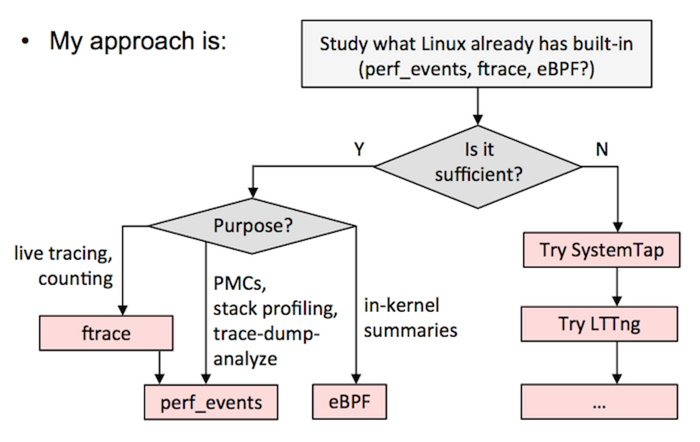

# 性能

## sysstat

### pidstat

pidstat是sysstat工具的一个命令，用于监控全部或指定进程的cpu、内存、线程、设备IO等系统资源的占用情况。

`pidstat [ 选项 ] [ <时间间隔> ] [ <次数> ]`

- -u：默认的参数，显示各个进程的cpu使用统计
- -r：显示各个进程的内存使用统计
- -d：显示各个进程的IO使用情况
- -p：指定进程号
- -w：显示每个进程的上下文切换情况
- -t：显示选择任务的线程的统计信息外的额外信息


## pstack

> 查看进程下所有线程的堆栈信息



可以查看的信息：

- 线程号，LWP号；
- 堆栈（栈深度、内存地址、函数名、库名）

### 通过pstack获取第N号线程的调用栈

```bash
# 获取第N号线程内容
file=$1
lwp=$2
echo "$file - $lwp"
found=0

while read line
do
if [[ $found -eq 1 && $line =~ "(LWP " ]]
then 
	exit 0
fi

if [[ $line =~ "LWP $lwp" ]]
then
    found=1
fi

if [[ $found -eq 1 ]]
then
	echo $line
fi

done < $file
```


## strace

示例：进程中的**171264**线程进行系统调用跟踪， 将输出的信息保存在output.txt中

`strace -o output.txt -T -tt -e trace=all -p 171264`



示例：假设频繁的read/write，**对应fd为1901**，查看`/proc/$pid/fd/1901`，如果是个socket连接，

```bash
dr-x------ 2 root root 0 3月 8 16:07 ./
dr-xr-xr-x 8 root root 0 3月 8 16:07 ../
lrwx------ 1 root root 64 3月 8 16:08 0 -> /dev/pts/1
lrwx------ 1 root root 64 3月 8 16:08 1 -> /dev/pts/1
lrwx------ 1 root root 64 3月 8 16:09 10 -> socket:[21190]
lrwx------ 1 root root 64 3月 8 16:07 2 -> /dev/pts/1
lrwx------ 1 root root 64 3月 8 16:08 3 -> /tmp/ZCUDY7QsPB (deleted)
lrwx------ 1 root root 64 3月 8 16:08 4 -> /tmp/sess_0fpvhvcpftcme834e1l4beo2i6
lrwx------ 1 root root 64 3月 8 16:08 5 -> socket:[20625]
lrwx------ 1 root root 64 3月 8 16:08 6 -> anon_inode:[eventpoll]
lrwx------ 1 root root 64 3月 8 16:08 7 -> socket:[20626]
lrwx------ 1 root root 64 3月 8 16:08 8 -> socket:[20627]
lrwx------ 1 root root 64 3月 8 16:09 1901 -> socket:[21189]
```

在**/proc/net/tcp**目录下面保存了所有TCP链接的状态信息，通过grep查找。

```shell
$ grep '21189' /proc/net/tcp
9: 8064A8C0:0929 0164A8C0:F4B5 01 00000000:00000000 02:00097B3E 00000000 0 0 21189 2 ffff88001a505b00 24 4 28 10 -1
```

链接的IP、PORT链接四元组【8064A8C0:0929 0164A8C0:F4B5】这个地方是用十六进制保存的，换算成十进制方式【192.168.100.128:2345  192.168.100.1:62645】，可以对应查看端口号服务是什么，判断卡顿点。


## kprobe

> 内核提供了一组方法，使用这组方法可以在内核任意一个方法上加一个钩子，每当内核执行到钩子的时候，就可以执行用户自定义的代码。
>
> 参考：
>
> 1. [Linux内核调试技术——kprobe使用与实现](https://blog.csdn.net/luckyapple1028/article/details/52972315)

### 原理

现在要在**do_fork**上加一个钩子，首先根据名称获取该方法在内核中的代码地址，类似于`cat /proc/kallsyms | grep do_fork`返回的地址 `ffffffff81084950 `处的代码，并将其改成一个软中断。当程序执行到这条指令到时候，就会陷入中断处理程序，中断处理程序执行用户指定代码，实现hook。

目前kprobes技术已经支持多种架构，包括i386、x86_64、ppc64、ia64、sparc64、arm、ppc和mips（有些架构实现可能并不完全，具体可参考内核的Documentation/kprobes.txt）。



### 配置查看

查看是否开启kprobe

```shell
$ cat /boot/config-3.10.0-* | grep KPROBES
CONFIG_KPROBES=y
CONFIG_KPROBES_ON_FTRACE=y
CONFIG_HAVE_KPROBES=y
CONFIG_HAVE_KPROBES_ON_FTRACE=y
```

### 使用

```c
//kprobe_example.c
#include<linux/init.h>
#include<linux/module.h>
#include<linux/kernel.h>
#include <linux/kprobes.h>

//统计do_fork()总共执行了几次
static int total_count = 0;

//前置方法，这里可以拿到方法入参和栈，每次执行do_fork() total_count++
static int handler_pre(struct kprobe *p, struct pt_regs *regs)
{
        total_count++;
        //printk 打印的日志 可以通过dmesg 命令查看
        printk(KERN_INFO "累计调用do_fork[%d]次\n",total_count);
        return 0;
}
//后置方法，这里可以拿到方法返回值
static void handler_post(struct kprobe *p, struct pt_regs *regs,
                                unsigned long flags)
{
}
//方法执行失败的回调函数
static int handler_fault(struct kprobe *p, struct pt_regs *regs, int trapnr)
{
        printk(KERN_INFO "fault_handler: p->addr = 0x%p, trap #%dn",p->addr, trapnr);
        return 0;
}
//通过kprobe这个数据结构，定义要hook的内核方法名称
static struct kprobe kp = {
        .symbol_name    = "do_fork",
};
//通过register_kprobe 方法更改内核对应方法的指令
static int kprobe_init(void){
        int ret;
        kp.pre_handler = handler_pre;
        kp.post_handler = handler_post;
        kp.fault_handler = handler_fault;

        ret = register_kprobe(&kp);
        if (ret < 0) {
                printk(KERN_INFO "register_kprobe failed, returned %d\n", ret);
                return ret;
        }
        printk(KERN_INFO "Planted kprobe at %p\n", kp.addr);
        return 0;
}
//通过unregister_kprobe卸载hook
static void kprobe_exit(void){
        unregister_kprobe(&kp);
        printk(KERN_INFO "kprobe at %p unregistered\n", kp.addr);
}

//构造内核模块
module_init(kprobe_init);
module_exit(kprobe_exit);
MODULE_LICENSE("GPL");
```

编写makefile

```makefile
// Makefile
obj-m +=kprobe_example.o
CURRENT_PATH:=$(shell pwd)
LINUX_KERNEL_PATH:=/lib/modules/$(shell uname -r)/build
all:
        make -C $(LINUX_KERNEL_PATH) M=$(CURRENT_PATH) modules
clean:
        make -C $(LINUX_KERNEL_PATH) M=$(CURRENT_PATH) clean
```

执行`sudo insmod kprobe_example.ko `装载内核模块,然后使用dmesg查看内核日志

## eBPF

> 参考：
>
> 1. [eBPF 简史](https://linux.cn/article-9032-1.html)

kprobe的每次调试装载卸载太过繁琐，如果可以装载一个通用的模块，每次调试通过配置这个模块来实现不同的功能，调试就更方便了。于是就引出了第二个关键词**`eBPF`**。

eBPF 源于早年间的成型于 BSD 之上的传统技术 BPF（Berkeley Packet Filter）。

BPF 的两大核心功能：

- 过滤Filter：根据外界输入的规则过滤报文；
- 复制Copy：将符合条件的报文由内核空间复制到用户空间；

eBPF是一项革命性的技术，可以在Linux内核中运行沙盒程序，而无需更改内核源代码或加载内核模块。

对于云原生领域，[Cilium](https://github.com/cilium/cilium) 已经使用**eBPF 实现了无kube-proxy的容器网络**。利用eBPF解决iptables带来的性能问题。

## BCC

> [BPF Compiler Collection (BCC)](0https://github.com/iovisor/bcc)，基于eBPF.


## 动态追踪

> 参考：
>
> 1. [动态追踪技术漫谈](https://blog.openresty.com.cn/cn/dynamic-tracing/)

Mac OS X / Unix : DTrace；**Linux : SystemTap, perf**



### Perf


### System Tap

 一个简单的探针和脚本，调用内核系统调用 sys_sync 时触发

```c
global count=0
probe kernel.function("sys_sync") {
 count++
 printf( "sys_sync called %d times, currently by pid %d\n", count, pid );
}
```


## 火焰图（FlameGraph）

https://github.com/brendangregg/FlameGraph

Linux `perf_events` has a variety of capabilities, including CPU sampling. Using it to sample all CPUs and generate a flame graph:

```bash
# git clone https://github.com/brendangregg/FlameGraph  # or download it from github
# cd FlameGraph
# perf record -F 99 -a -g -- sleep 60
# perf script | ./stackcollapse-perf.pl > out.perf-folded
# ./flamegraph.pl out.perf-folded > perf-kernel.svg
```

