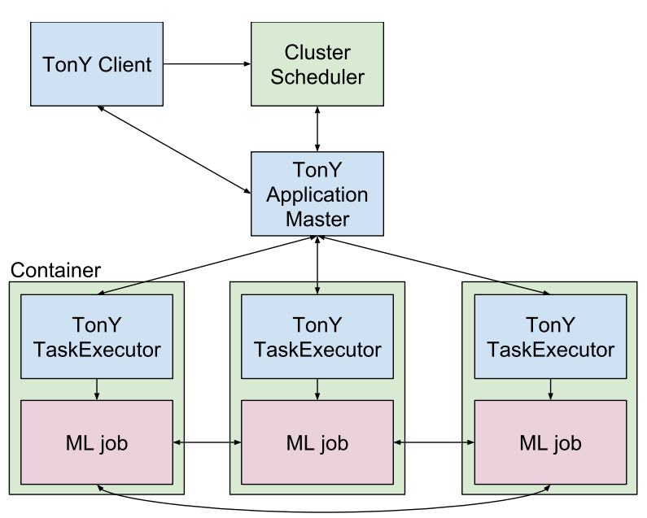

[toc]

# 分布式 AI 框架

> 除了原生的分布式AI框架（如TF，Pytorch），这里更注重多用户、分布式、资源管理。

## 基于 Spark

### Analytics Zoo/Intel

> Intel 早期还有一个TOY(Tensorflow On Yarn) 项目，也支持CPU，2017年已经没有更新；

统一的基于Spark的分布式Tensorflow, Keras, Pytorch and BigDL的分析+AI平台

**只支持CPU训练**。

### Horovod/Uber

基于Spark的Horovod，需要将数据先写成Parquet存储，大数据的时候速度很慢。

### TensorFlowOnSpark/Yahoo

- **需要对TF代码进行修改适配。**

### Spark Deep Learning/Databricks

采用 Horovod 进行 AI 训练，但 Horovod 运行配置复杂，且需要将数据写成Parquet，没有 TF原生on Spark好用。

- Image IO
- Transfer learning
- Distributed hyperparameter tuning
- Model as SQL functions

### Spark_tensorflow_distributor / Tensorflow

Tensorflow ecosystem 提供的官方 TF On Spark的分布式训练框架。

- Spark executor 通过barrier自组 TF 网络；
- TF 原生代码，无需任何改动；

## Yarn Native

> 基于Spark，肯定是可以在Yarn上运行。

### TonY/LinkedIn

> https://github.com/tony-framework/TonY

支持 **Tensorflow，PyTorch，MxNet，Horovod**

支持Ring-AllReduce（即不需要PS）

支持异构资源的申请，如对PS服务器申请较少内存和CPU，对Worker申请较大内存和GPUs。

有对应的Tracking url。

### Submarine（Apache）

基于 TonY 实现 AI on Yarn。

### XLearning/Qihoo360

deep learning frameworks 如 TensorFlow, MXNet, Caffe, Theano, PyTorch, Keras, XGBoost。

支持GPU。

### Yarn Native Service

## 基于K8s

### Kubeflow/Kubenetes

不可以运行在Hadoop上，至多支持5000台节点（https://kubernetes.io/docs/setup/best-practices/cluster-large/）

### Submarin(Apache)

> https://submarine.apache.org/

- 支持 K8s 和 Yarn；
- 采用MLFlow 记录实验结果，并进行对比；

## AutoML Tookit

### 分布式算法：pyspark

- MLlib + Automated MLFlow：CrossValidator和TrainValidatorSplit

### 单机算法： sklearn，tensorflow

- Hyperopt + Automated MLflow 

## AutoDL Tookit

