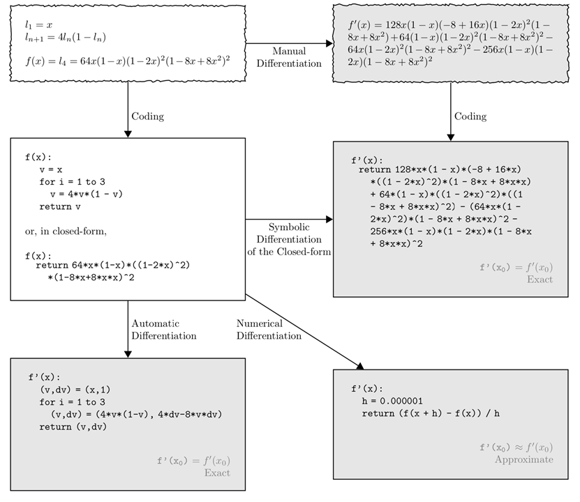
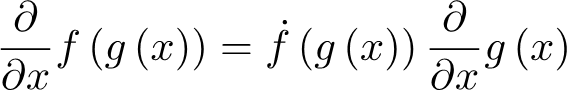

# 深度学习框架

## 目标

- 机器学习框架的历史演进；
- 声明式和命令式的DSL（Domain Specific Language）；
- 自动微分；

早期的 ML/统计 语言

- S -> R
- Matlab，Octave开源版

现在：2012年后，大量从Matlab转到Python

- Python：iPython (2001) + SciPy (2001) + Matplotlib (2003) + NumPy (2006)
- sklearn：基础ML算法和模型 （2007）

机器学习库

- LIBLINEAR/LIBSVM（2008）：线性模型和SVM，in sklean
- Vowpal Wabbit：2010，泛化线性模型等
- Weka（1997）：Java的机器学习算法
- Xgboost（2014）：分布式的boosted决策树

分布式机器学习库

- Mahout（2009）：ML on Hadoop
- GraphLab（2010）：图结构算法
- SparkML（2014）：参考GraphLab、Sklearn、SystemML；内存Cache；

Embedded Domain Specific Languages

- 作为特定任务的 **libraries** 或 **语言扩展**

- 是DSL 和 通用语言的结合，结合双方的好处，如线性代数库

ML Pipelines

- Sklearn Pipelines
- Spark ML Pipelines

SystemML 和 KeyStone ML

- SystemML ：R like，not embedded
- KeyStone ML：embedded scala DSL，on top of spark

深度学习框架：

- Theano (2008), Caffe (2014), MXNet (2015), TensorFlow (2015), PyTorch (2016)
- 自动微分 + 硬件加速

## 自动微分

### 计算导数的方法

- 手动实现：费力且容易出错
- 数值微分：简单，昂贵和敏感的数字精度
- 符号微分：计算机代数系统，但表达书指数增长

### **Chain Rule**

### **前向微分**

- 执行的过程中，计算微分

- 多输出的单微分，有效，因需要对每个输入变量执行微分

### **后向微分（后向传播）**

- Hinton， 1986
- 将中间微分计算的结果，缓存起来

- 多微分计算和有效，需要caching

## 声明式和命令式

### 声明式（define and run）

静态计算图：如Theano (2010), Caffe (2014), TensorFlow (2015)

- 更容易优化、分布式和模型导出

### 命令式（define by run）

动态计算图：如 Chainer (2015), autograd (2016), PyTorch (2017) 

- 推理和梯度的解释执行
- 更容易编程和调试

### 混合（Hybrid）

如 TensorFlow Eager, MXNet

### Pytorch & TenforFlow

Pytorch

- 命令式的DL库，类似Numpy（on GPUs）
- 支持自动微分

## 阅读

### Automatic differentiation in ML: Where we are and where we should be going？

### TensorFlow: A System for Large-Scale Machine Learning

### TensorFlow: Large-Scale Machine Learning on Heterogeneous Distributed Systems