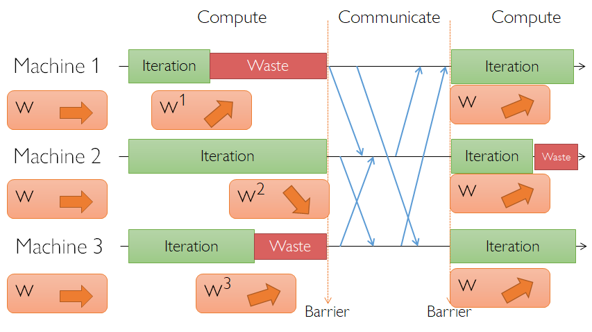
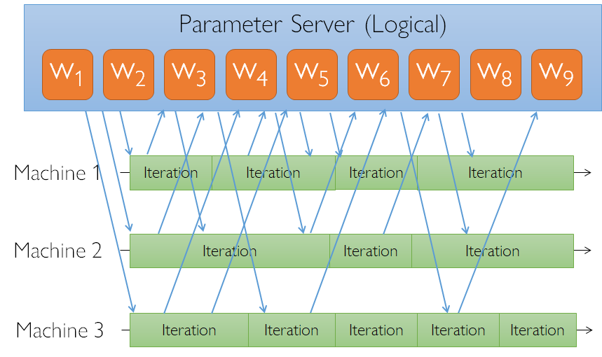
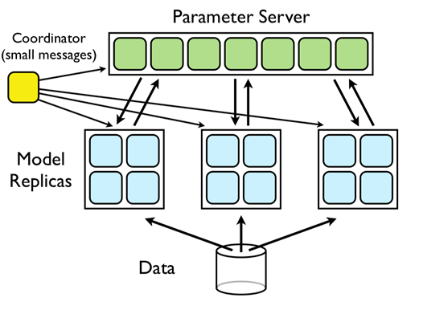
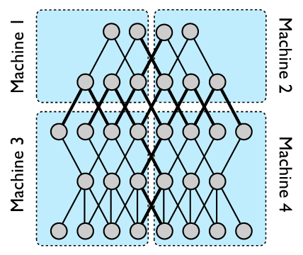
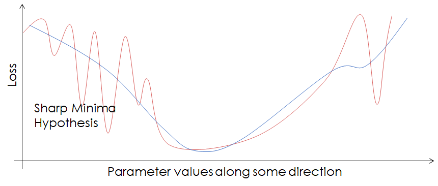
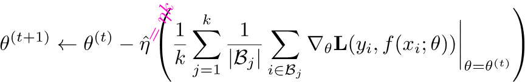

[toc]

# 分布式训练

系统判断

- 最低的时间学习到最好的模型（测试样本错误率指标）
- 复杂度：是否引入额外的训练复杂度（如超参数）
- 稳定性：系统训练模型的一致性？
- 代价：更多的花费会获得更好的结果？

## MR & Spark 

Map-Reduce is not optimized for **iteration** and **multi-stage** computation。

- 重复性的读取训练数据和输出中间结果模型

Spark ： Iteration and Multi-stage computation

**TODO：重要：和 distributed.md 进行合并**

## 参数更新

### BSP（Bulk Synchronous Parallel ）

同步，节点数据或计算性能差异导致性能浪费。

### ASP（ASynchronous Parallel ）

异步，可以使用 Parameter Server，因为异步需要参数的更新，需要将其它节点的参数收集并更新自己的参数。

## 并行

Parameter Server是数据并行和模型并行？

### 数据并行

模型在每个机器上复制一份。

同步执行：结果确定性，阻塞，需要较大的batch-size，不支持batch normalization

异步执行：消除阻塞，batched不需要跨节点？影响收敛

**问题：模型和激活参数必须在每个节点存储**

### 模型并行

将模型在机器间划分，复制数据。

模型如何切分：层间划分、单层划分

### AletNet 和 DistBelief 

DistBelief 首先提出 PS 的架构和DownPour SGD算法，Sandblaster L-BFGS算法。

模型并行在规模大的语言模型中仍然在使用，比如BERT；

batch-size 不是越大越好，会影响泛化性能；

小batch的梯度下降，可以认为是regularizer；

Scale the learning rate linearly with the batch size

### All-Reduce

机器学习中经常需要对梯度进行求和，并返回最新的给worker

P ：机器个数

N ：参数个数

总的数据发送量：( P - 1) * N * 2

扇入表示同时从几个节点接受数据

#### 单个Master的All-Reduce

同步梯度更新，将各个分区计算出来的梯度汇总到master上进行。

机器的最大扇入：P - 1

机器的最大数据量：( P - 1) * N

通信步骤：2

#### Parameter Server

P个Server，每个机器对N参数量划分为P份，每个机器负责规约1份。

机器的最大扇入：P - 1

规约后单台机器的数据量：( P - 1) * N / P

通信步骤：2

#### recursive halving and doubling

经典的树形算法

机器的最大扇入：1

机器的最大数据量：N

通信步骤：2 * logP

#### Ring-AllReduce

NCCL 2.3 版本采用

将数据切成P份，循环发送P-1轮数据进行部分聚合。**延迟与GPU的数量成线性关系**。

另外，有一些基于ring的层次的，2D的优化算法。

机器的最大扇入：1

单次机器的最大数据量：N / P，每轮所有机器的带宽为 N

通信步骤：2 * (P - 1)

#### Double Binary Tree All-Reduce（TODO）

[NCCL 2.4](https://devblogs.nvidia.com/massively-scale-deep-learning-training-nccl-2-4/)版本采用，MPI中的算法2009（Two-Tree Algorithms for Full Bandwidth Broadcast, Reduction and Scan）

其主要思想是利用二叉树中大约一半节点是叶子节点的特性，通过将叶子节点变换为非叶子节点，得到两颗二叉树，每个节点在其中一颗二叉树上是叶子节点，在另一颗二叉树上是非叶子节点。

## 阅读

### MLlib*: Fast Training of GLMs using Spark MLlib，2019.

解决broadcast -> collect -> broadcast 的循环，避免drvier端瓶颈。

- model averaging : 每个分区独自采用SGD训练出模型，然后将**分区的模型取平均作为整体模型**，再分发到每个分区上进行下一轮训练； 
  - 分区训练时，针对L2正则化，采取了基于阈值的延迟方法更新模型参数；

- Distributed Aggregation using AllReduce : driver每轮不再汇总分区模型，而是通过分区点对点shuffle计算整体模型；
- Stochastic gradient descent tricks 第18.5.1章节，进行梯度的更新；

### Scaling Distributed Machine Learning with the Parameter Server 

### PipeDream: Generalized Pipeline Parallelism for DNN Training 

### Adaptive Communication Strategies to Achieve the Best Error-Runtime Trade-off in Local-Update SGD 