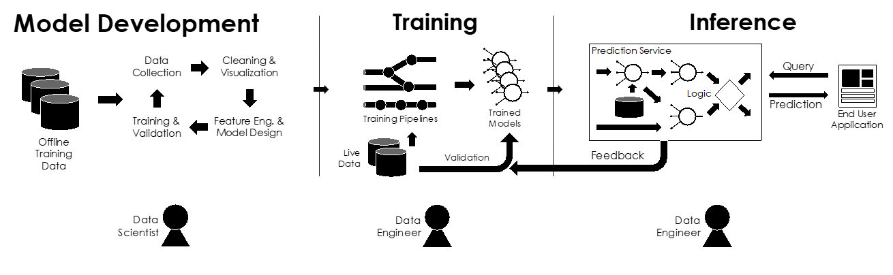
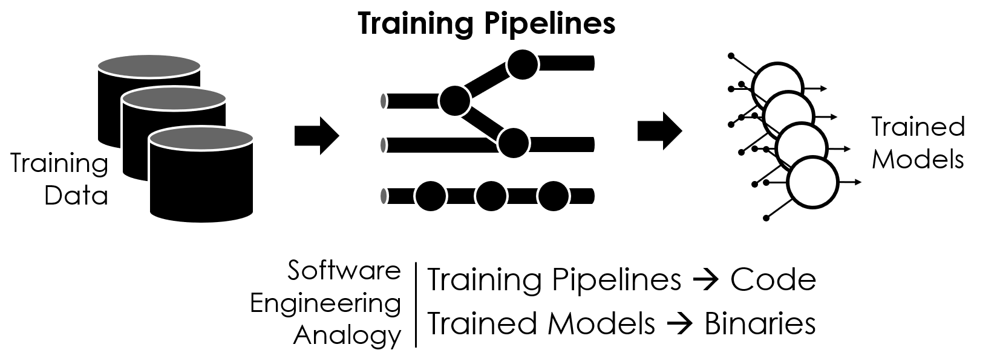

# ML Lifecycle

机器学习的生命周期

- 挑战和机遇
- 科学及 VS 工程师

关键的概念

- 超参数
- 模型流水线，特征，特征工程
- 热启动，细粒度调优
- 反馈循环，重新训练和持续训练

## 组成

### 模型开发

数据科学家无法做的事情：数据收集，清洗和可视化

- 确定潜在的数据来源
- 连接合并多个来源的数据
- 处理缺失值和离群值
- 绘制趋势识别异常

**数据科学家做的事情：特征工程，训练和验证**

- 构建好的特征函数
- 设计新的模型架构
- 调整超参数
- 验证模型准确性

**特征：**

- 特征连接：在一个特征中组合多个数据源
- 特征重用：多个任务中重用相同的特征（如用户标签，产品内嵌的信息）
- 预测作为特征：一个任务的预测作为另一个任务的特征
- 特征缓存：特征值经常是预先计算出来并缓存
- 动态特征：特征比模型更常被修改，会出现 covariate shift 的问题

**超参数：**

- 手动设置，或者交叉验证进行调优
- 为什么不在模型中直接学习？
- 如何直接学习模型？

**模型开发的输出**

- 报告和仪表板
- 训练的模型（直接输出这个，非常不好）
  - 无法根据新数据重新训练模型
  - 无法跟踪数据和调试代码
  - 无法捕获开发时的依赖
  - 无法合规的审计训练（audit training for compliance），如GDPR（通用数据保护条例）- 

### 训练

- 训练的流水线（Traning Pipelines）

  - 描述了如何从数据源训练出模型

  - 在大规模实时数据上训练模型

  - 在新数据上重新训练模型

  - 自动验证准确率

  - 管理模型的版本信息

  - 需要很少的机器学习的专业知识

    

- 热启动
  - 随着时间的迁移学习
  - 数据分布会改变，但不会迅速改变
  - 需要一种机制可以合适地设置学习率（典型会设置启动非常小）
  - 灾难性忘记：旧数据上的模型退化，可以通过持续训练旧数据解决

- 细粒度调优
  - 使用小的学习率对新的数据集或者预测任务，训练预训练或部分预训练的模型
    - 快速训练，提升准确度

- Context
  - How was the model or data created ?
  - What is the latest or best version ?
  - Who is responsible?
- Composition
  - 模型可以被组合用来解决新的问题，但可能会造成错误的结果
    - 需要跟踪组成并验证端到端准确性
    - 需要模型的单元和集成测试

### 推理

目标：在爆发性高负载时，预测性能 ~10ms

深度神经网络导致更加负载 -> 新的ML算法和系统

加入反馈（Incorporating feedback）

- 模型更新：新数据来临时重新训练

  - 周期性：批处理和验证

  - 持续性（在线学习）：最新的模型

    - 需要验证，学习率设置。。。非常复杂
- 特征更新：新数据可能会改变特征
  - 例如：更新用户的点击历史  -> 新的预测
  - 比在线学习更加鲁棒

反馈循环（Feedback Cycles）

- 模型描述收集数据的偏见（bias the data they collect）

  - 如 内容推荐

  - 特征模型反应早期的模型偏见

- Exploration - Exploitation Trade-off

  - Exploration：观察不同的输出
  - Exploitation：利用模型获取预测的最佳解决方案 

- 解决方案

  - Randomization（**ε-greedy**）：不定期忽略模型
  - Bandit Algorithms / Thompson Sampling ：最优地平衡exploration和exploitation（主要的研究的领域）

## Readings

### Hidden Technical Debt in Machine Learning Systems

Google面临的挑战的概述

- 描述
- 关键点
- 贡献

### TFX: A TensorFlow-Based Production-Scale Machine Learing Platform

https://www.tensorflow.org/tfx : 部分集成

Google对于上面问题的解决方案

- 描述
- 关键点
- 贡献

### Towards Unified Data and Lifecycle Management for Deep Learning

可选的数据库社区解决方案

- 描述
- 关键点
- 贡献

### 相关的系统

[Doing Machine Learning the Uber Way: Five Lessons From the First Three Years of Michelangelo](https://towardsdatascience.com/doing-machine-learning-the-uber-way-five-lessons-from-the-first-three-years-of-michelangelo-da584a857cc2)

[Introducing FBLearner Flow: Facebook’s AI backbone](https://engineering.fb.com/core-data/introducing-fblearner-flow-facebook-s-ai-backbone/)

[KubeFlow](https://www.kubeflow.org/): Kubernetes Pipeline Orchestration Framework

[DeepBird](https://blog.twitter.com/engineering/en_us/topics/insights/2018/twittertensorflow.html): Twitters ML Deployment Framework

[Mlflow: A System to Accelerate the Machine Learning Lifecycle](http://mlflow.org)

[Data Engineering Bulletin](http://sites.computer.org/debull/A18dec/issue1.htm) on the Machine Learning Lifecycle 

- Full disclosure: I was the editor