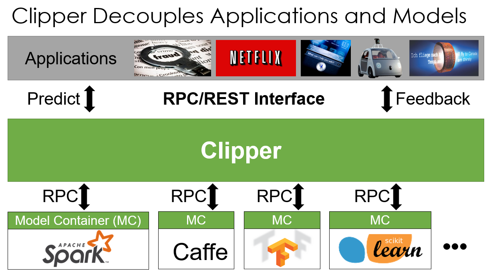

[toc]

# Prediction Serving

低延迟（10ms），其挑战型：

- 模型：模型复杂，大量参数；
- 查询：复杂查询，如Top K；
- 特征：特征多，join多表；

两种解决方式：

- 离线预计算：
- 在线实时计算：

Clipper：学术研究产物，不再维护

Clipper is a low-latency prediction serving system for machine learning. 

- 增长batch size，直到延迟超过阈值；
- 如果延迟超过SLO，则将batch size按比例缩小；