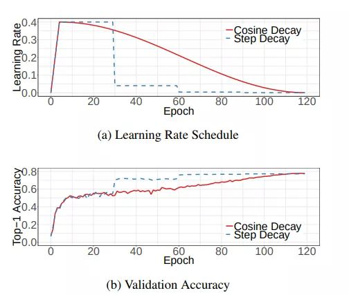
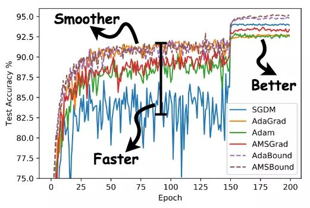

# 深度学习


## 激活函数

> 作为决定神经网络是否传递信息的「开关」，激活函数对于神经网络而言至关重要。

常见的激活函数有：

- Sigmod
- RELU
- GELU

### Sigmoid 

> 早期人工神经元使用二元阈值单元（Hopfield, 1982; McCulloch & Pitts, 1943）。二元决策通过 Sigmoid 激活函数进行平滑化，从而具有非常快的解码速度，并可以利用反向传播进行训练。

随着网络深度的不断增加，利用 Sigmoid 激活函数来训练证实不如非平滑、低概率性的 ReLU 有效。

### RELU

> ReLU 可以对抗梯度爆炸/消失问题，计算效率也很高。

RELU 是人工神经网络中最常用的激活函数（activation function），通常指代以「斜坡」函数及其变种为代表的非线性函数族。这个函数族比较常见的有 ReLU 以及 Leaky ReLU。

>  $f(x) = max(0, x)$


### GELU

> GELU : Gaussian Error Linear Units.
>
> BERT、RoBERTa、ALBERT 等目前业内顶尖的 NLP 模型都使用了这种激活函数。

GELU 与随机正则化有关，因为它是自适应 Dropout 的修正预期（Ba & Frey, 2013）。这表明神经元输出的概率性更高。


## 梯度消失/梯度爆炸

- 精心设计的权值初始化方法、BatchNorm 或 LayerNorm 这类标准化技术；
- [ReZero is All You Need: Fast Convergence at Large Depth](https://mp.weixin.qq.com/s/TRGeLzHtY9GbvammTerO5w)；


## Tricks

### 图像分类任务

> 来源：https://mp.weixin.qq.com/s/LXjR2tGwcP0MLcHrSOB72w

图像分类中的各种技巧对于目标检测、图像分割等任务也有很好的作用：

#### *Warmup*

源于 ResNet 论文，学习率预热（学习率动态变更）

- 刚开始训练时模型的权重(weights)是随机初始化的，选择一个较大的学习率，可能会带来模型的不稳定；
- 学习率预热就是在刚开始训练的时候先使用一个较小的学习率，训练一些epoches，等**模型稳定时再修改为预先设置的学习率进行训练**
- gradual warmup 从最开始的小学习率开始，每个iteration增大一点，直到最初设置的比较大的学习率。

#### *Linear scaling learning rate*

- batch size的增大，达到相同精度所需要的epoch数量越来越多；增大batch size不会改变梯度的期望，但是会降低它的方差；
- batch size为256时选择的学习率是0.1，当我们把batch size变为一个较大的数b时，学习率应该变为 0.1 × b/256；


#### *Cosine learning rate decay*

在warmup之后的训练过程中，学习率不断衰减是一个提高精度的好方法，有step decay和cosine decay。

- 对于cosine decay，假设总共有T个batch（不考虑warmup阶段），在第t个batch时，学习率η_t为

  $\eta_t = \frac{1}{2} (1 + cos(\frac{t\pi}{T}))\eta$



#### *Label-smoothing*

- inception-v2，最后一层一般是全连接层，然后对应标签的one-hot编码

  - 对于一个由多人标注的数据集，不同人标注的准则可能不同，每个人的标注也可能会有一些错误。模型对标签的过分相信会导致过拟合
  - LSR 通过在标签y中加入噪声，实现对模型约束，降低模型过拟合程度的一种正则化方法
  - 公式：ε是一个小的常数，K是类别的数目，y是图片的真正的标签，i代表第i个类别，q_i是图片为第i类的概率

  $q_i = \begin{cases}1-\epsilon \qquad\qquad  if\quad i=y \\ \epsilon/(K-1) \qquad otherwise \end{cases}$

#### *Random image cropping and patching* 

- 随机裁剪四个图片的中部分，然后把它们拼接为一个图片，同时混合这四个图片的标签。
- Ix, Iy是原始图片的宽和高。w和h称为boundary position，它决定了四个裁剪得到的小图片的尺寸。w和h从beta分布Beta(β, β)中随机生成，β也是RICAP的超参数。最终拼接的图片尺寸和原图片尺寸保持一致。

#### *Knowledge Distillation*

> 模型压缩的一种常用的方法

知识蒸馏：使用一个教师模型来帮助当前的模型（学生模型）训练

- 教师模型是一个较高准确率的预训练模型，因此学生模型可以在保持模型复杂度不变的情况下提升准确率；
- 蒸馏损失来惩罚学生模型和教师模型的输出之间的差异


#### *Cutout*

正则化方法：在训练时随机把图片的一部分**减掉**，这样能提高模型的鲁棒性。


#### *Random* erasing

正则化方法：模拟物体遮挡情况的数据增强方法，但**用随机数或者数据集中像素的平均值**替换原来的像素值，且替换掉的区域大小是随机。


#### *Mixup training*.

数据增强的方法：每次取出2张图片，然后将它们线性组合，得到新的图片，以此来作为新的训练样本，进行网络的训练。

Mixup方法主要增强了训练样本之间的线性表达，增强网络的泛化能力，不过mixup方法需要较长的时间才能收敛得比较好。

$\hat{x}=\lambda x_i + (1-\lambda)x_j$

$\hat{y}=\lambda y_i + (1-\lambda)y_j$

- λ是从Beta(α, α)随机采样的数，在[0,1]之间。在训练过程中，仅使用$(\hat{x}, \hat{y})$。

```python
for (images, labels) in train_loader:
	l = np.random.beta(mixup_alpha, mixup_alpha)
	index = torch.randperm(images.size(0))

    images_a, images_b = images, images[index]
    labels_a, labels_b = labels, labels[index]

    mixed_images = l * images_a + (1 - l) * images_b

    outputs = model(mixed_images)

    loss = l * criterion(outputs, labels_a) + (1- l) * criterion(outputs, labels_b)

    acc = l * accuracy(outputs, labels_a)[0] + (1- l) * accuracy(outputs, labels_b)[0]
```


#### *AdaBound*

Optimizer：练过程像adam一样快，并且像SGD一样好。



#### *AutoAugment*

数据增强：搜索适合当前问题的数据增强方法的方法。


## 正则化方法

- Dropout
- L1/L2正则
- Batch Normalization
- Early stopping
- Random cropping
- Mirroring
- Rotation
- Color shifting
- PCA color augmentation
