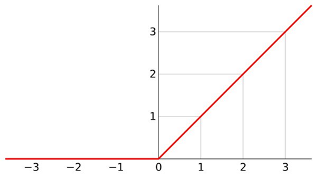
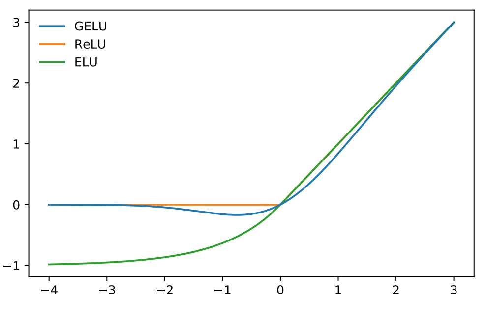

# 深度学习

## 激活函数

> 作为决定神经网络是否传递信息的「开关」，激活函数对于神经网络而言至关重要。

常见的激活函数有：

- Sigmod
- RELU
- GELU

### Sigmoid 

> 早期人工神经元使用二元阈值单元（Hopfield, 1982; McCulloch & Pitts, 1943）。二元决策通过 Sigmoid 激活函数进行平滑化，从而具有非常快的解码速度，并可以利用反向传播进行训练。

随着网络深度的不断增加，利用 Sigmoid 激活函数来训练证实不如非平滑、低概率性的 ReLU 有效。

### RELU

> ReLU 可以对抗梯度爆炸/消失问题，计算效率也很高。

RELU 是人工神经网络中最常用的激活函数（activation function），通常指代以「斜坡」函数及其变种为代表的非线性函数族。这个函数族比较常见的有 ReLU 以及 Leaky ReLU。

>  $f(x) = max(0, x)$

### GELU

> GELU : Gaussian Error Linear Units.
>
> BERT、RoBERTa、ALBERT 等目前业内顶尖的 NLP 模型都使用了这种激活函数。

GELU 与随机正则化有关，因为它是自适应 Dropout 的修正预期（Ba & Frey, 2013）。这表明神经元输出的概率性更高。

