# 图解 GPT-2（可视化 Transformer 语言模型）

> 原文：[图解 GPT-2（可视化转换器语言模型）——Jay Alammar ](https://jalammar.github.io/illustrated-gpt2/)

## 第1部分：GPT2 和语言建模

### 什么是语言模型

语言模型——基本上是一种机器学习模型，能够查看句子的一部分并预测下一个单词。

- 最著名的语言模型是智能手机键盘，它根据您当前输入的内容建议下一个单词。

GPT-2 是在一个名为 WebText 的 40GB 海量数据集上训练的。

### 用于语言建模的转换器

最初的 transformer 模型由编码器和解码器组成，每个是由多个称为***转换块***（Transformer Blocks）的栈构成。

- 该模型解决了机器翻译问题。  

在随后的许多研究工作中都抛弃了编码器或解码器，只使用一堆*转换块*——将它们堆叠得尽可能高。

GPT-2 的小模型到特大模型的模型维度

### 与 BERT 的一个区别

GPT-2 是使用 transformer 解码器块构建的。另一方面，BERT 使用transformer 编码器块。

- GPT-2 与传统语言模型一样，一次输出一个 Token。
- [made RNNs unreasonably effective](https://karpathy.github.io/2015/05/21/rnn-effectiveness/)：在生成每个令牌后，该令牌被添加到输入序列中。该新序列将成为模型下一步的输入。

GPT2 以及一些后来的模型，如 TransformerXL 和 XLNet，本质上是自动回归的

- BERT失去自动回归时，获得了将单词两边的上下文合并以获得更好结果的能力。

- XLNet 恢复了自回归，同时找到了一种替代方法来合并双方的上下文。

### 转换块的演变

#### The Encoder Block 编码器模块

首先是编码器块

#### The Decoder Block 解码器块

其次，解码器块与编码器块的架构略有不同，该层允许它**关注编码器中的特定段**：

自我注意力层的一个关键区别是，它屏蔽了未来的令牌

- 不是通过像 BERT 那样将单词更改为 [mask]，而是通过**干扰自注意力计算**来阻止来自正在计算的位置右侧的令牌的信息。

例如，如果我们要突出显示位置 #4 的路径，我们可以看到它只允许关注当前和以前的Token

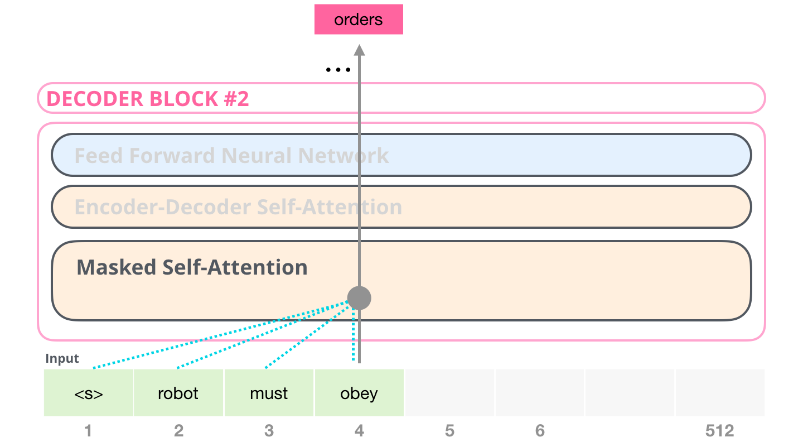重要的是要明确自我注意力（BERT 使用的东西）和掩蔽的自我注意力（GPT-2 使用的东西)之间的区别。

- 正常的自注意力允许一个位置在其右侧的Token处达到峰值（allows a position to peak at tokens to its right）
- Masked的自注意力可以防止这种情况发生；

#### The Decoder-Only Block 仅解码器块

在原始论文之后，通过总结长序列生成维基百科提出了另一种能够进行语言建模的转换器模块的排列。

- 模型称为“Transformer-Decoder”：扔掉了 Transformer 编码器

这个早期的基于 Transformer 的语言模型由六个 transformer 解码器块堆栈组成：

- 这些块与原始解码器块非常相似，只是它们取消了第二个自注意力层。
- 该模型现在可以在某个段中处理多达 4,000 个令牌——这是对原始 transformer 中的 512 的大规模升级。

OpenAI GPT-2 模型使用这些仅限解码器的块。

### 脑外科速成课程：深入了解 GPT-2

GPT-2 可以处理 1024 个 tokens。每个 token 都沿着自己的路径流经所有解码器块。

运行经过训练的 GPT-2 的最简单方法是让它自己漫无边际（这在技术上称为生成无条件样本）。或者，我们可以提示它让它谈论某个主题（又名生成交互式条件样本）。

- 在漫无边际的情况下，我们可以简单地将开始标记交给它并让它开始生成单词（经过训练的模型用 `<|endoftext|>` 其开始标记。让我们改称它 `<s>` ）

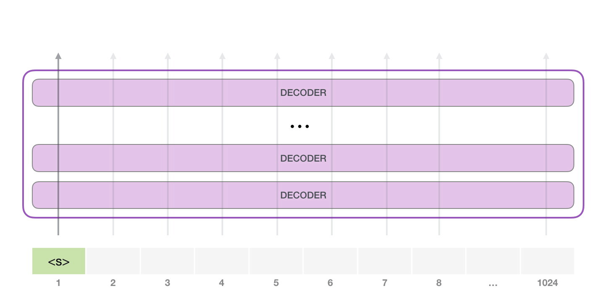

模型只有一个输入标记，因此该路径将是唯一的活动标记。令牌通过所有层连续处理，然后沿着该路径生成向量。

- 该向量可以根据模型的词汇量（模型知道的所有单词，在 GPT-2 的情况下为 50,000 个单词）进行评分。

在本例中，我们选择了概率最高的代币“the”。在下一步中，我们将第一步的输出添加到输入序列中，并让模型进行下一个预测：

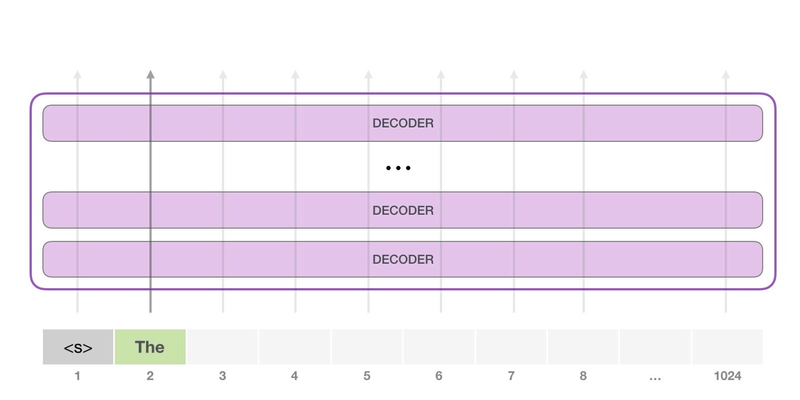

第二条路径是此计算中唯一处于活动状态的路径。GPT-2 的每一层都保留了自己对第一个令牌的解释，并将使用它来处理第二个令牌。GPT-2 不会根据第二个令牌重新解释第一个令牌。

### 更深入地了解内部

#### 输入编码

从输入开始，该模型在其嵌入矩阵中查找输入词的嵌入。

- 每一行都是一个单词嵌入：一个数字列表，代表一个单词并捕获它的一些含义。在不同的 GPT2 模型大小中，该列表的大小是不同的。最小的模型使用每个字/标记 768 的嵌入大小。

在开始时，我们在嵌入矩阵 `<s>` 中查找开始标记的嵌入。在将其传递给模型中的第一个模块之前，我们需要合并位置编码：一个信号，指示序列中 Transformer Blocks中单词的顺序

- 训练模型的一部分是一个矩阵，其中包含输入中 1024 个位置中每个位置的位置编码向量。

有了这个，我们就已经介绍了在将输入词传递到第一个转换器块之前如何处理输入词。我们还知道构成训练的 GPT-2 的两个权重矩阵。

向第一个转换器模块发送一个字意味着查找其嵌入并与位置 #1 的位置编码向量相加。

#### 堆栈之旅

第一个块现在可以处理 token，方法是首先通过自注意力过程，然后通过其神经网络层。一旦第一个转换器块处理了token，它就会将其生成的向量发送到堆栈中，由下一个块处理。每个块的过程是相同的，但每个块在自注意力和神经网络子层中都有自己的权重。

#### Self-Attention Recap 自我关注回顾

语言在很大程度上依赖于上下文。例如，看第二定律：

> **Second Law of Robotics 机器人第二定律**
> A robot must obey the orders given **it** by human beings except where **such orders** would conflict with the **First Law**.
> 机器人必须服从人类下达的命令，除非这些命令与第一定律相冲突。

模型处理这句话时，它必须能够知道：

- **it**  指的是机器人
- **such orders**  是指法律的早期部分，即“人类所下达的命令”
- **The First Law**  是指整个第一定律

这就是自我关注（self-attention）的作用。它烘焙（bakes）模型对相关和相关单词的理解，这些单词在处理某个单词之前解释该单词的上下文（通过神经网络传递它）。它通过**为句段中每个单词的相关性分配分数**，并加其向量表示来做到这一点。

- 举个例子，顶部块中的这个自我注意力层在处理“它”这个词时会注意“机器人”。它将传递给其神经网络的向量是**三个单词中每个单词的向量乘以它们的分数的总和**。

#### Self-Attention Process 自我关注过程

自注意力沿着句段（segment）中每个 token 的路径进行处理。重要组成部分是三个向量：

- Query: 查询是当前单词的表示形式，用于对所有其他单词（使用其键）进行评分。只关心当前正在处理的 token 的查询。
- Key: 关键向量就像句段中所有单词的标签。它们是我们在搜索相关单词时所匹配的。
- Value: 值向量是实际的单词表示，一旦我们对每个单词的相关性进行了评分，这些值就是我们加起来表示当前单词的值。

一个粗略的类比是把它想象成在文件柜里搜索。

- 查询就像正在研究的主题的便签。

- 钥匙就像柜子里文件夹的标签。

当您将标签与便签匹配时，我们会取出该文件夹的内容，这些内容是值向量。除了您不仅要查找一个值，还要查找来自混合文件夹的值的混合值。

将查询向量乘以每个键向量会生成每个文件夹的分数（从技术上讲：点积后跟 softmax）。

我们将每个值乘以它的分数并相加——从而产生我们的自我关注结果。

- 这种价值向量的加权混合导致一个向量将 50% 的“注意力”支付给单词 `robot` ，30% 支付给单词 `a` ，19% 支付给单词 `it` 。

#### Model Output 模型输出

当模型中的顶部模块产生其输出向量（其自身自注意力的结果，然后是其自身的神经网络）时，模型将该向量乘以嵌入矩阵。

回想一下，嵌入矩阵中的每一行都对应于模型词汇表中一个单词的嵌入。这种乘法的结果被解释为模型词汇表中每个单词的分数。

我们可以简单地选择得分最高的 token（top_k = 1）。但是，如果模型也考虑其他单词，则会获得更好的结果。

- 上策是使用分数作为选择该单词的概率从整个列表中抽取一个单词（因此分数较高的单词被选中的机会更高）。
- 中策是将 top_k 设置为 40，并让模型考虑得分最高的 40 个单词。

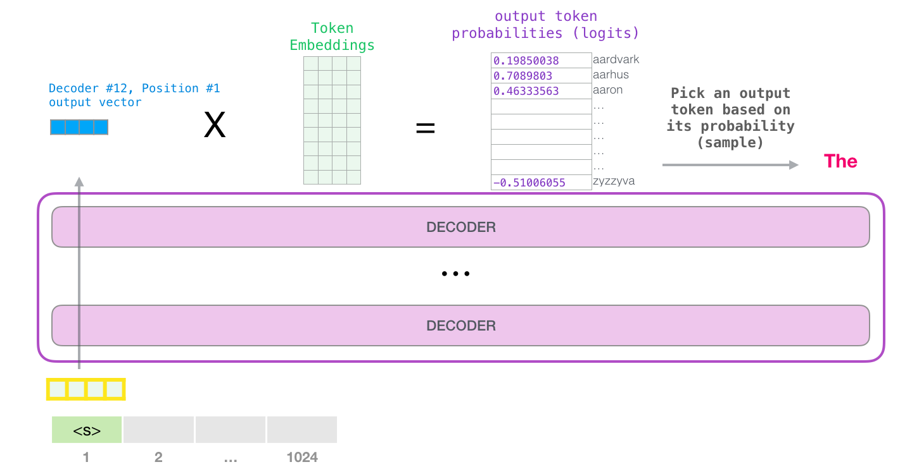

这样，模型就完成了迭代，输出了一个单词。模型继续迭代，直到生成整个上下文（1024 个标记）或直到生成序列末尾标记。

### 第 #1 部分结束：GPT-2，女士们，先生们

如果你想知道自我关注层内部到底发生了什么，那么下面的奖励部分就是为你准备的。

我创建它是为了引入更多的视觉语言来描述自我注意力，以便更容易地描述后来的 transformer 模型（看着你，TransformerXL 和 XLNet）。

我想在这篇文章中指出一些过于简化的地方：

- 我交替使用“words”和“tokens”。但实际上，GPT2 使用字节对（Byte Pair）编码来创建其词汇表中的 token。这意味着 tokens 通常是 words 的一部分。
- 展示的示例在其推理/评估模式下运行 GPT2。这就是为什么它一次只处理一个单词。在训练时，模型将针对较长的文本序列进行训练，并同时处理多个令牌。同样在训练时，模型将处理更大的批量大小 （512） VS 评估使用的批量大小。
- 我自由地旋转/转置矢量，以更好地管理图像中的空间。在实施时，必须更加精确。
- Transformer 使用大量的层归一化，这非常重要。在这篇文章中更侧重于自我关注。
- 有时我需要显示更多的框来表示向量。我将其表示为“放大”。例如：

## 第 #2 部分：自我关注的图解

在文章的前面，我们展示了这张图片，以展示在处理单词 `it` 的层中应用的自我注意力：

在本节中，我们将详细介绍如何做到这一点。请注意，我们将以一种尝试理解单个单词发生的事情的方式来看待它。这就是为什么我们将展示许多单向量。实际的实现是通过将巨型矩阵相乘来完成的。

### 自我关注（无Masking）

让我们先看一下在编码器块中计算的原始的自注意力。让我们看一个玩具 transformer block ，它一次只能处理四个令牌。

自我关注通过三个主要步骤应用：

- 为每个路径创建 Query、Key 和 Value 向量。
- 对于每个输入令牌，使用其查询向量对所有其他关键向量进行评分
- 将值向量乘以相关分数后，将价值向量相加。

#### 1- 创建查询、键和值向量

接受它的查询，并与所有键进行比较。这将为**每个键生成一个分数**。自注意力的第一步是计算每个令牌路径的三个向量（我们暂时忽略注意力头）：

#### 2- Score 2- 得分

现在我们有了向量，我们只在步骤 #2 中使用查询和键向量。由于我们专注于第一个令牌，因此我们将其查询乘以所有其他关键向量，从而得出四个令牌中每个令牌的分数。

#### 3- 总和

现在，我们可以将分数乘以值向量。在我们将它们相加后，得分高的值将构成结果向量的很大一部分。

分数越低，我们显示的价值向量就越透明。这是为了表明乘以一个小数字如何稀释向量的值。

如果我们对每个路径执行相同的操作，我们最终会得到一个向量，表示包含该标记（token）的适当上下文的每个标记。然后，这些被呈现给转换器模块（前馈神经网络）中的下一个子层：

### Masked Self-Attention的图解

掩蔽的自我注意力与自我注意力相同，除非涉及到步骤#2。

假设模型只有两个标记作为输入，并且我们正在观察第二个标记。在这种情况下，最后两个标记（token）被屏蔽。因此，模型会干扰评分步骤。它基本上总是将未来标记评分为 0，因此模型无法达到未来单词的峰值（peak to future words）：

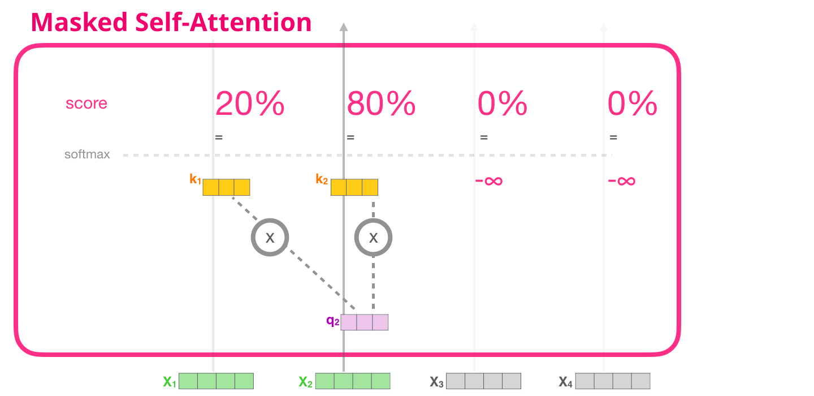

这种掩码通常作为称为注意力掩码的矩阵实现。想想一个由四个词组成的序列（例如 “robot must obey orders”）。在语言建模场景中，此序列分四个步骤吸收 - 每个单词一个步骤（现在假设每个单词都是一个标记）。

由于这些模型是批量工作的，我们可以假设这个玩具模型的批处理大小为 4，它将作为一个批处理整个序列（包括四个步骤）。

在矩阵形式中，我们通过将查询矩阵乘以键矩阵来计算分数。让我们将其可视化如下，除了该单元格中与该单词关联的查询（或键）向量之外，不是单词：

乘法之后，我们拍打我们的注意力掩码三角形。它将我们想要屏蔽的单元格设置为 -infinity 或非常大的负数（例如，GPT2 中的 -10 亿）：

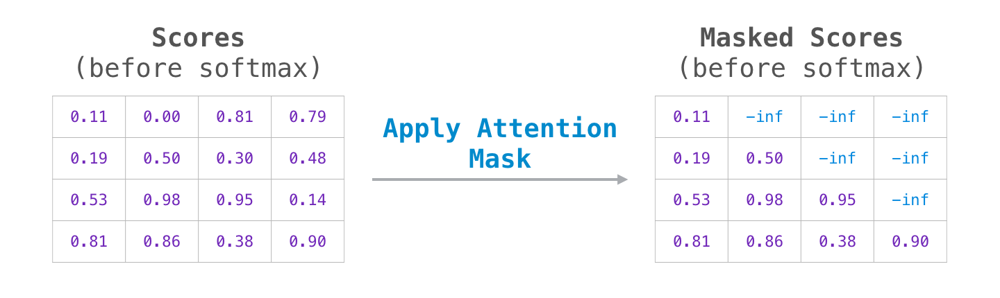

然后，在每一行上应用 softmax 会产生我们用于自我注意力的实际分数：

此分数表的含义如下：

- 当模型处理数据集中的第一个示例（行 #1）时，该示例仅包含一个单词（“机器人”），其 100% 的注意力将集中在该单词上。
- 当模型处理数据集中的第二个示例（行 #2）时，其中包含单词 （“robot must”），当它处理单词“must”时，其 48% 的注意力将放在“机器人”上，52% 的注意力将放在“必须”上。
- 等等

### GPT-2 Masked Self-Attention

#### 评估时间：一次处理一个令牌

我们可以让 GPT-2 完全按照掩饰的自我注意力工作方式运行。但是在评估过程中，当我们的模型在每次迭代后只添加一个新单词时，对于已经处理过的标记，沿着早期路径重新计算自我注意力是低效的。

在本例中，我们处理第一个令牌（暂时忽略 `<s>` ）。

GPT-2 保留 `a` token 的键和值向量。每个自注意力层都保留该令牌的各自键和值向量：

现在，在下一次迭代中，当模型处理单词 `robot` 时，它不需要为 `a` token 生成查询、键和值查询。它只是重用它从第一次迭代中保存的内容：

#### GPT-2 自我关注：1- 创建查询、键和值

假设模型正在处理单词 `it` 。如果我们谈论的是底部块，那么该令牌的输入将是 `it` + 插槽 #9 的位置编码的嵌入：

transformer的每个块都有自己的权重（在后面的帖子中分解）。我们遇到的第一个是我们用来创建查询、键和值的权重矩阵。

自注意力将其输入乘以其权重矩阵（并添加一个偏置向量，此处未说明）。

乘法得到一个向量，该向量基本上是单词 `it` 的查询、键和值向量的串联。

将输入向量乘以注意力权重向量（并在后方添加偏向量）得到此标记的键、值和查询向量。

#### GPT-2 自我注意力：1.5- 分裂成注意力头

在前面的例子中，我们直接进入自我关注，忽略了“多头”部分。

自我注意力在Q，K，V向量的不同部分进行多次。“拆分”注意力头只是将长向量重塑为矩阵。小 GPT2 有 12 个注意力头，因此这将是重塑矩阵的第一个维度：

在前面的例子中，我们已经研究了一个注意力头内部发生的事情。考虑多个注意力头的一种方法是这样的（如果我们只想象十二个注意力头中的三个）：

#### GPT-2 自我关注：2- 得分

我们现在可以继续评分了——我们只看一个注意力头（而所有其他注意力头都在进行类似的操作）：

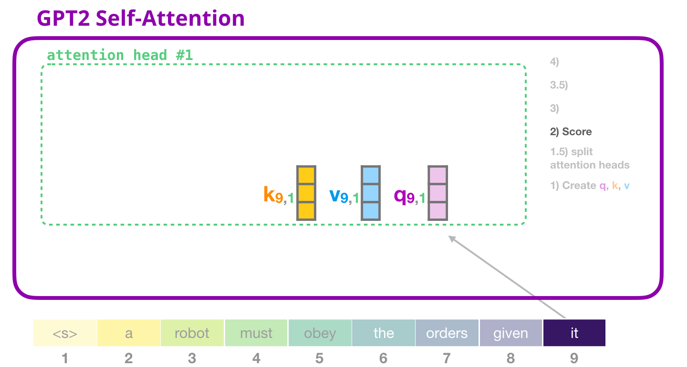

现在，token 可以根据其他 token  的所有键进行评分（在以前的迭代中，这些键是在 attention head #1 中计算的）：

#### GPT-2 自我关注：3- 总和

现在将每个值与其分数相乘，然后将它们相加，从而产生注意力头 #1 的自我注意结果：

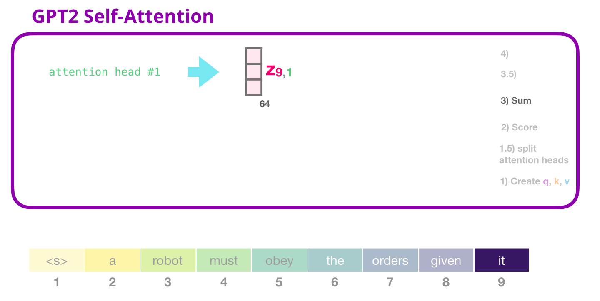

#### GPT-2 自我注意力：3.5- 合并注意力头

我们处理各种注意力头的方式是，我们首先将它们连接成一个向量：

但是矢量还没有准备好发送到下一个子图层。我们需要首先把这个弗兰肯斯坦的隐藏状态怪物变成一个同质的表示（turn this Frankenstein’s-monster of hidden states into a homogenous representation）。

#### GPT-2 自我关注：4-投射

我们将让模型学习如何最好地将串联的自我注意力结果映射到前馈神经网络可以处理的向量中。这是我们的第二个大型权重矩阵，它将注意力头的结果投射到自注意力子层的输出向量中：

有了这个，我们已经产生了可以发送到下一层的向量：

#### GPT-2 全连接神经网络：第 #1 层

在全连接神经网络中，模块在自我注意力在其表示中包含适当的上下文后处理其输入令牌。它由两层组成。第一层的大小是模型的四倍（由于 GPT2 小是 768，因此该网络将有 768*4 = 3072 个单元）。为什么是四次？这只是原始变压器滚动的尺寸（模型尺寸为 512，该模型中的层 #1 为 2048）。这似乎为Transformer模型提供了足够的表示能力来处理迄今为止抛给它们的任务。

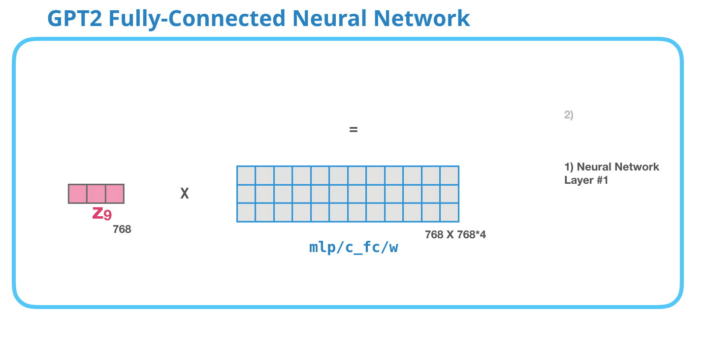

（未显示：偏置向量）

#### GPT-2 全连接神经网络：第 #2 层 - 投影到模型维度

第二层将第一层的结果投射回模型维度（小 GPT2 为 768）。此乘法的结果是此令牌的转换器块的结果。

（未显示：偏置向量）

这是我们将要介绍的 transformer block 的最详细版本！现在，您几乎已经掌握了 Transformer 语言模型内部发生的绝大多数情况。回顾一下，我们勇敢的输入向量遇到了这些权重矩阵：

每个块都有自己的一组权重。另一方面，该模型只有一个标记嵌入矩阵和一个位置编码矩阵：

如果你想查看模型的所有参数，那么我在这里统计了它们：

由于某种原因，它们加起来的参数最多是 124M，而不是 117M。我不知道为什么，但这就是它们中似乎有多少在已发布的代码中（如果我错了，请纠正我）。

## 第 3 部分：超越语言建模

仅解码器转换器不断显示出超越语言建模的前景。在很多应用程序中，它已经取得了成功，这可以通过与上述类似的视觉效果来描述。让我们通过查看其中一些应用程序来结束这篇文章。

### 机器翻译

进行翻译不需要编码器。仅解码器转换器可以解决相同的任务：

### Summarization 综述

这是第一个仅使用解码器的转换器所训练的任务。它被训练阅读维基百科文章（目录前没有开头部分），并对其进行总结。文章的实际开头部分被用作训练数据中的标签：

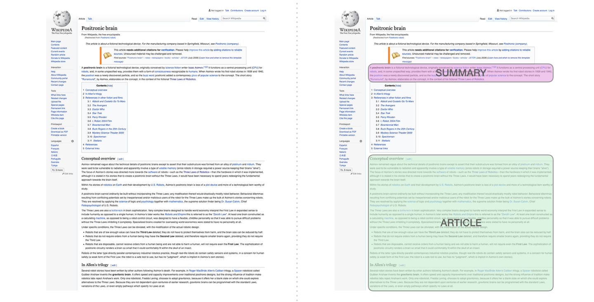

这篇论文针对维基百科的文章训练了模型，因此训练后的模型能够总结文章：

### 迁移学习

在[使用单个预训练转换器的示例高效文本摘要](https://arxiv.org/abs/1905.08836)中，仅解码器转换器首先在语言建模方面进行预训练，然后进行微调以进行摘要。事实证明，在有限的数据设置中，它比预训练的编码器-解码器转换器获得更好的结果。

GPT2 论文还显示了在语言建模上预训练模型后的总结结果。

### 音乐生成

[Music Transformer ](https://magenta.tensorflow.org/music-transformer)使用仅解码器转换器来生成具有表现力的时序和动态的音乐。

- “音乐建模”就像语言建模一样——只是让模型以无监督的方式学习音乐，然后让它对输出进行采样（我们之前称之为“漫无边际”）。

在音乐表演中（现在让我们考虑一下钢琴），我们必须表现音符，但也要表现速度——衡量钢琴键的力度。

A performance is just a series of these one-hot vectors. 

MIDI文件可以转换成这样的格式。本文包含以下示例输入序列：

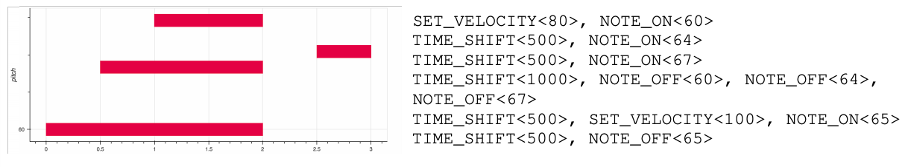

此输入序列的单热向量表示形式如下所示：

我喜欢论文上的视觉展示，显示了 Music Transformer 的自我注意力。我在这里添加了一些注释：

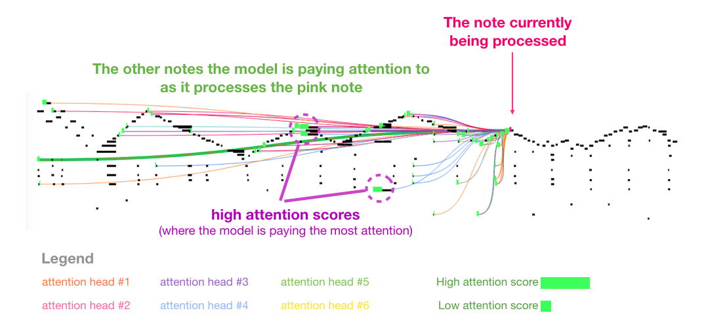

图 8：这件作品有一个反复出现的三角形轮廓。查询位于后面的一个高峰，它关注了高峰上的所有先前高音，一直到乐曲的开头。“该图显示了一个查询（所有注意力线的来源）和以前被关注的记忆（在中突出显示了接收更多softmax概率的笔记）。注意线的颜色对应于不同的头部，宽度对应于softmax概率的权重。

如果您不清楚音符的这种表示形式，请观看[此视频](https://www.youtube.com/watch?v=ipzR9bhei_o)。

## Conclusion 结论

我们进入 GPT2 的旅程到此结束，以及我们对它的父模型——仅解码器转换器的探索。

