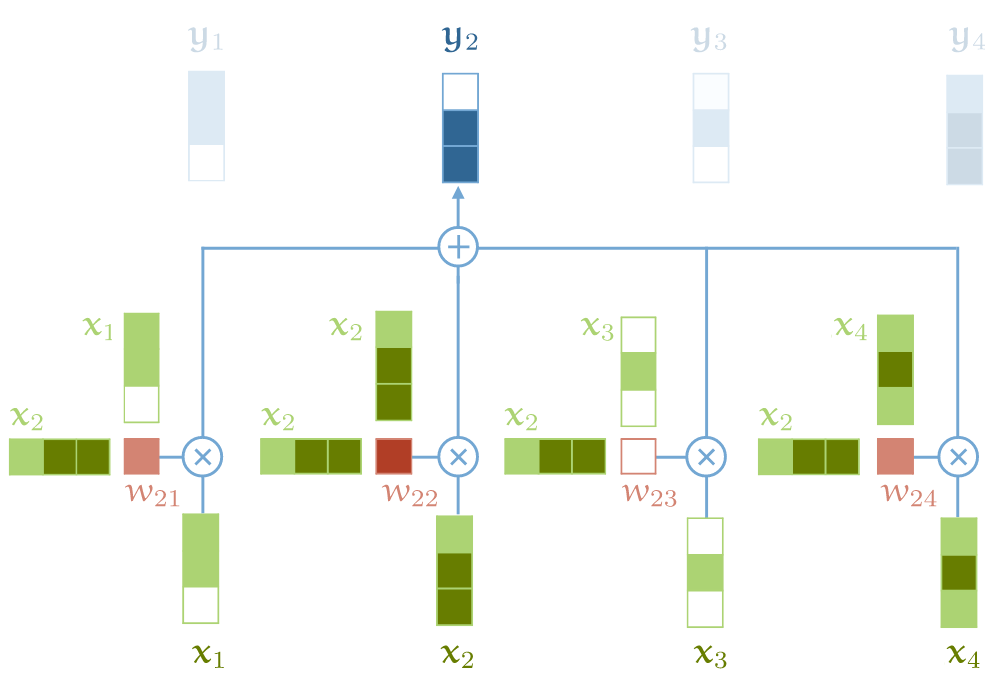

# Transformer


## self-attention模型

**sequence-to-sequence 运算**： 输入一个向量序列（a sequence of vectors），输出另一个向量序列





**self-attention 本身是不关心输入的顺序属性的**


### 基础版实现

**最基础的 self-attention 模型**的实现： **两次矩阵乘法和一次归一化**（softmax）。

- 输入 **X** 由 t 个 k-维 vector 组成的序列，
- 引入一个 minibatch dimension b，

就得到了一个三维矩阵 `(b,t,k)`，这就是一个 tensor。

- 输出矩阵 **Y** 就是 size `(b, t, k)` 的 tensor，每一行都是对 𝐗 的行的加权。

```python
import torch
import torch.nn.functional as F

# 假设我们有一些 tensor x 作为输入，它是 (b, t, k) 维矩阵
x = ...

# torch.bmm() 是批量矩阵乘法（batched matrix multiplication）函数，对一批矩阵执行乘法操作
raw_weights = torch.bmm(x, x.transpose(1, 2))
weights = F.softmax(raw_weights, dim=2)
y = torch.bmm(weights, x)
```


### 现代 transformer 对 self-attention 的扩展

