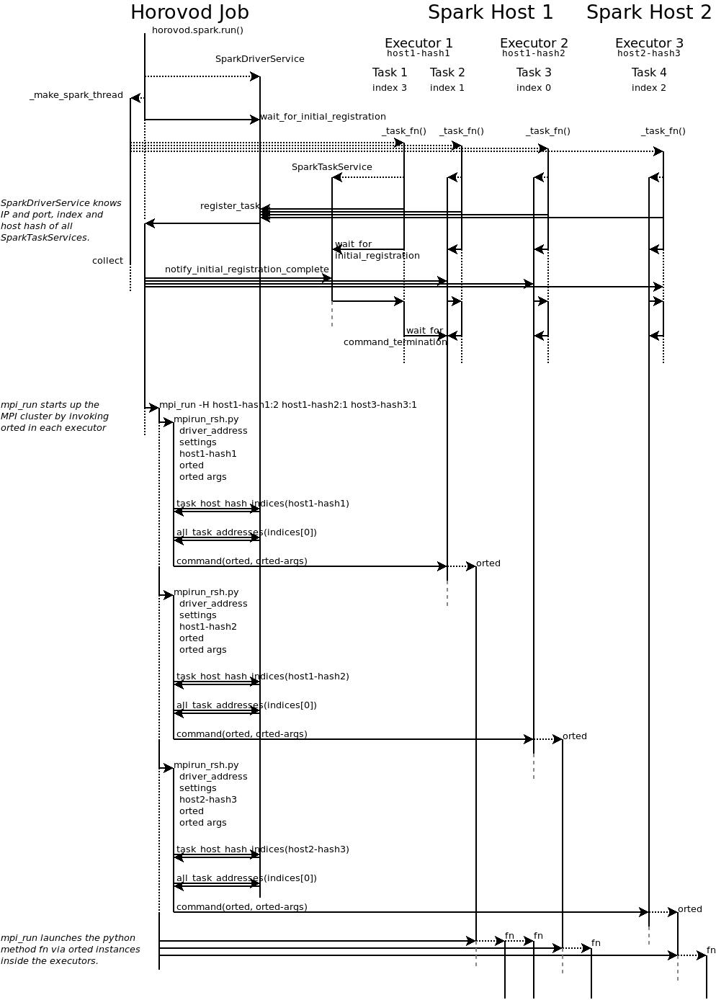

[toc]

# Horovod on Spark

## Horovod Spark Estimators

可以和Spark ML 集成，定义了hvd.KerasEstimator和TorchEstimator，继承Spark ML的Estimator。

```python
from tensorflow import keras
import tensorflow as tf
import horovod.spark.keras as hvd

model = keras.models.Sequential()
    .add(keras.layers.Dense(8, input_dim=2))
    .add(keras.layers.Activation('tanh'))
    .add(keras.layers.Dense(1))
    .add(keras.layers.Activation('sigmoid'))

# NOTE: unscaled learning rate
optimizer = keras.optimizers.SGD(lr=0.1)
loss = 'binary_crossentropy'

store = HDFSStore('/user/username/experiments')
keras_estimator = hvd.KerasEstimator(
    num_proc=4,
    store=store,
    model=model,
    optimizer=optimizer,
    loss=loss,
    feature_cols=['features'],
    label_cols=['y'],
    batch_size=32,
    epochs=10)


keras_model = keras_estimator.fit(train_df) \
    .setOutputCols(['predict'])
predict_df = keras_model.transform(test_df)
```


## 原理

https://horovod.readthedocs.io/en/stable/contributors_include.html

Horovod in  Spark 使用 Open MPI 来跑 Horovod 作业。

- Horovod job作为Spark driver，在Spark集群中创建`num_procs`个任务（`horovod.spark._make_spark_thread`），每个Task执行`horovod.spark._task_fn`，向driver注册IP和Port，以及host hash（被MPI作为hostname）；
  - **所有作业同时启动，因此需要确保集群的可行并行度（集群的核数大于num_procs * spark.task.cpus）大于num_procs**；

- Driver通知所有tasks其它task已经启动，每个task继续初始化并等待终止的RPC；
- Driver运行`mpi_run`启动Python函数
  - 通常，MPI通过SSH连接到host，但这不允许在Spark executor中启动Python函数；
  - MPI连接executor，通过调用`horovod.spark.driver.mpirun_rsh`（MPI connects to each executor by invoking the `horovod.spark.driver.mpirun_rsh` method to “remote shell” into the executors.）
  - This method communicates with the task that has the smallest index per host hash. This task executes the `orted` command provided by MPI.
  - 每个executor运行单个`orted`进程，在每个executor的第一个Task会有Python函数运行在每个核上（？？），同样host hash下的其它的task需要等待第一个task结束。




## 配置

### GPU配置

2.x版本

在Standalone模式下，通过在`spark_env.sh`设置`export SPARK_WORKER_CORES=<# of GPUs>`，通过将`spark.task.cpus` 来控制申请每个Task使用的GPU；


