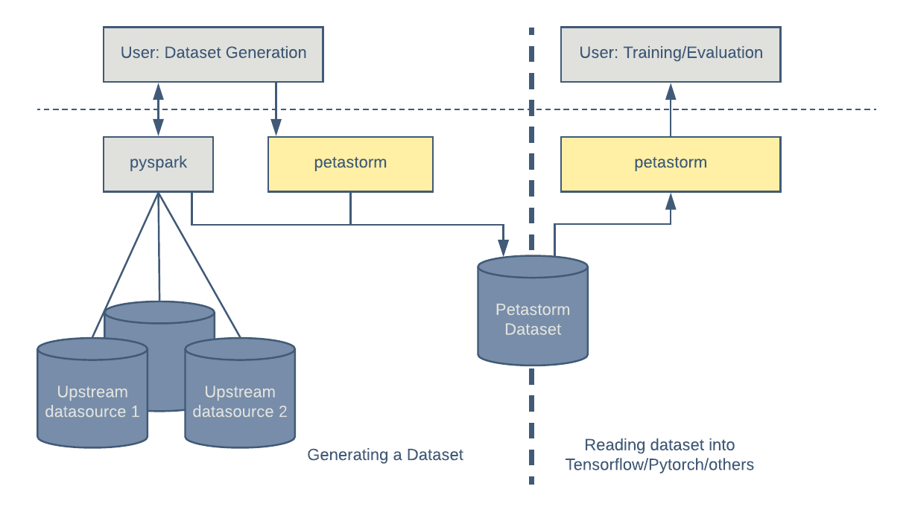
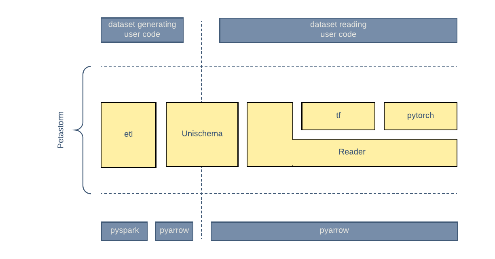

# PetaStorm

> Petastorm library enables single machine or distributed training and evaluation of **deep learning models from datasets in Apache Parquet format**. It supports ML frameworks such as Tensorflow, Pytorch, and PySpark and can be used from pure Python code.

深度学习/机器学习框架，可以读取Parquet格式的数据。

Petastorm使用[PyArrow](https://arrow.apache.org/docs/python/)库读取Parquet文件





## 生成数据集

定义一个数据模式，称为**Unischema**，Petastorm会将其转换为所有受支持的框架格式，例如PySpark，Tensorflow和纯Python。

- 必需的字段属性包括：字段名称，数据类型（由NumPy数据类型表示），多维数组形状，用于数据编码/解码的编解码器以及字段是否可为空。

```python
import numpy as np
from petastorm.codecs import CompressedImageCodec, NdarrayCodec, ScalarCodec
from petastorm.etl.dataset_metadata import materialize_dataset
from petastorm.unischema import Unischema, UnischemaField, dict_to_spark_row
from pyspark.sql import SparkSession
from pyspark.sql.types import IntegerType


HelloWorldSchema = Unischema('HelloWorldSchema', [
   UnischemaField('id', np.int32, (), ScalarCodec(IntegerType()), False),
   UnischemaField('image1', np.uint8, (128, 256, 3), CompressedImageCodec('png'), False),
   UnischemaField('other_data', np.uint8, (None, 128, 30, None), NdarrayCodec(), False),
])


def row_generator(x):
   """Returns a single entry in the generated dataset. Return a bunch of random values as an example."""
   return {'id': x,
           'image1': np.random.randint(0, 255, dtype=np.uint8, size=(128, 256, 3)),
           'other_data': np.random.randint(0, 255, dtype=np.uint8, size=(4, 128, 30, 3))}


def generate_hello_world_dataset(output_url='file:///tmp/hello_world_dataset'):
   rows_count = 10
   rowgroup_size_mb = 256

   spark = SparkSession.builder.config('spark.driver.memory', '2g').master('local[2]').getOrCreate()
   sc = spark.sparkContext

   # Wrap dataset materialization portion. Will take care of setting up spark environment variables as
   # well as save petastorm specific metadata
   with materialize_dataset(spark, output_url, HelloWorldSchema, rowgroup_size_mb):

       rows_rdd = sc.parallelize(range(rows_count))\
           .map(row_generator)\
           .map(lambda x: dict_to_spark_row(HelloWorldSchema, x))

       spark.createDataFrame(rows_rdd, HelloWorldSchema.as_spark_schema()) \
           .coalesce(10) \
           .write \
           .mode('overwrite') \
           .parquet(output_url)
```

## Reader API

### Pure Python 

```python
from petastorm import make_reader

 with make_reader('hdfs://myhadoop/some_dataset') as reader:
    for row in reader:
        print(row)
```

### Tensorflow

```python
from petastorm.tf_utils import tf_tensors

with make_reader('file:///some/localpath/a_dataset') as reader:
   row_tensors = tf_tensors(reader)
   with tf.Session() as session:
       for _ in range(3):
           print(session.run(row_tensors))

# DataSet 
from petastorm.tf_utils import make_petastorm_dataset

with make_reader('file:///some/localpath/a_dataset') as reader:
    dataset = make_petastorm_dataset(reader)
    iterator = dataset.make_one_shot_iterator()
    tensor = iterator.get_next()
    with tf.Session() as sess:
        sample = sess.run(tensor)
        print(sample.id)
```

### Pytorch

```python
import torch
from petastorm.pytorch import DataLoader

torch.manual_seed(1)
device = torch.device('cpu')
model = Net().to(device)
optimizer = torch.optim.SGD(model.parameters(), lr=0.01, momentum=0.5)

def _transform_row(mnist_row):
    transform = transforms.Compose([
        transforms.ToTensor(),
        transforms.Normalize((0.1307,), (0.3081,))
    ])
    return (transform(mnist_row['image']), mnist_row['digit'])


transform = TransformSpec(_transform_row, removed_fields=['idx'])
# 如果使用非常大BatchSize，可以使用 petastorm.pytorch.BatchedDataLoader
with DataLoader(make_reader('file:///localpath/mnist/train', num_epochs=10,
                            transform_spec=transform), batch_size=64) as train_loader:
    train(model, device, train_loader, 10, optimizer, 1)
```

### Spark

PetaStorm DataSet可以直接被Spark使用。

```python
# Create a dataframe object from a parquet file
dataframe = spark.read.parquet(dataset_url)

# Show a schema
dataframe.printSchema()

# Count all
dataframe.count()

# Show a single column
dataframe.select('id').show()
```

### Spark Convert

将 Spark DataFrame 转换为 Tensorflow 或者 Pytorch 的格式，Spark DataFrame会先以Parquet格式落盘，然后被加载为tf或者torch格式。

```python
from petastorm.spark import SparkDatasetConverter, make_spark_converter
import tensorflow.compat.v1 as tf  # pylint: disable=import-error

# specify a cache dir first.
# the dir is used to save materialized spark dataframe files
spark.conf.set(SparkDatasetConverter.PARENT_CACHE_DIR_URL_CONF, 'hdfs:/...')

df = ... # `df` is a spark dataframe

# create a converter from `df`
# it will materialize `df` to cache dir.
converter = make_spark_converter(df)

# make a tensorflow dataset from `converter`
with converter.make_tf_dataset() as dataset:
    # the `dataset` is `tf.data.Dataset` object
    # dataset transformation can be done if needed
    dataset = dataset.map(...)
    # we can train/evaluate model on the `dataset`
    model.fit(dataset)
    # when exiting the context, the reader of the dataset will be closed

# delete the cached files of the dataframe.
converter.delete()
```


## Non Petastorm Parquet Stores

match_batch_reader可以直接读取Parquet的数据。

| `make_reader`                                                | `make_batch_reader`                                          |
| ------------------------------------------------------------ | ------------------------------------------------------------ |
| Only Petastorm datasets (created using materializes_dataset) | Any Parquet store (some native Parquet column types are not supported yet.） |
| The reader returns **one record at a time**.                 | The reader returns batches of records. The **size of the batch is not fixed** and defined by Parquet row-group size. |
| Predicates passed to `make_reader` are evaluated per single row. | Predicates passed to `make_batch_reader` are evaluated per batch. |
| Can filter parquet file based on the `filters` argument.     | Can filter parquet file based on the `filters` argument      |