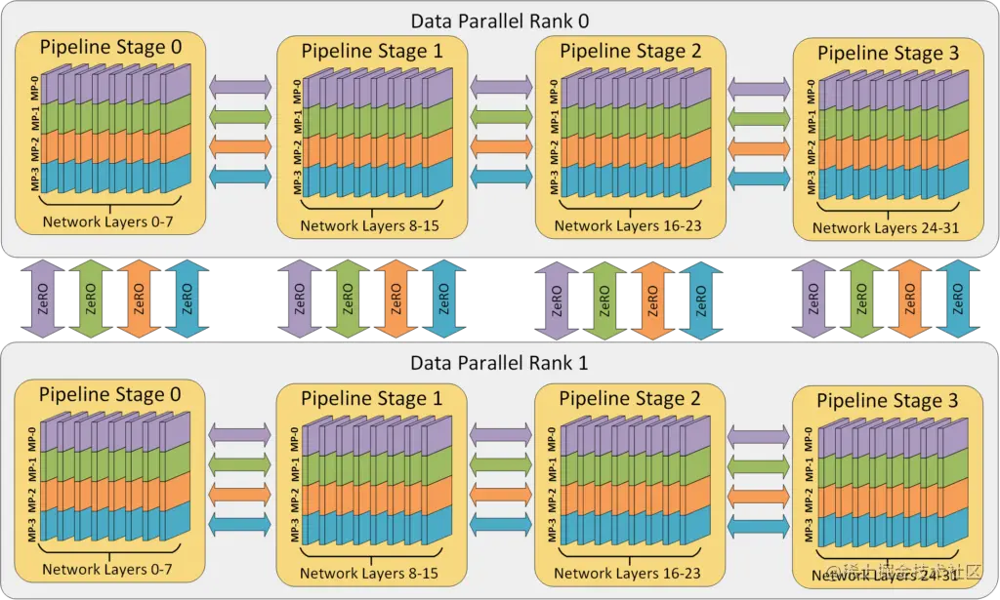
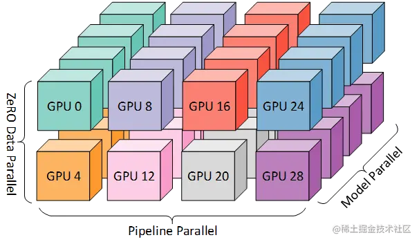

# DeepSpeed

## ZeRO

> Zero Redundancy Optimizer

**ZeRO-offload**：**delegate some computations and memory to the host’s CPU and RAM**

- `partitioning instead of replicating`，**划分而不是复制**

把参数占用，逻辑上分成三种类型。将这些类型的参数划分：

- `optimizer states`：即优化器的参数状态。例如，Adam的动量参数。
- `gradients`：梯度缓存，对应于optimizer。
- `parameters`：模型参数。

DeepSpeed的ZeRO config文件就可以分为如下几类：

- **ZeRO Stage 1**：划分`optimizer states`。优化器参数被划分到多个memory上，每个momoey上的进程只负责更新它自己那部分参数。
- **ZeRO Stage 2**：划分`gradient`。每个memory，只保留它分配到的optimizer state所对应的梯度。这很合理，因为梯度和optimizer是紧密联系在一起的。只知道梯度，不知道optimizer state，是没有办法优化模型参数的。
- **ZeRO Stage 3**：划分模型参数，或者说，不同的layer. ZeRO-3会在forward和backward的时候，自动将模型参数分配到多个memory。

**ZeRO-1** 只分配 optimizer states(参数量很小)，实际使用的时候，**一般只会考虑`ZeRO-2`和`ZeRO-3`。**

## 并行策略

借用英伟达的 [Megatron-LM](https://github.com/NVIDIA/Megatron-LM) 来为基于 **Transformer 的语言模型**提供大规模模型并行功能。

- 32 个 worker 进行 3D 并行的例子。神经网络的各层分为四个流水线阶段。每个流水线阶段中的层在四个模型并行 worker 之间进一步划分。最后，每个流水线阶段有两个数据并行实例，且 ZeRO 在这 2 个副本之间划分优化器状态量。

彩色块显示上图 中的 worker 到八个节点（每个节点有四个 GPU）的系统上的 GPU 的映射。同一颜色的 GPU 在同一节点上。

zero 可以认为理解成数据并行，不过是把参数sharding到多个设备上去，当需要完整参数时，再从其它设备取过来。和 tensor model parallelism 不一样