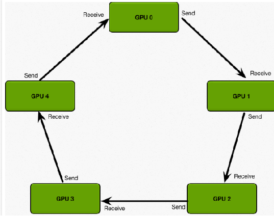

# 概念

> [常见的分布式并行策略 - OneFlow](https://docs.oneflow.org/master/parallelism/01_introduction.html)

像CNN这类大数据、小模型的神经网络层次最好用数据并行，对超大的全连接层这种模型更大的层次最好用模型并行，对于feature map超大或者层次超深的神经网络更适合流水并行。

## 数据并行

每一个节点（或者叫进程）都有一份模型，然后各个节点取不同的数据，通常是一个batch_size，然后各自完成前向和后向的计算得到梯度。

- 数据并行的 batch 大小随 worker 数量提高，往往无法在不影响收敛性的情况下一直增加 batch 大小；
- worker 之间规约梯度的通信开销跟模型大小成正相关，**当模型很大或通信带宽很低时，计算效率会受限**；

### PS

数据并行由于不需要拆分模型在实践中更加常用。

第一代数据并行分布式训练由**参数服务器（Parameter Server）**架构主导。 在参数服务器架构中，一个或多个参数服务器保存当前模型，并在每个迭代中对一组工作节点的参数或梯度进行同步。

架构的问题是**参数服务器和工作节点之间的网络连接成为瓶颈**。当参数服务器的带宽成为瓶颈时，**工作节点无法利用自己的全部带宽**， 当GPU之间的权值更新通信所需的时间线性增长时，网络I/O很快就会成为阻止训练进一步扩展的瓶颈，减慢了训练速度。

这个问题促使了**Ring  All Reduce分布式训练架构**的产生。

### Ring-AllReduce

数据传输量= 2 ( N − 1) K / N

- K : 参数个数
- N : GPU个数

## 模型并行

### 张量并行

> **张量并行是在一个操作中进行并行计算，如矩阵-矩阵乘法。 流水线并行是在各层之间进行并行计算**。

当模型巨大，单机内存不足的时候，将计算工作 partition，同一个大模型的不同部分交给不同机器负责（比如多层网络的各个节点）

### 流水线并行

> 流水线并行的核心思想是：**在模型并行的基础上，进一步引入数据并行的办法，即把原先的数据再划分成若干个batch，送入GPU进行训练**。未划分前的数据，叫**mini-batch**。在mini-batch上再划分的数据，叫**micro-batch**。

当神经网络过于巨大，无法在一个设备上存放时，除了上述的模型并行的策略外，还可以**选择流水并行**。 流水并行指将网络切为多个阶段，并分发到不同的计算设备上，各个计算设备之间以“接力”的方式完成训练。

下图，展示了一个逻辑上的4层网络（`T1` 至 `T4`)是如何做流水并行的。

4层网络被切分到2个计算设备上，其中 `GPU0` 上进行 `T1` 与 `T2` 的运算，`GPU1` 上进行 `T3` 与 `T4` 的计算。

`GPU0` 上完成前两层的计算后，它的输出被当作 `GPU1` 的输入，继续进行后两层的计算。

## 混合并行

网络的训练中，也可以将多种并行策略混用，以 GPT-3 为例，以下是它训练时的设备并行方案：

- 首先被分为 64 个阶段，进行流水并行，每个阶段都运行在 6 台 主机上，共 384 台机器。
- 在6台主机之间，进行的是**数据并行训练**；
- 每台主机有 8 张 GPU 显卡，同一台机器上的**8张 GPU 显卡之间是进行模型并行训练**。

