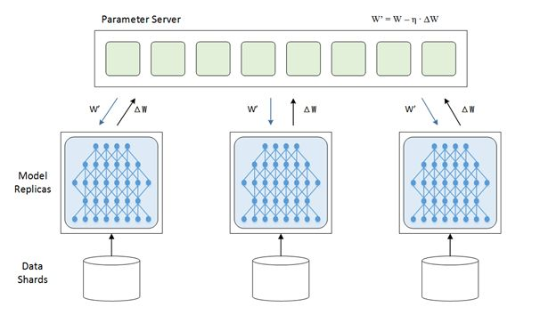
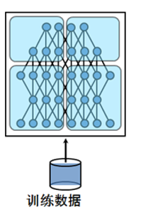
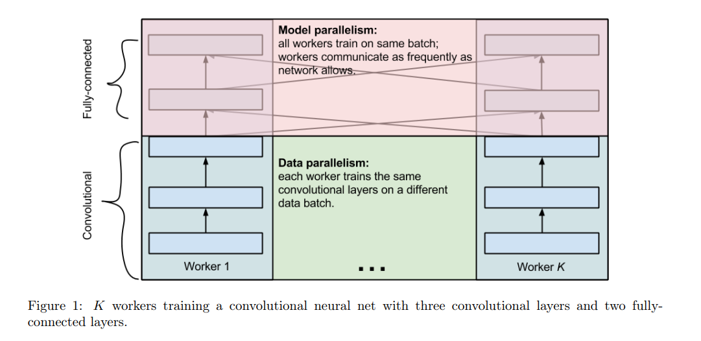

[toc]

# 概念

## 数据并行

每一个节点（或者叫进程）都有一份模型，然后各个节点取不同的数据，通常是一个batch_size，然后各自完成前向和后向的计算得到梯度。

共有参数的管理方案：有经典的ps和petuum 的ssp改进。

### PS和Ring-AllReduce

数据并行由于不需要拆分模型在实践中更加常用。

第一代数据并行分布式训练由**参数服务器（Parameter Server）**架构主导。 在参数服务器架构中，一个或多个参数服务器保存当前模型，并在每个迭代中对一组工作节点的参数或梯度进行同步。

架构的问题是**参数服务器和工作节点之间的网络连接成为瓶颈**。当参数服务器的带宽成为瓶颈时，**工作节点无法利用自己的全部带宽**， 当GPU之间的权值更新通信所需的时间线性增长时，网络I/O很快就会成为阻止训练进一步扩展的瓶颈，减慢了训练速度。

这个问题促使了**Ring  All Reduce分布式训练架构**的产生。

## 模型并行

当模型巨大，单机内存不足的时候，将计算工作 partition，同一个大模型的不同部分交给不同机器负责（比如多层网络的各个节点）

## 数据模型+模型并行

> One weird trick for parallelizing convolutional neural networks

现代卷积神经网络主要由两种层构成，他们具有不一样的属性和性能：

1. **卷积层**，占据了90% ~ 95% 的计算量，5% 的参数，但是对结果具有很大的表达能力。
2. **全连接层**，占据了 5% ~ 10% 的计算量， 95% 的参数，但是对于结果具有相对较小的表达的能力。

综上：卷积层计算量大，所需参数系数 W 少，全连接层计算量小，所需参数系数 W 多。因此对于卷积层适合使用数据并行，对于全连接层适合使用模型并行。

