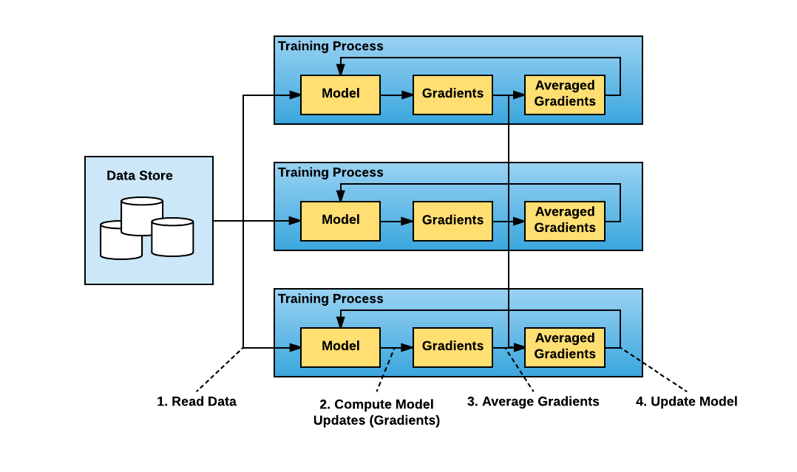
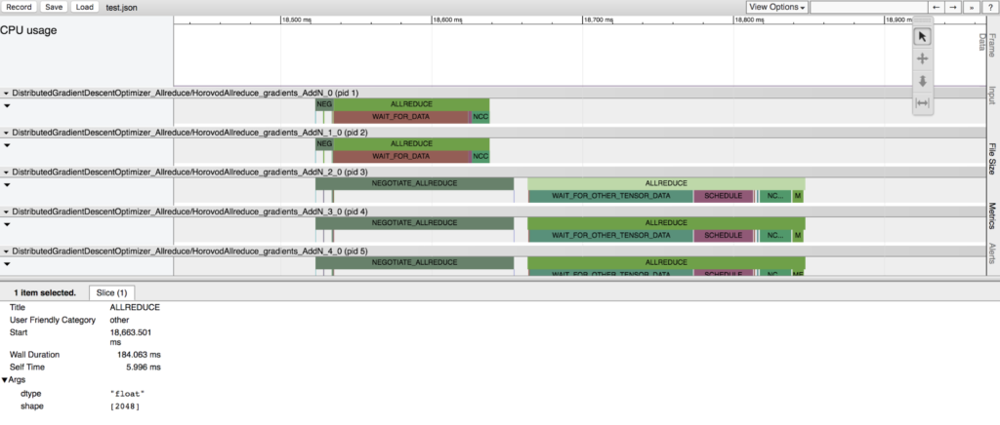
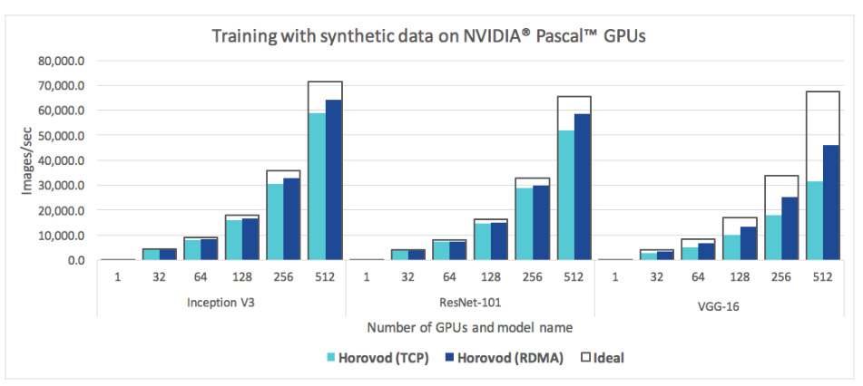

# Horovod(Uber开源)

> Horovod : fast and easy distributed deep learning in TensorFlow, 2018.

注：**Tensorflow 提供 MultiWorkerMirroredStrategy，采用AllReduce进行梯度更新，Horovod除了多框架统一外，性能没有额外的优势。**

## 数据并行

## Timeline

用户可以使用Horovod Timeline，以查看在整个训练过程中的每个时间步骤中每个节点正在做什么。

## Tensor Fusion

如果张量足够大，ring-all-reduce以一种最佳的方式利用网络，但如果张量非常小，则不能有效或快速地工作。

- 交错通信和计算，加上能力批处理小的allreduce操作；

Tensor Fusion works by attempting to **combine all the tensors that are ready to be reduced at given moment of time into one reduction operation**. The algorithm of Tensor Fusion is as follows:

1. Determine which tensors are ready to be reduced. Select first few tensors that fit in `HOROVOD_FUSION_THRESHOLD` bytes and have the same data type.
2. Allocate fusion buffer of size `HOROVOD_FUSION_THRESHOLD` if it was not allocated before. Default fusion buffer size is 64 MB.
3. Copy data of selected tensors into the fusion buffer.
4. Execute the **allreduce** operation on the fusion buffer.
5. Copy data from the fusion buffer into the output tensors.
6. Repeat until there are no more tensors to reduce in this cycle.

## 扩展性

