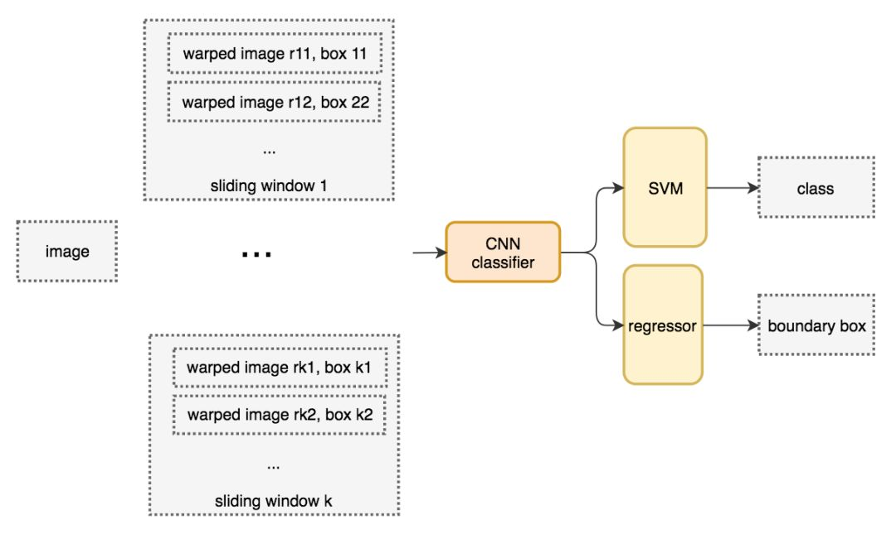
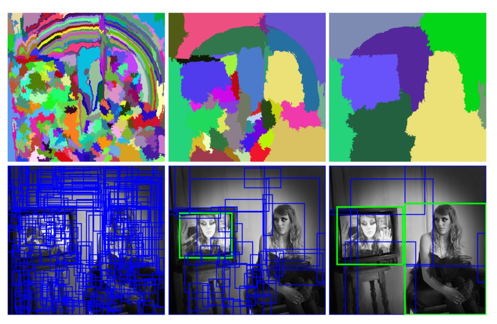
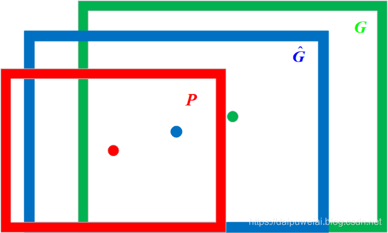
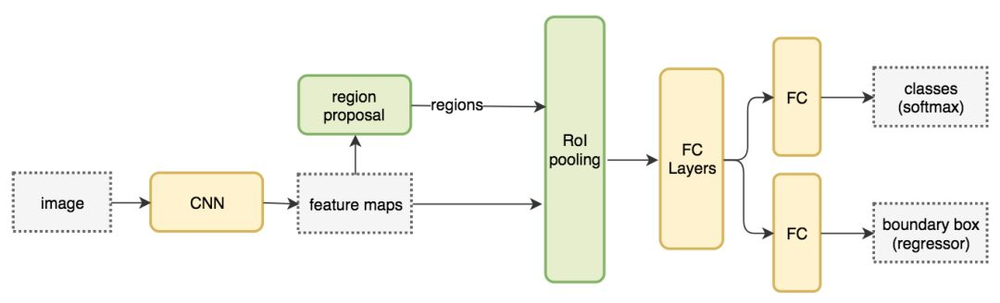

From System 1 Deep Learning to System 2 Deep Learning. NeurIPS‘2019 Keynote


计算机视觉领域

- 语义分割（Semantic segmentation）
- 分类与定位（Classification and localization）
- 目标检测（Object detection）
- 实例分割（Instance segmentation）


## 目标检测（Object detection）

### 基于候选区域的目标检测器

**滑动窗口检测器**

- 暴力方法是从左到右、从上到下滑动窗口，利用分类识别目标；
- 滑动窗口的图像块是经过变形转换成统一大小，输入 CNN 分类器中；
- 使用 SVM 分类器识别类别 和 线性回归器识别边界框。



**选择性搜索**

> 不使用暴力方法，而是用候选区域方法（region proposal method）创建目标检测的感兴趣区域（ROI）

- 将每个像素作为一组。然后，计算每一组的纹理，并将两个最接近的组结合起来；
- 避免单个区域吞噬其他区域，首先对较小的组进行分组；
- 继续合并区域，直到所有区域都结合在一起。

下图第一行展示了如何使区域增长，第二行中的蓝色矩形代表合并过程中所有可能的 ROI。



**R-CNN**

R-CNN 利用候选区域方法创建了约 2000 个 ROI。这些区域被转换为固定大小的图像，并分别馈送到卷积神经网络中。该网络架构后面会跟几个全连接层实现目标分类并提炼边界框。


**边界框回归器**

> [【R-CNN目标检测系列】二、边界框回归（Bounding-Box Regression）_daipuweiai的博客-CSDN博客_边界框回归](https://blog.csdn.net/qq_30091945/article/details/96570669)

在给定一组候选目标框P，寻找到一个映射f，使得 $f(P) = \hat{G} \approx G$

- 红色框代表候选目标框，绿色框代表真实目标框，蓝色框代表边界框回归算法预测目标框



**Fast R-CNN**

> R-CNN 需要非常多的候选区域以提升准确度，但其实有很多区域是彼此重叠的，因此 R-CNN 的训练和推断速度非常慢，若有 2000 个候选区域，且每一个都需要独立地馈送到 CNN 中，那么对于不同的 ROI，我们需要重复提取 2000 次特征。

- Fast R-CNN 使用**特征提取器**（CNN）先提取整个图像的特征，而不是从头开始对每个图像块提取多次；
- 将创建候选区域的方法直接应用到提取到的特征图上；

Fast R-CNN 最重要的一点就是包含**特征提取器、分类器和边界框回归器在内的整个网络能通过多任务损失函数进行端到端的训练**，这种多任务损失即结合了分类损失和定位损失的方法，大大提升了模型准确度。



**ROI 池化**

**在卷积层后**用来将卷积层输出的不同尺寸的向量固定成一个尺寸，使其可以在**模型原始输入向量大小不同时可将卷及部分输出的向量统一规格输入到后续的全连接部分。**


**Faster R-CNN**

Faster R-CNN 采用与 Fast R-CNN 相同的设计，只是它用**Region Proposal Networks**生成候选区域。


**基于区域的全卷积神经网络（R-FCN）**

R-FCN 通过减少每个 ROI 所需的工作量实现加速。

- 位置敏感得分图position-sensitive score map

```python
# Faster R-CNN
feature_maps = process(image)
ROIs = region_proposal(feature_maps)
for ROI in ROIs
    patch = roi_pooling(feature_maps, ROI)
    class_scores, box = detector(patch)         # Expensive!
    class_probabilities = softmax(class_scores)
    
# R-FCN
feature_maps = process(image)
ROIs = region_proposal(feature_maps)         
score_maps = compute_score_map(feature_maps)
for ROI in ROIs
    V = region_roi_pool(score_maps, ROI)     
    class_scores, box = average(V)              # Much simpler!
    class_probabilities = softmax(class_scores)
```


### 单次检测器

**YOLO** 

YOLO 在卷积层之后使用了 DarkNet 来做特征检测。

- 并没有使用多尺度特征图来做独立的检测；
- 将特征图部分平滑化，并将其和另一个较低分辨率的特征图拼接；

YOLO（v2）做出了很多实现上的改进。

**YOLOv3**

YOLOv3 使用了更加复杂的骨干网络来提取特征。DarkNet-53 主要由 3 × 3 和 1× 1 的卷积核以及类似 ResNet 中的跳过连接构成

- 添加了特征金字塔，以更好地检测小目标；


**特征金字塔网络（FPN）**

特征金字塔网络（FPN）是一种旨在提高准确率和速度的特征提取器。它取代了检测器（如 Faster R-CNN）中的特征提取器，并生成更高质量的特征图金字塔。
