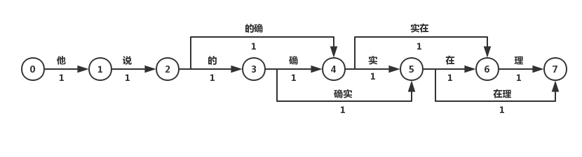
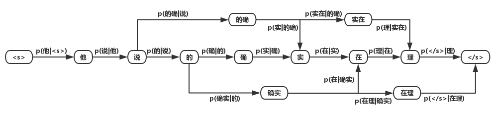

# 分词

> 

分词是**词法分析**（包括**词性标注**和**命名实体识别**）的最基本的任务。

中文分词的难点：

- 分词粒度不统一，不同应用对分词的粒度要求不一样；
- 中文歧义问题；
- 未登录词，新兴词语；

## 分词算法

基于字典的分词：

- 句子按照字典切分成词，再寻找词的的最佳组合方式；

基于字的分词：

- 句子分成字，再将字组合成词，寻找最优的切分策略，也可以转化为序列标注问题。

### 基于词表的分词

> **成熟的工业界应用上几乎不会直接使用词表分词作为分词模块的实现方法**。

#### 最大匹配分词算法

**正向最大匹配**

对于输入的一段文本从左至右、以贪心的方式切分出当前位置上长度最大的词。

**逆向最大匹配**

分词顺序变为从右至左。

##### 双向最大匹配

正向和反向，选择词最少的匹配，如果词数一样，返回单字数最少的匹配，如果也一样，则返回逆向匹配。

- 启发式，**汉语中单字词的数量远远小于非单字词**，算法中尽量减少结果中的单字。

#### 最短路径分词算法

将一句话中的所有词匹配出来，构成词图（DAG），寻找从起始点到终点的最短路径作为最佳组合。

可以认为图中的每个词的权重都是相等的。

### 基于统计模型的分词算法

#### 基于n-gram 模型的分词算法

上一部分的DAG图中，每条路径的权重都是相等的，但是实际中常用词的出现频率/概率比罕见词大。

将求解词图最短路径的问题转化为**求解最大概率路径的问题（维比特算法）**，即分词结果为“最有可能的词的组合“。

2-gram模型的公式如下（一般n为2，3）：

$p(s)=\displaystyle \prod^{l}_{i=1}{p(w_i|w_1...w_{i-1})}\approx\displaystyle \prod^{l}_{i=1}{p(w_i|w_{i-1})}$

### 基于字的分词（序列标注）

将分词看成是序列标注问题，**序列标注（tagging）**指的是给定一个序列$x=x_1x_2...x_n$，找出序列中每个元素的对应标签$y=y_1y_2...y_n$的问题，其中y的可能取值集合称为**标注集**。

**中文分词可以转化为标注集为`{切，过}`的序列标注问题**。

#### 生成式模型分词算法

生成式模型主要有n-gram模型、HMM隐马尔可夫模型、朴素贝叶斯分类等。

基于字的n-gram模型进行分词，不过这种方法的效果没有基于词的效果要好。

##### HMM隐马尔可夫模型

HMM模型认为在解决序列标注问题时存在两种序列，一种是**观测序列**，即人们显性观察到的句子，而序列标签是**隐状态序列**，即观测序列为X，隐状态序列是Y，因果关系为`Y->X`。因此要得到标注结果Y，必须对**X的概率、Y的概率、P(X|Y)**进行计算，即建立**P(X,Y)的概率分布模型**。

[隐马尔可夫模型的定义和求解](../hmm.md)

#### 判别式模型算法

判别式模型主要有**感知机、SVM支持向量机、CRF条件随机场、最大熵模型、神经网络**等。在分词中常用的有感知机模型和CRF模型。

##### 平均感知机分词算法

##### 条件随机场（CRF）分词算法

### 神经网络分词算法

在NLP中，最常用的神经网络为**循环神经网络（**RNN，Recurrent Neural Network），它在处理变长输入和序列输入问题中有着巨大的优势。**LSTM**为RNN变种的一种，在一定程度上解决了RNN在训练过程中梯度消失和梯度爆炸的问题。**双向（Bidirectional）循环神经网络**分别从句子的开头和结尾开始对输入进行处理，将上下文信息进行编码，提升预测效果。

目前对于序列标注任务，公认效果最好的模型是**BiLSTM+CRF**。

