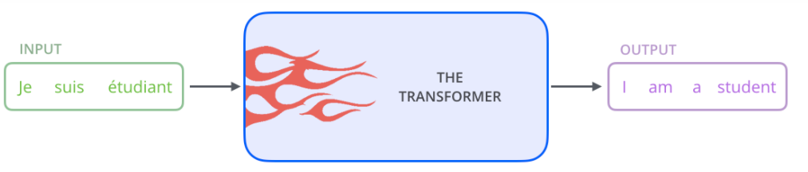

# Transformer

> Google 在17年的 Attention Is All You Need 论文中提出，在NLP的多个任务上取得了非常好的效果，抛弃了传统的CNN和RNN，整个网络结构完全是由Attention机制组成。

## 相关工作

一般讲解Transformer都会以机器翻译任务为例子讲解

### 1.1 早期seq2seq

seq2seq结构，也可以称为**encoder-decoder**结构

- 早期一般是RNN模块(因为其可以捕获时序信息)，后来引入了**LSTM**或者**GRU**模块；
- 核心思想是**通过Encoder编码成一个表示向量，然后由Decoder来进行解码**，翻译成目标语言。

结构缺陷：（编码单元输出的隐含向量，其包含的信息有限，对于一些复杂任务可能信息不够）

- 不论输入和输出的语句长度是什么，**中间的上下文向量长度都是固定**，一旦长度过长，仅仅靠一个固定长度的上下文向量明显不合理；
- 仅仅利用上下文向量解码，会有信息瓶颈，**长度过长时候信息可能会丢失**。

### 1.2 基于attention的seq2seq

注意力机制Attention：

- 假设给定一张图片，我们会自动聚焦到一些关键信息位置，而不需要逐行扫描全图；
- 本质是对输入的自适应加权

### 1.3 基于transformer的seq2seq

基于attention的seq2seq不足：

- 不管是采用RNN、LSTM还是GRU都**不利于并行训练和推理**，因为相关算法只能从左向右依次计算或者从右向左依次计算
- **长依赖信息丢失问题**，顺序计算过程中信息会丢失，虽然LSTM号称有缓解，但是无法彻底解决

包括6个结构完全相同的编码器，和6个结构完全相同的解码器，其中每个编码器和解码器设计思想完全相同，只不过由于任务不同而有些许区别，整体详细结构如下所示

## 参考文献

- [3W字长文带你轻松入门视觉transformer](https://zhuanlan.zhihu.com/p/308301901)

  