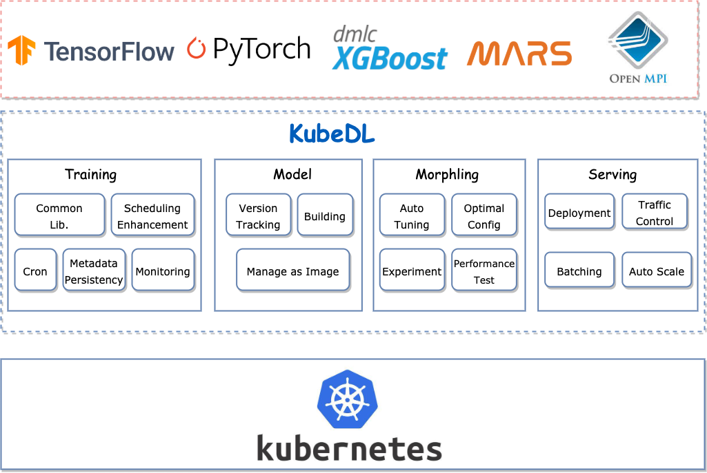
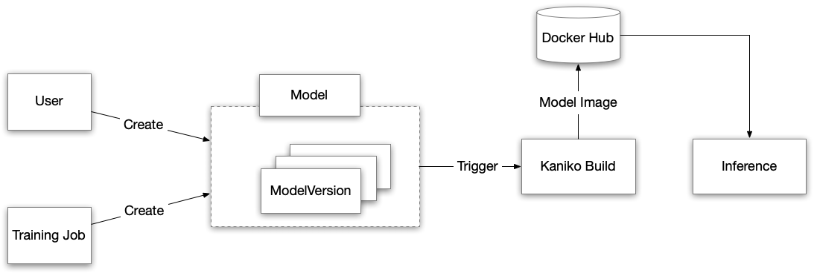
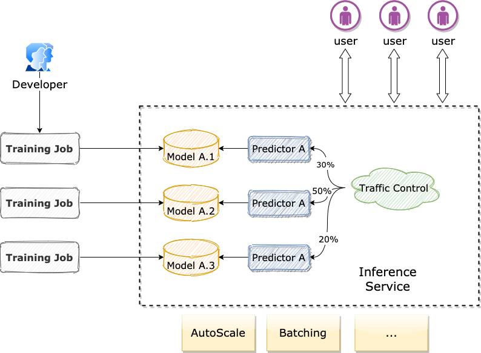

# [KubeDL](https://github.com/kubedl-io/kubedl)

> *CNCF sandbox project*：KubeDL makes **deep learning workloads run on Kubernetes more easily and efficiently**.
>
> 最新的 Release：v-0.5.0, Dec 5, 2022，当前活跃度不高

阿里开源的基于 Kubernetes 的 AI 工作负载管理框架：

- 训练（Training）：支持 Gang-Scheduling / Cron Scheduling，支持宿主机网络通信；
- 模型管理（Model）：支持 LocalPath 和 NFS；
- 推理（Serving）：支持 A/B Test（基于 Istio VirtualService）；

## 架构

### 训练

调度：

- 支持定时调度运行；

- GangScheduling：与 [Coscheduling Scheduling Plugin](https://github.com/kubernetes-sigs/scheduler-plugins/blob/master/pkg/coscheduling/README.md), [YuniKorn](https://yunikorn.apache.org/), Volcano, KubeBatch 集成；

Job Events 持久化：当前仅支持 `aliyun-sls`

- 默认 k8s 将 events 仅持久化3 小时；

Job Metadata 持久化：当前仅支持 MySQL

- Kubernetes api-server 通常在有限的生命周期内存储 Job 信息；

### 模型

用户手动创建 Model CRD 或者由 TrainingJob 自动创建

- 触发 Kaniko 构建 Model 的镜像；

### 推理

- 注入 model-loader的 init 容器进行模型加载；
- 使用 Istio 的 VirtualService 进行流量控制；

