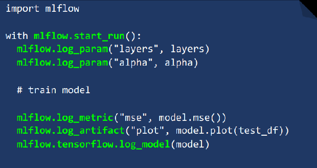

# ML Flow

[ML Flow](https://www.mlflow.org/ )，详细内容整理见 [MLflow：机器学习的全生命周期的开源平台.ppt](./MLflow：机器学习的全生命周期的开源平台.ppt)

**管理机器学习全生命周期**

- 记录并查询结果：代码、数据、配置、结果；
- 可在任何平台上重复运行的打包格式；
- 将模型发送到各种部署工具的通用格式 


 底层对接多种ML库，但是模型不能在不同库中使用；

- MLFlow Tracking：记录和查询实验结果（如代码，配置，算法结果等），解决模型参数、指标记录繁琐，且难以直观对比的问题；
- MLFlow Projects：打包格式，可以在任意平台上重现实验结果，解决ML结果难以重现的问题；
- MLFlow Models：通用的模型格式，支持多种部署工具，解决模型发布/部署难的问题；
- MLFlow Model Registry：模型来源和版本管理的问题；


亮点：

- 统一的模型存储规范，支持多种底层库；
- 模型对外提供服务；
- 参数和结果可视化；


## MLFlow Tracking 

> 默认情况下，mlflow python API logs的运行结果保存在本地（运行结束后，直接通过mlflow run查看）。
>
> 可以设置环境变量`MLFLOW_TRACKING_URI`或者调用`mlflow.set_tracking_url()`将 logs 的结果保存到远程Tracking Server。

remote tracking URIs 支持：

- 本地文件存储，如`file:/my/local/dir`；
- db存储，`<dialect>+<driver>://<username>:<password>@<host>:<port>/<database>`；
- http server，即 MLflow tracking server 地址；

### Tracking Server

> 默认情况下，mlflow 使用 Local FS 作为 Backend / Artifact Store；

Backend Store：元数据（如实验和运行的参数、指标、标签等）存储

- 文件存储（只支持Local FileSystem）
- SQL存储（兼容SQLAlchemy，支持mysql，postgresql，sqlite等），只有SQL才能支持模型注册

Artifact Store：数据和模型的存储

- S3，Azure Blob，Google Cloud；FTP，SFTP；
- Local FS，NFS，HDFS

`no-serve-artifacts`

- 配置代理，不将`artifact`的操作通过Tracking Server 进行 proxy，而是返回相关路径，由Client直接跟Artifact Store交互；

```shell
mlflow server --backend-store-uri /mnt/persistent-disk --default-artifact-root s3://my-flow-bucket/ --host 0.0.0.0 --no-serve-artifacts
```


### API Logging

experiment 实验，包含多个run（默认存在`default`）；

run : 单次运行，start_run 会返回当前的run（如果不存在则创建一个）；

> no need to call `start_run` explicitly, calling one of the logging functions with no active run automatically starts a new one.



### Automatic Logging

> 自动记录参数、指标和模型，无需显式代码记录。

支持：

- Scikit-learn
- Keras
- Gluon
- XGBoost
- LightGBM
- Statsmodels
- Spark
- Fastai
- Pytorch

```python
import mlflow
mlflow.autolog()
```


## Mlflow Projects

**project environments**: 

- Virtualenv environment
- system environment
- Docker container environment : 会拷贝project内容到`/mlflow/projects/code`目录下，并**生成新的镜像**并运行；
- conda environment


Project File ：`MLproject`

```yaml
name: My Project

conda_env: my_env.yaml
# or
# docker_env:
#    image:  mlflow-docker-example
#    environment: [["NEW_ENV_VAR", "new_var_value"], "VAR_TO_COPY_FROM_HOST_ENVIRONMENT"]


entry_points:
  main:
    parameters:
      data_file: path
      regularization: {type: float, default: 0.1}
    command: "python train.py -r {regularization} {data_file}"
  validate:
    parameters:
      data_file: path
    command: "python validate.py {data_file}"
```

### 运行

#### K8s 运行

重新生成镜像，上传到镜像仓库中，并启动 K8s Job；

- 使用 `docker_env`

`kubernetes_config.json` 元信息文件：

- `kube-context`：k8s 运行环境信息；（in-cluster形式时，使用当前pod的service account）；
- `repository-uri`：镜像仓库地址；
- `kube-job-template-path`：k8s job yaml的路径；

执行命令

```shell 
# <project_uri> is a Git repository URI or a folder
mlflow run <project_uri> --backend kubernetes --backend-config examples/docker/kubernetes_config.json
```


## MLflow Model

### 存储格式

```shell
# Directory written by mlflow.sklearn.save_model(model, "my_model")
my_model/
├── MLmodel
├── model.pkl
├── conda.yaml
├── python_env.yaml
└── requirements.txt
```


### 保存和加载模型

保存和加载模型

```python
mlflow.<>.save_model   保存模型到本地
mlflow.<>.log_model    作为 artifact 存储
mlflow.<>.load_module  从本地或者artifact中加载模型
```


### 部署

支持 **本地部署** 或者**生成Docker** 镜像。

- 本地部署

  ```
  mlflow models serve -m runs:/a4599bb9b3ea4ee9b2f20a56a607fcec/model
  
  mlflow models serve -m "models:/sk-learn-random-forest-reg-model/Production"
  ```

- 构建 docker 镜像

  ```shell
  mlflow models build-docker -m my_model -n my-model 
  ```

`Rest API`定义4个接口：

- `/ping` used for health check
- `/health` (same as /ping)
- `/version` used for getting the mlflow version
- `/invocations` used for scoring


MLServer 通过  `/invocations` endpoint

```shell
# 安装 extras 库
pip install mlflow[extras]

mlflow models build-docker -m my_model --enable-mlserver -n my-model
mlflow models serve -m my_model --enable-mlserver
```


## MLflow Model Registry

管理模型的生命周期

- 模型来源和版本管理的问题模型版本模型来源模型阶段（Staging, Production, Archived）

```python
# Log the sklearn model and register as version 1
mlflow.sklearn.log_model(
        sk_model=sk_learn_rfr,
        artifact_path="sklearn-model",
        registered_model_name="sk-learn-random-forest-reg-model"
)

# 注册模型
result = mlflow.register_model(
    "runs:/d16076a3ec534311817565e6527539c0/sklearn-model",
    "sk-learn-random-forest-reg"
)

# 方式3：通过Client注册模型
from mlflow import MlflowClient

client = MlflowClient()
client.create_registered_model("sk-learn-random-forest-reg-model")
result = client.create_model_version(
    name="sk-learn-random-forest-reg-model",
    source="mlruns/0/d16076a3ec534311817565e6527539c0/artifacts/sklearn-model",
    run_id="d16076a3ec534311817565e6527539c0"
)

```

